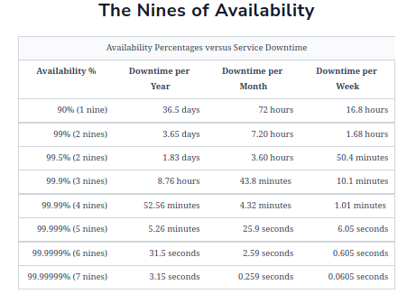
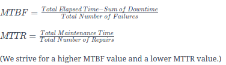

# Table of Contents
1. Key distributed system properties
2. Functional Requirements
3. Non-Functional Requirements
4. Understanding Abstraction

## 1. Key distributed system properties

1. Robustness (the ability to maintain operations during a crisis)
2. Scalability
3. Availability
4. Performance
5. Extensibility
6. Resiliency (the ability to return to normal operations over an acceptable period of time post disruption)

## 2. Functional Requirements

## 3. Non-functional Requirements
    1. Availability
    2. Reliability
    3. Scalability
    4. Maintainability
    5. Fault Tolerance   

#### Measuring Availability

#### Measuring Reliability
    MTBF - Mean time between failures
    MTTR - Mean time to repair

    ++ Reliability and availability are two important metrics to measure compliance of 
       service to agreed-upon service level objective(SLO).

#### Scalability
    Scalability is the ability of a system to hanldle an increasing amount of workload 
    without compromising performance.

    1. Workload types
        + Request Workload - This is the number of requests served by the system.
        + Data/storage workload - This is the amount of data stored by the system.

    2. Dimensions 
        + Size scalability 
            A system is scalable in size if we can simply add additional users and resources to it.
        + Administrative scalability
            This is the capacity for a growing number of organizations or users to share a single
            distributed system with ease
        + Geographical scalability 
            This relates to how easily the program can cater to other regions while maintaining 
            acceptable performance constraints.

Different approaches of scalability

    1. Vertical scalability (scaling up) - upgrading the machines (computationally or memory)
    2. Horizontal scalability (scaling out) - increasing the number of machines

#### Maintainability
    Besides building a system, one of the main tasks afterward is keeping the system up and running by
    finding and fixing bugs, adding new functionality, keeping the system's platform updated, sys ops.
    
    Maintainability can be further divided to -
        + Operability
            Ease with which we can ensure the system's smooth operational running under normal
            circumstances and achieve normal conditions under a fault.
        + Lucidity
            This refers to simplicity of the code. The simpler the code base, the easier it is to
            understand and maintain it, and vice versa.
        + Modifiability
            This is the capability of the system to integrate modified, new, and unforeseen features
            without any hassle.

    _Mean time for repair (MTTR) = Total Maintenance Time/Total number of Repairs_

#### Fault Tolerance
    Fault Tolerance refers to a system's ability to execute persistently even if one or more of its
    components fail.

    Counter-Measure
        + Replicaton based fault tolerance
        + Check-pointing 
            - Technique that saves the system's state in stable storage for later retrieval.

## 4. Understanding Abstraction
    + Database Abstraction - Transactions
    + Network Abstration - RPC
    + Spectrum of consistency models
        Eventual Consistency
            - Ensures that all the replicas converge on a final value after a finite time. 
            - If new writes keep coming, replicas of an eventually consistent system might 
              never reach the same state
            - No strict ordering requirements and don't require reads to return the latest write.
            - Examples - DNS, Cassandra NoSQL db.

        Causal Consistency
            - Categorize operations into dependent and independent operations.
            - Dependent operations are causally-related operations.
            - Model doesn't ensure ordering for the operations that are not causally related.
            - Examples - Facebook posts, commenting systems.

        Sequential Consistency
            - Preserves the ordering specified by each client's program.
            - Doesn't ensure that writes are visible instantaneously or in the same order as they occur.
            - Examples - Social Netwroking applications.

        Strict Consistency - aka Linearizability
            - Ensures that read request from any replicas will get the latest write value.
            - It's a challenge to achieve in distributed systems because of network delays/failures.
            - Examples - banking system

    + Spectrum of Failure Models
        Fail-stop
            - A node in the distributed system halts permanently.
            - Other nodes can detect that the node is failed.

        Crash
            - A node in the distributed system halts silently.
            - Other nodes can't detect that the node has stopped working.

        Omission
            - Node fails to send/receive messages.
            - Send omission failure/Receive omission failure.

        Temporal failures
            - Node generates correct results, but is too late to be useful.
            - delay in responses.

        Byzantine
            - Node exhibits random behavior resulting in producing wrong results or stopping mid-way.
