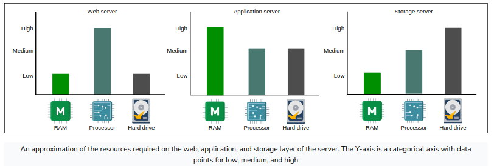

<!-- TOC -->
  * [1. Key distributed system properties](#1-key-distributed-system-properties)
  * [2. Functional Requirements](#2-functional-requirements)
  * [3. Non-functional Requirements](#3-non-functional-requirements)
      * [Measuring Availability](#measuring-availability)
      * [Measuring Reliability](#measuring-reliability)
      * [Scalability](#scalability)
      * [Maintainability](#maintainability)
      * [Fault Tolerance](#fault-tolerance)
  * [4. Understanding Abstraction](#4-understanding-abstraction)
* [back-of-the-envelope calculations](#back-of-the-envelope-calculations)
  * [Types of data center servers](#types-of-data-center-servers)
<!-- TOC -->

## 1. Key distributed system properties

1. Robustness (the ability to maintain operations during a crisis)
2. Scalability
3. Availability
4. Performance
5. Extensibility
6. Resiliency (the ability to return to normal operations over an acceptable period of time post disruption)

## 2. Functional Requirements

## 3. Non-functional Requirements
    1. Availability
    2. Reliability
    3. Scalability
    4. Maintainability
    5. Fault Tolerance   

#### Measuring Availability

#### Measuring Reliability
    MTBF - Mean time between failures
    MTTR - Mean time to repair

    ++ Reliability and availability are two important metrics to measure compliance of 
       service to agreed-upon service level objective(SLO).

#### Scalability
    Scalability is the ability of a system to hanldle an increasing amount of workload 
    without compromising performance.

    1. Workload types
        + Request Workload - This is the number of requests served by the system.
        + Data/storage workload - This is the amount of data stored by the system.

    2. Dimensions 
        + Size scalability 
            A system is scalable in size if we can simply add additional users and resources to it.
        + Administrative scalability
            This is the capacity for a growing number of organizations or users to share a single
            distributed system with ease
        + Geographical scalability 
            This relates to how easily the program can cater to other regions while maintaining 
            acceptable performance constraints.

Different approaches of scalability

    1. Vertical scalability (scaling up) - upgrading the machines (computationally or memory)
    2. Horizontal scalability (scaling out) - increasing the number of machines

#### Maintainability
    Besides building a system, one of the main tasks afterward is keeping the system up and running by
    finding and fixing bugs, adding new functionality, keeping the system's platform updated, sys ops.
    
    Maintainability can be further divided to -
        + Operability
            Ease with which we can ensure the system's smooth operational running under normal
            circumstances and achieve normal conditions under a fault.
        + Lucidity
            This refers to simplicity of the code. The simpler the code base, the easier it is to
            understand and maintain it, and vice versa.
        + Modifiability
            This is the capability of the system to integrate modified, new, and unforeseen features
            without any hassle.

    _Mean time for repair (MTTR) = Total Maintenance Time/Total number of Repairs_

#### Fault Tolerance
    Fault Tolerance refers to a system's ability to execute persistently even if one or more of its
    components fail.

    Counter-Measure
        + Replicaton based fault tolerance
        + Check-pointing 
            - Technique that saves the system's state in stable storage for later retrieval.

## 4. Understanding Abstraction
    + Database Abstraction - Transactions
    + Network Abstration - RPC
    + Spectrum of consistency models
        Eventual Consistency
            - Ensures that all the replicas converge on a final value after a finite time. 
            - If new writes keep coming, replicas of an eventually consistent system might 
              never reach the same state
            - No strict ordering requirements and don't require reads to return the latest write.
            - Examples - DNS, Cassandra NoSQL db.

        Causal Consistency
            - Categorize operations into dependent and independent operations.
            - Dependent operations are causally-related operations.
            - Model doesn't ensure ordering for the operations that are not causally related.
            - Examples - Facebook posts, commenting systems.

        Sequential Consistency
            - Preserves the ordering specified by each client's program.
            - Doesn't ensure that writes are visible instantaneously or in the same order as they occur.
            - Examples - Social Netwroking applications.

        Strict Consistency - aka Linearizability
            - Ensures that read request from any replicas will get the latest write value.
            - It's a challenge to achieve in distributed systems because of network delays/failures.
            - Examples - banking system

    + Spectrum of Failure Models
        Fail-stop
            - A node in the distributed system halts permanently.
            - Other nodes can detect that the node is failed.

        Crash
            - A node in the distributed system halts silently.
            - Other nodes can't detect that the node has stopped working.

        Omission
            - Node fails to send/receive messages.
            - Send omission failure/Receive omission failure.

        Temporal failures
            - Node generates correct results, but is too late to be useful.
            - delay in responses.

        Byzantine
            - Node exhibits random behavior resulting in producing wrong results or stopping mid-way.

# back-of-the-envelope calculations
    A distributed system has compute nodes connected via a network. There are wide variety of available
    compute nodes and they can be connected in many different ways.

    Back-of-the-envelope calculations helps us to ignore the nitty-gritty details of the system (at least
    at the design level) and focus on more important aspects.

some examples of a back-of-the-envelope calculation could be
- The number of concurrent TCP connections a server can support
- The number of requests per second (RPS) a web, database, or cache server can handle
- The storage requirements of a service

Choosing an unreasonable number of such calculations can lead to a flawed design. Below concepts helps
us arrive a reasonable calculations.

## Types of data center servers
    Data centers don't have a single type of server. Enterprise solutions use commodity hardware to
    save cost and develop scalable solutions.

- **Web servers**

    Web servers are the first point of contact after load balancers. Typical data centers have racks
    full of web servers t hat usually handle API calls from the clients.

    1. These servers requires good computational resources.
    2. Depending on the service that's offered, the memory and storage resources are small to medium.
    3. Web servers mostly server static content to the client

**Application servers**

    1. Application servers run the core application software and business logic.
    2. Depending on the application logic, these servers require extensive computation and storage resources.
        ex - Facebook application servers uses upto 256GB RAM and two types of storage -- traditoinal
             rotating disks and flash -- with a capacity of up to 6.5TB.

**storage servers**

    With the explosive growth of Internet users, the amount of data stored by giant servers has multiplied.
    For instance, youtube uses the following datastores:
        1. Blob storage for its encoded videos.
        2. A temporary processing queue storage that can hold a few hunderd hours of video content
            uploaded dialy to YouTube for processing
        3. Specialized storage called Bigtable for storing a large number of thumbnails of videos.
        4. RDBMS for users and vidoes metadata (comments, likes, user channels, and so on)

    Facebook numbers that were open-sourced back in the day -
        
        | Component         | Count                     |
        |-------------------|---------------------------|
        | Number of Sockets | 2                         |
        | Processor         | Intel Xeon X2686          |
        | Number of Cores   | 26 cores (72 H/W Threads) |
        | RAM               | 256 MB                    |
        | Cache (L3)        | 45 MB                     |
        | Storage Capacity  | 15 TB                     |

**standard numbers to remember**

    Important Latencies
    
    | Componnent                                                     | Time (nano seconds)            |
    |----------------------------------------------------------------|--------------------------------|
    | L1 cache reference                                             | 0.9                            |
    | L2 cache reference                                             | 2.8                            |
    | L3 cache reference                                             | 12.9                           |
    | Main Memory reference                                          | 100                            |
    | Compressed 1KB with Snzip                                      | 3,000 (3 micro-seconds)        |
    | Read 1MB sequentially from memory                              | 9,000 (9 micro-seconds)        |
    | Read 1 MB sequentially from SSD                                | 200,000 (200 micro-seconds)    |
    | Round Trip within same datacenter                              | 500,000 (500 micro-seconds)    |
    | Read 1 MB sequentially from SSD  with speed ~1GB/sec   | 1000,000 (1 milli-seconds)     |
    | Disk seek                                                      | 4000,000 (4 milli-seconds)     |
    | Read 1 MB sequentially from disk                               | 2000,000 (2 milli-seconds)     |
    | Send package SF->NYC                                           | 71,000,0000 (71 milli-seconds) |

    Important Rates
    
    |                                |             |
    |--------------------------------|-------------|
    | QPS handled by mySQL           | 1000        |
    | QPS handled by key-value store | 10,000      |
    | QP handled by cache server     | 100,000-1 M |

**Request estimation**

    Within a server, there are limited resources and depending on the type of client requests, 
    different resources can become bottleneck.

    Assumptions - 
        1. Our server is a typical server with pretty default config as below.
        2. OS and other services consumed a total of 16GB of RAM.
        3. Each worker consumes 300 MBs of RAM storage to complete a request.
        4. For simplicaity, we assume that the CPU obtains data from the RAM. (caches always a hit)
        5. Each CPU-bound request takes 200ms, whereas a memory-bound request takes 50ms

    CPU-bound - 
        CPU bound RPS = (Number of CPU threads, which are also called by hardware threads) 
                     * 1/(time each task takes to complete)
        RPS_CPU = Num_CPU x (1/Task_time)

        ex = RPScpu = 72 * 1/200 ms = 360 RPS

    
    Memory-bound -
        Memory bound RPS = (Total size of RAM/Worker Memory) * 1/(A worker in memeroy that manages a request)
        RPS_Memory = (RAMsize/WORKERmemory) * (1/TASKtime)

        ex = RPSmemory = 240GB/300MB * 1/50ms = 16,000 RPS

    A server receives both the CPU-bound and memory-bound requests. Considering the case that half of the
    requests are CPU-bound and the other half memory-bound --
        360/2 + 16,000/2 = 8,180 == 8,000 RPS

**Exercise**

Number of servers required for a Twitter-like server -

    Assumptions:
        - There are 500 Million (M) daily active users (DAU).
        - A single user makes 20 requests per day on average.
        - Recall that a singler server can handle 8,000 RPS.
---- TODO ----