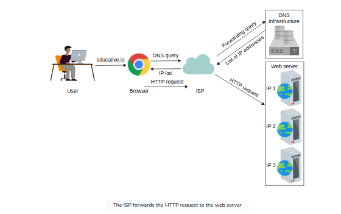
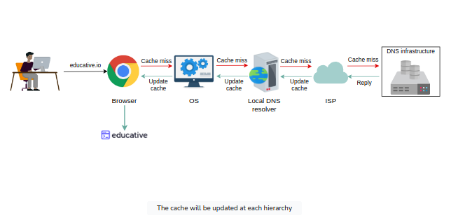
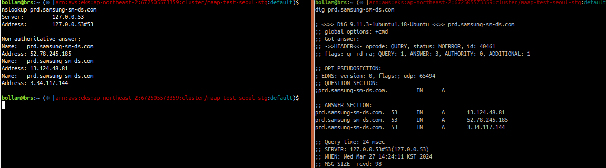
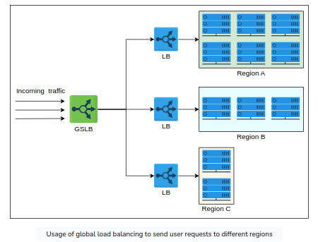
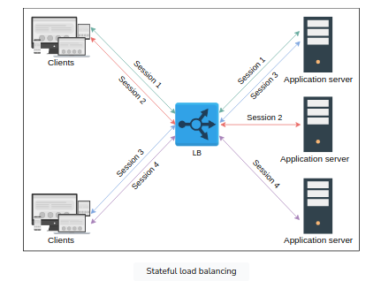
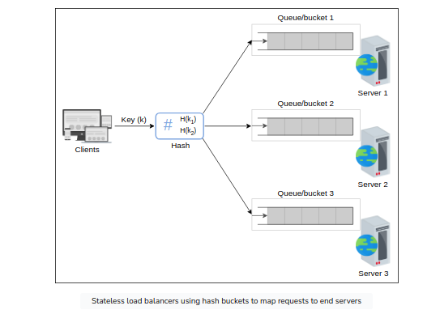
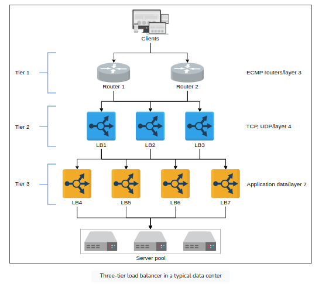
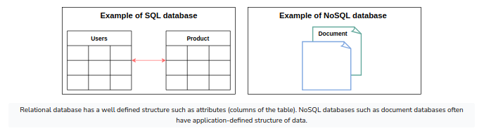

<!-- TOC -->
  * [1. Domain Name System](#1-domain-name-system)
    * [Important Details](#important-details)
    * [DNS hierarchy](#dns-hierarchy)
    * [DNS caching](#dns-caching)
    * [DNS as a distributed system](#dns-as-a-distributed-system)
    * [Test](#test)
  * [2. Load balancers](#2-load-balancers)
    * [Introduction](#introduction)
    * [Global server load balancers (GSLB)](#global-server-load-balancers--gslb-)
    * [Local Load balancers](#local-load-balancers)
    * [Advanced Load balancers](#advanced-load-balancers)
  * [3. Databases](#3-databases)
    * [Introduction](#introduction)
    * [Types of Database](#types-of-database)
    * [Data Replication](#data-replication)
    * [Data Partition](#data-partition)
    * [Trade-offs in Databases](#trade-offs-in-databases)
  * [4. Key-Value Store](#4-key-value-store)
  * [5. Content Delivery Network](#5-content-delivery-network)
  * [6. Sequencer](#6-sequencer)
  * [7. Service Monitoring](#7-service-monitoring)
  * [8. Distributed Caching](#8-distributed-caching)
  * [9. Distributed Messaging Queue](#9-distributed-messaging-queue)
  * [10. Publish-Subscribe System](#10-publish-subscribe-system)
  * [11. Rate Limiter](#11-rate-limiter)
  * [12. Blob Store](#12-blob-store)
  * [13. Distributed Search](#13-distributed-search)
  * [14. Distributed Logging](#14-distributed-logging)
  * [15. Distributed Task Scheduling](#15-distributed-task-scheduling)
  * [16. Shared Counters](#16-shared-counters)
<!-- TOC -->

## 1. Domain Name System
    DNS is the Internet's naming service that maps human-friendly domain names to machine-readable IP addresses.
    Typically DNS service is transparent to users. The browser translates the domain name to IP address via DNS Infra.

<kbd> 
    
</kbd>

### Important Details

    - Name servers: DNS isn't a single server. It's a complete infrastructure with numerous servers.
                    DNS servers that respond to the users' queries are called name servers.

    - Resource records: The DNS database stores domain name to IP address mappings in the form of
        record names (RR). The RR is the smallest unit of information that users request from the
        name servers. The 3 important pieces of information are type, name, and value.

| Type  | Description                                                                | Name       | Value          | Example(Type, Name, Value)                               |
|-------|----------------------------------------------------------------------------|------------|----------------|----------------------------------------------------------|
| A     | Provides the hostname to IP address mapping                                | Hostname   | IP address     | (A, relay1.main.educative.io,104,18.2.119)               |
| NS    | Provides the hostname that is the authoritative  DNS for a domain name | Domainname | Hostname       | (NS,educative.io, dns.educative.io)                      |
| CNAME | Provides the mapping from alias to canonical hostname                      | Hostname   | Canonical name | (CNAME, educative.io, server1.primary.educative.io)      |
| MX    | Provides the mapping of mail server from alias to canonoical hostname      | Hostname   | Canonical name | (MX, mail.educative.io, mailserver1.backup.educative.io) |

    
    - Caching: DNS uses caching at different layers to reduce request latency for the user.

    - Hierarchy: DNS name servers are hierarchical form. The hierarchical structure allows DNS to be highly scalable 
        because of its increasing size and query load. 

### DNS hierarchy
    - DNS isn't a single server that accepts requests and responds to queries. It's a complete infrastructure with
        "Name Servers" at different hierarchies. Below are the different types of servers in the DNS hierarchy.
        + DNS resolver: Resolvers initiate the querying sequence and forward requests to the other DNS name servers.
            Typically, DNS resolvers lie within the premis of the user's network. These servers can also be called
            as local or defaults servers. Caching technique is used fo cater DNS queries.

        + Root-level name servers: These servers receives requests from the local servers. Root name servers maintain
            name servers based on top-level domain names, such as .com, .edu, .us, and so on. When a user requests the
            IP address of "docker.io", root-level name servers will return a list of top-level domain (TLD) servers
            that hold the IP addresses of the .io domain.

        + Top-level domain(TLD) name servers: These servers hold the IP addresses of authoritative name servers. The
            querying party will get a list of IP addresses that belong to the authoritative servers of the organization.

        + Authoritative name servers: These are the organization's DNS name servers that provide the IP addresses of the
            web or application servers.

<kbd>

</kbd>

    - Typically, an iterative query is preferred to reduce query load on DNS infrastructure.

### DNS caching
    - A record is a data unit within the DNS database that shows a name-to-value binding. 
        Caching reduces response time to the user and decreases network traffic.
<kbd>

</kbd>

### DNS as a distributed system
    - Highly Scalable
        There are 13 logical root name servers (named letter A to M) with over 1,000 replicated instances
    spread throughout the world strategically to handle user queries and managed by 12 different organizations.
    
    - Reliable
        + Caching
            Caching is done in the browser, the OS, and the local name server, and the ISP DNS resolvers also maintain
            a rich cache of freqently visited services. Even if the servers are down, cached records can be served.
        + Server replicatons
            DNS has replicated copies of each logical server spread systematiclly across the globe to entertain users
            requests at low latency.
        + Protocol
            Many clients rely on the unrealiable UDP to request and recevie DNS response, but is fast and improves
            DNS performance. DNS queries are usually retransmitted at the transport layer if there's no response for
            the previous one. Therefore, request-response might need additional round trips, which provides a shorter
            delay as compared to TCP, which needs a three-way handshake every time before data exchange.

    - Consistent
        DNS provides eventual consistency and updates records on replicated servers lazily. Typically, it can take from
        few seconds up to three days on the DNS servers across the Internet.
        Consistency can suffer because of caching too. Since authoritativce servers are located within the ogranization,
        it may be possible that certain resource records are updated on the authoritative servers in case of server
        failures at the organization. To mitigate this issue, each cached record comes with an expiration 
        time called (TTL)

### Test
    nsloop => Non-Authoritative answer --> Refererence to cached response.
    dig => 53 refers to TTL and "Query time: 24 msec" refers to DNS response time
    
<kbd>

</kbd>

## 2. Load balancers

### Introduction
    The job of the load balancer is to faily divide all client's requests among the pool of available servers.
    Load balancers perform this  job to avoid overloading or crashing servers.

    The load balancing layer is the first point of contact within a data center after the firewall. They provide
    following capabilities:-

        - Scalability
            Load balancers make upscaling or downscaling of servers transparent to the end users. 

        - Availability
            One of the jobs of the load balancers is to hide faults and failuers of servers. Even if some servers
            go down or suffer a fault, the system still remains available.

        - Performance
            Load balancers can forward requests to servers with a lesser load so the user can get a 
            quicker response time. This not only improves performance but also improves resource utilization.

    Services offered by Load Balancers

        - Health checking: LBs use the heartbeat protocol to monitor the health and, therefore, reliability of end-servers.

        - TLS termination: LBs reduce the burden on end-servers by handling TLS termination with the client.

        - Predictive analytics: LBs can predict traffic patterns through analytics performed over traffic passing
            through them or using statistics of traffic obtained over time.

        - Service discovery: Client's requests are forwarded to appropriate hosting servers by inquiring about the
            server registry.

        - Security: LBs improve security by mitigating attacks like DoS at different layers of the OSI model (3,4, 7).

### Global server load balancers (GSLB)
    GSLB invovles the distribution of traffic load across multiple geographical regions. GSLB ensures that globally
    arriving traffic load is intelligently forwarded to a data center. 

    GSLB takes forwarding decisions based on the users' geographic locations, the number of hosting servers in 
    different locations, the health of data centers and so on. GSLB offers automatic zonal failover.
    Example: power or network failure in a data center requires that all the traffice be routed to another data center.  
    
    GSLB service can be installed on-premises or obtained through "Load balancing as a Service(LBaaS)".

<kbd>

</kbd>

### Local Load balancers
    Load balancing achieved within a data center. This type of load balancing focuses on improving efficieny and better
    resource utliziation of the hosting servers in a data center.
    They behave like a "reverse proxy" and make their best effort to divide incoming requests among the pool of 
    available servers. Incoming clients' requests seamlessly connect to the LB that uses a virtual IP address (VIP).

### Advanced Load balancers
    - Algorithms of load balancers
        + Round-robing scheduling - each request is forwarded to a server in the pool in a repeating sequential manner.

        + Weighted round-robin - If some servers have a higher capability of serving clients' requests, then it's 
            preferred to use a weighted round-robin algorithm. Each node is assigned a weight. LBs forward requests 
            according to the weight of the node. The higher the weight, higher the number of assignments.

        + Least connections - If all the servers have the same capacity to serve clients, uneven load on certain servers
            is still a possibility. Newer requests are assigned to servers with fewer existing connections. LBs keep
            a state of the number and mapping of existing connections in such a scenario.

        + Least response time - In performance-sensitive services, algorithms such as least response time are required.
            This algorithm ensures that the server with the least response time is requested to serve the clients.

        + IP hash - Some applications provide a different level of service to users based on their IP addresses. In that
            case, hashing the IP address is performed to assign users' requests to servers.

        + URL hash - It may be possible that some services within the application are provided by specific servers only.
            In that case, a client requesting service from a URL is assigned to a certain cluster or set of servers.
            The URL hasing algorithm is used in those scenarios.

        + Static vs dynamic algorithms
            - Static algorithms don't consider the changing state of the servers. Therefore, task assignment is carried
                out based on existing knowledge about the server's configuration. 
            
            - Dynamic algorithms consider the current or recent state of the servers. Dynamic algorithms maintain state
                by communicating with the server, which adds a communication overhead. State maintenance makes the 
                design of the algorithm much more complicated.

            In practice, dynamic algorithms provide far better results because they maintain a state of the serving 
            hosts and are, therefore, worth the effort and complexity.

        + Stateful load balancers versus stateless LBs
            - Stateful load balancing involved maintaining a state of the sessions established between clients and 
                hosting servers. The stateful LB incorporates state information in its algorithm to perform load 
                balancing. Stateful LBs increase complexity and limit scalability because session information of all the
                clients is maintained across all the load balancers.That is, load balancers share their state information
                with each other to make forwarding decisions.
<kbd>

</kbd>       

            - Stateless load balancing maintains no state and is, therefore, faster and light weight. Stateless LBs use
                consistent hashing to make forwarding decisions. However, if infrastructure changes (a new application
                server is added), stateless LBs may not be resilient as stateful LBs because consistent hashing alone
                isn't enough to route a request to the correct application server. Therefore, local state may still be
                required along with consistent hashing.
<kbd>

</kbd>   

    - Types of Load balancers
        + Layer 4 load balancer: Layer 4 refers to load balancing performed on the basis of transport protocol like 
            tcp/udp. These types of LBs maintain conneciton/session with the clients and ensure that the same TCP/UDP
            communication ends up being forwarded to the same back-end server. Even though TLS termination is performed
            at layer 7 LBs, some layer 4 LBs also support it.

        + Layer 7 load balancer: Layer 7 load balancers are based on the data of application layer protocols. It's 
            possible to make application-aware forwarding decisions based on HTTP headers, URLs,  cookies, and other
            application-specific data- for example, user ID. Apart from TLS termination, these LBs can take 
            responsibility like rate limiting users, HTTP routing, and header rewriting.

        Layer 7 load balancers are smart in terms of inspection. However layer 4 load balancers are faster in terms of
        processing.

    - Load balancer deployments
        In practice, a single layer LB isn't enough for a large data center. In fact, multiple layers of load balancers
        coordinate to take informed forwarding decisions as shown below:-
<kbd>

</kbd>   

        + Tier-0 and Tier-1 LBs: If DNS can be considered as the tier-0 load balancer, equal cost multipath (ECMP)
            routers are the tier-1 LBs. ECMP routers divides incoming traffic on the basis of IP or some other algo
            like round-robin or weighted round-robin. Tier-1 LBs will balance the load across different paths to higher
            tiers of load balancers.
            ECMP routers play a vital role in the horizontal scalability of the higher-tier LBs.

        + Tier-2 LBs: The Tier-2 LBs include layer 4 load balancers. They make sure that for any connection, all incoming
            packets are forwarded to the same tier-3 LBs. Consistent Hashing can be used for this purpose. Since hashing
            has limiation with infra changes, local or global state needs to be maintained.
            Tier-2 LBs glues Tier-1 and Tier-3 LBs.

        + Tier-3 LBs: These LBs are in direct contact with the back-end servers, they perform health monitoring of
            servers at HTTP level. This tier enables scalability by evenly distributing requests amoung  the set of 
            healthy back-end servers.
            This tier also reduces the burden on end-servers by handling low-level details like TCP-congestion control
            protocols, the discover of Path MTU (maximum transmission unit), the difference in application protocol
            between client and back-end servers, and so on.

        Tier-1 balances the load among the load balancers themselves. 
        Tier 2 enables a smooth transition from tier-1 and tier-3 in case of failures
        Tier-3 does the actual load balancing between the back-end servers. 
            
## 3. Databases

### Introduction

    + For an application like WhatsApp, why can't we store information in a File?
        1. We can't offer concurrent managmentto seperate users accesssing the storage files fromd different loc.
        2. We can't grant different access rights to different users.
        3. How will the system scale and be available when adding thousands of entires?
        4. How will we search content for different users in a short time?

    A database is an organized collection of data that can be managed and accessed easily. Databases are created to
    make it easier to store, retrieve, modify, and delete data in connection with different data-processing procedures.

    + Two basic types of databases:
        - SQL (relational database)
            Relational databases, like phone books that record contact numbers and addresses, are organized 
            and have predetermined schemas.
        - NoSQL (non-relational database)
            Non-Relational databases, like file directories that store anything from a person's constant information
            to shopping preferences, are unstructured, scattered, and feature a dynamic schema.
<kbd>

</kbd>

    + Reasons why a database is important
        - Managing large data: A large amount of data can be easily handled with a database, which wouldn't be
            possible using other tools.

        - Retrieving accurate data (data consistency): Due to different constraints in databases, we can retrieve
            accurate data whenever we want.

        - Easy Updation: It is quite easy to update data in databases using data manipulation language (DML).
    
        - Security: Databases ensure the security of the data. A database only allows authorized users to access data.

        - Data Integrity

        - Availability

        - Scalability

### Types of Database

### Data Replication

### Data Partition

### Trade-offs in Databases

## 4. Key-Value Store

## 5. Content Delivery Network

## 6. Sequencer

## 7. Service Monitoring

## 8. Distributed Caching

## 9. Distributed Messaging Queue

## 10. Publish-Subscribe System

## 11. Rate Limiter

## 12. Blob Store

## 13. Distributed Search

## 14. Distributed Logging

## 15. Distributed Task Scheduling

## 16. Shared Counters
