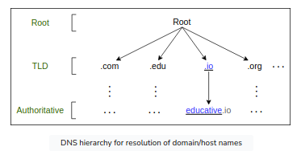

<!-- TOC -->
  * [1. Domain Name System](#1-domain-name-system)
    * [Important Details](#important-details)
    * [DNS hierarchy](#dns-hierarchy)
    * [DNS caching](#dns-caching)
    * [DNS as a distributed system](#dns-as-a-distributed-system)
    * [Test](#test)
  * [2. Load balancers](#2-load-balancers)
    * [Introduction](#introduction)
    * [Global server load balancers (GSLB)](#global-server-load-balancers--gslb-)
    * [Local Load balancers](#local-load-balancers)
    * [Advanced Load balancers](#advanced-load-balancers)
  * [3. Databases](#3-databases)
    * [Introduction](#introduction)
    * [Types of Database](#types-of-database)
      * [1. Relational Database](#1-relational-database)
        * [Flexibility](#flexibility)
        * [Reduced redundancy](#reduced-redundancy)
        * [Concurrency](#concurrency)
        * [Integration](#integration)
        * [Backup and disaster recovery](#backup-and-disaster-recovery)
        * [Drawbacks of Relational databases](#drawbacks-of-relational-databases)
      * [2. Non-Relational Database](#2-non-relational-database)
        * [Simple design](#simple-design)
        * [Horizontal scaling](#horizontal-scaling)
        * [Availability](#availability)
        * [Support for unstructured and semi-structured data](#support-for-unstructured-and-semi-structured-data)
        * [Cost](#cost)
    * [Data Replication](#data-replication)
      * [Synchronous Vs Asynchronous](#synchronous-vs-asynchronous)
      * [Data replication models](#data-replication-models)
        * [1. Single leader/primary-secondary replication](#1-single-leaderprimary-secondary-replication)
        * [2. Multi-leader replication](#2-multi-leader-replication)
        * [3. Peer to peer/leaderless replication](#3-peer-to-peerleaderless-replication)
    * [Data Partition](#data-partition)
      * [Sharding](#sharding)
        * [1. Vertical Sharding](#1-vertical-sharding)
        * [2. Horizontal Sharding](#2-horizontal-sharding)
        * [3. Re-balance the partitions](#3-re-balance-the-partitions)
      * [Request Routing](#request-routing)
        * [1. ZooKeeper](#1-zookeeper)
    * [Trade-offs in Databases](#trade-offs-in-databases)
      * [Centralized database](#centralized-database)
      * [Distributed database](#distributed-database)
      * [Query optimization and processing speed in a distributed database](#query-optimization-and-processing-speed-in-a-distributed-database)
      * [Parameters assumption](#parameters-assumption)
      * [Possible approaches](#possible-approaches)
  * [4. Key-Value Store](#4-key-value-store)
    * [Design of a key-value store](#design-of-a-key-value-store)
      * [Requirements](#requirements)
      * [Assumptions](#assumptions)
      * [API design](#api-design)
    * [Ensure Scalability](#ensure-scalability)
    * [Ensure Replication](#ensure-replication)
    * [Versioning Data and Archiving](#versioning-data-and-archiving)
    * [Enable Fault Tolerance and Failure Detection](#enable-fault-tolerance-and-failure-detection)
  * [5. Content Delivery Network](#5-content-delivery-network)
    * [System Design: The Content Delivery Network (CDN)](#system-design--the-content-delivery-network--cdn-)
    * [Introduction to CDN](#introduction-to-cdn)
    * [In-depth Investigation of CDN:](#in-depth-investigation-of-cdn-)
    * [Evaluation of CDN Design](#evaluation-of-cdn-design)
  * [6. Sequencer](#6-sequencer)
    * [System Design Sequencer](#system-design-sequencer)
    * [Design of a Unique ID Generator](#design-of-a-unique-id-generator)
      * [First solution: UUID](#first-solution--uuid)
      * [Second solution: using a database](#second-solution--using-a-database)
      * [Third solution: using a range handler](#third-solution--using-a-range-handler)
    * [Unique IDs with Causality](#unique-ids-with-causality)
      * [UNIX time stamps](#unix-time-stamps)
      * [Twitter Snowflake](#twitter-snowflake)
      * [Using logical clocks](#using-logical-clocks)
      * [TrueTime API](#truetime-api)
  * [7. Distributed Monitoring](#7-distributed-monitoring)
    * [Distributed Monitoring](#distributed-monitoring)
      * [System Design](#system-design)
      * [Pre-requisites](#pre-requisites)
    * [Monitor Service-side errors](#monitor-service-side-errors)
      * [System Design](#system-design)
      * [Visualize](#visualize)
    * [Monitor Client-side errors](#monitor-client-side-errors)
      * [System Design](#system-design)
  * [8. Distributed Caching](#8-distributed-caching)
    * [System Design](#system-design)
    * [High-level Design](#high-level-design)
    * [Detailed Design](#detailed-design)
    * [Evaluation](#evaluation)
    * [Memcached vs Redis](#memcached-vs-redis)
  * [9. Distributed Messaging Queue](#9-distributed-messaging-queue)
    * [Requirements](#requirements)
    * [Considerations](#considerations)
    * [System Design](#system-design)
    * [Evaluation](#evaluation)
  * [10. Publish-Subscribe System](#10-publish-subscribe-system)
    * [System Design](#system-design)
  * [11. Rate Limiter](#11-rate-limiter)
    * [Requirements](#requirements)
    * [System Design](#system-design)
    * [Algorithms](#algorithms)
  * [12. Blob Store](#12-blob-store)
    * [Requirements](#requirements)
    * [System Design](#system-design)
    * [Evaluation](#evaluation)
  * [13. Distributed Search](#13-distributed-search)
    * [Requirements](#requirements)
    * [Indexing](#indexing)
    * [System Design](#system-design)
    * [Scaling](#scaling)
    * [Evaluation](#evaluation)
  * [14. Distributed Logging](#14-distributed-logging)
    * [System Design](#system-design)
  * [15. Distributed Task Scheduling](#15-distributed-task-scheduling)
    * [Requirements](#requirements)
    * [System Design](#system-design)
    * [Evaluation](#evaluation)
  * [16. Shared Counters](#16-shared-counters)
    * [High-level Design](#high-level-design)
    * [System Design](#system-design)
<!-- TOC -->

## 1. Domain Name System
DNS is the Internet's naming service that maps human-friendly domain names to machine-readable IP addresses.
Typically, DNS service is transparent to users. The browser translates the domain name to IP address via DNS Infra.

<kbd> 
    
</kbd>

### Important Details

- Name servers: DNS isn't a single server. It's a complete infrastructure with numerous servers.
                DNS servers that respond to the users' queries are called name servers.

- Resource records: The DNS database stores domain name to IP address mappings in the form of
    record names (RR). The RR is the smallest unit of information that users request from the
    name servers. The 3 important pieces of information are type, name, and value.

| Type  | Description                                                                | Name       | Value          | Example(Type, Name, Value)                               |
|-------|----------------------------------------------------------------------------|------------|----------------|----------------------------------------------------------|
| A     | Provides the hostname to IP address mapping                                | Hostname   | IP address     | (A, relay1.main.educative.io,104,18.2.119)               |
| NS    | Provides the hostname that is the authoritative  DNS for a domain name | Domainname | Hostname       | (NS,educative.io, dns.educative.io)                      |
| CNAME | Provides the mapping from alias to canonical hostname                      | Hostname   | Canonical name | (CNAME, educative.io, server1.primary.educative.io)      |
| MX    | Provides the mapping of mail server from alias to canonoical hostname      | Hostname   | Canonical name | (MX, mail.educative.io, mailserver1.backup.educative.io) |

    
- Caching: DNS uses caching at different layers to reduce request latency for the user.

- Hierarchy: DNS name servers are hierarchical form. The hierarchical structure allows DNS to be highly scalable 
    because of its increasing size and query load. 

### DNS hierarchy
- DNS isn't a single server that accepts requests and responds to queries. It's a complete infrastructure with
    "Name Servers" at different hierarchies. Below are the different types of servers in the DNS hierarchy.
    + DNS resolver: Resolvers initiate the querying sequence and forward requests to the other DNS name servers.
        Typically, DNS resolvers lie within the premis of the user's network. These servers can also be called
        as local or defaults servers. Caching technique is used fo cater DNS queries.

    + Root-level name servers: These servers receives requests from the local servers. Root name servers maintain
        name servers based on top-level domain names, such as .com, .edu, .us, and so on. When a user requests the
        IP address of "docker.io", root-level name servers will return a list of top-level domain (TLD) servers
        that hold the IP addresses of the .io domain.

    + Top-level domain(TLD) name servers: These servers hold the IP addresses of authoritative name servers. The
        querying party will get a list of IP addresses that belong to the authoritative servers of the organization.

    + Authoritative name servers: These are the organization's DNS name servers that provide the IP addresses of the
        web or application servers.

<kbd>

</kbd>

- Typically, an iterative query is preferred to reduce query load on DNS infrastructure.

### DNS caching
- A record is a data unit within the DNS database that shows a name-to-value binding. 
    Caching reduces response time to the user and decreases network traffic.

<kbd>

</kbd>

### DNS as a distributed system
- Highly Scalable
    There are 13 logical root name servers (named letter A to M) with over 1,000 replicated instances
spread throughout the world strategically to handle user queries and managed by 12 different organizations.

- Reliable
    + Caching is done in the browser, the OS, and the local name server, and the ISP DNS resolvers also maintain
        a rich cache of freqently visited services. Even if the servers are down, cached records can be served.
    + Server replications
        DNS has replicated copies of each logical server spread systematiclly across the globe to entertain users
        requests at low latency.
    + Protocol
        Many clients rely on the unrealiable UDP to request and recevie DNS response, but is fast and improves
        DNS performance. DNS queries are usually retransmitted at the transport layer if there's no response for
        the previous one. Therefore, request-response might need additional round trips, which provides a shorter
        delay as compared to TCP, which needs a three-way handshake every time before data exchange.

- Consistent
    DNS provides eventual consistency and updates records on replicated servers lazily. Typically, it can take from
    few seconds up to three days on the DNS servers across the Internet.
    Consistency can suffer because of caching too. Since authoritativce servers are located within the ogranization,
    it may be possible that certain resource records are updated on the authoritative servers in case of server
    failures at the organization. To mitigate this issue, each cached record comes with an expiration 
    time called (TTL)

### Test
    nsloop => Non-Authoritative answer --> Refererence to cached response.
    dig => 53 refers to TTL and "Query time: 24 msec" refers to DNS response time
    
<kbd>

</kbd>

## 2. Load balancers

### Introduction
The job of the load balancer is to faily divide all client's requests among the pool of available servers.
Load balancers perform this  job to avoid overloading or crashing servers.

The load balancing layer is the first point of contact within a data center after the firewall. They provide
following capabilities:-

- Scalability - Load balancers make upscaling or downscaling of servers transparent to the end users. 

- Availability - One of the jobs of the load balancers is to hide faults and failuers of servers. Even if some servers
    go down or suffer a fault, the system still remains available.

- Performance - Load balancers can forward requests to servers with a lesser load so the user can get a 
    quicker response time. This not only improves performance but also improves resource utilization.

Services offered by Load Balancers

- Health checking: LBs use the heartbeat protocol to monitor the health and, therefore, reliability of end-servers.

- TLS termination: LBs reduce the burden on end-servers by handling TLS termination with the client.

- Predictive analytics: LBs can predict traffic patterns through analytics performed over traffic passing
    through them or using statistics of traffic obtained over time.

- Service discovery: Client's requests are forwarded to appropriate hosting servers by inquiring about the
    server registry.

- Security: LBs improve security by mitigating attacks like DoS at different layers of the OSI model (3,4, 7).

### Global server load balancers (GSLB)
GSLB involves the distribution of traffic load across multiple geographical regions. GSLB ensures that globally
arriving traffic load is intelligently forwarded to a data center. 

GSLB takes forwarding decisions based on the users' geographic locations, the number of hosting servers in 
different locations, the health of data centers and so on. GSLB offers automatic zonal failover.
Example: power or network failure in a data center requires that all the traffice be routed to another data center.  

GSLB service can be installed on-premises or obtained through "Load balancing as a Service(LBaaS)".

<kbd>

</kbd>

### Local Load balancers
Load balancing achieved within a data center. This type of load balancing focuses on improving efficieny and better
resource utliziation of the hosting servers in a data center.
They behave like a "reverse proxy" and make their best effort to divide incoming requests among the pool of 
available servers. Incoming clients' requests seamlessly connect to the LB that uses a virtual IP address (VIP).

### Advanced Load balancers
- **Algorithms of load balancers**
    + **Round-robing scheduling** - each request is forwarded to a server in the pool in a repeating sequential manner.

    + **Weighted round-robin** - If some servers have a higher capability of serving clients' requests, then it's 
        preferred to use a weighted round-robin algorithm. Each node is assigned a weight. LBs forward requests 
        according to the weight of the node. The higher the weight, higher the number of assignments.

    + **Least connections** - If all the servers have the same capacity to serve clients, uneven load on certain servers
        is still a possibility. Newer requests are assigned to servers with fewer existing connections. LBs keep
        a state of the number and mapping of existing connections in such a scenario.

    + **Least response time** - In performance-sensitive services, algorithms such as least response time are required.
        This algorithm ensures that the server with the least response time is requested to serve the clients.

    + **IP hash** - Some applications provide a different level of service to users based on their IP addresses. In that
        case, hashing the IP address is performed to assign users' requests to servers.

    + **URL hash** - It may be possible that some services within the application are provided by specific servers only.
        In that case, a client requesting service from a URL is assigned to a certain cluster or set of servers.
        The URL hasing algorithm is used in those scenarios.

    + **Static vs dynamic algorithms**
        - Static algorithms don't consider the changing state of the servers. Therefore, task assignment is carried
            out based on existing knowledge about the server's configuration. 
            
        - Dynamic algorithms consider the current or recent state of the servers. Dynamic algorithms maintain state
            by communicating with the server, which adds a communication overhead. State maintenance makes the 
            design of the algorithm much more complicated.

        In practice, dynamic algorithms provide far better results because they maintain a state of the serving 
        hosts and are, therefore, worth the effort and complexity.

**Stateful load balancers versus stateless LBs**

- Stateful load balancing involved maintaining a state of the sessions established between clients and 
    hosting servers. The stateful LB incorporates state information in its algorithm to perform load 
    balancing. Stateful LBs increase complexity and limit scalability because session information of all the
    clients is maintained across all the load balancers.That is, load balancers share their state information
    with each other to make forwarding decisions.

<kbd>

</kbd>       

- Stateless load balancing maintains no state and is, therefore, faster and light weight. Stateless LBs use
    consistent hashing to make forwarding decisions. However, if infrastructure changes (a new application
    server is added), stateless LBs may not be resilient as stateful LBs because consistent hashing alone
    isn't enough to route a request to the correct application server. Therefore, local state may still be
    required along with consistent hashing.

<kbd>

</kbd>   

- **Types of Load balancers**
    + **Layer 4 load balancer**: Layer 4 refers to load balancing performed on the basis of transport protocol like 
        tcp/udp. These types of LBs maintain conneciton/session with the clients and ensure that the same TCP/UDP
        communication ends up being forwarded to the same back-end server. Even though TLS termination is performed
        at layer 7 LBs, some layer 4 LBs also support it.

    + **Layer 7 load balancer**: Layer 7 load balancers are based on the data of application layer protocols. It's 
        possible to make application-aware forwarding decisions based on HTTP headers, URLs,  cookies, and other
        application-specific data- for example, user ID. Apart from TLS termination, these LBs can take 
        responsibility like rate limiting users, HTTP routing, and header rewriting.

    Layer 7 load balancers are smart in terms of inspection. However layer 4 load balancers are faster in terms of
    processing.

- **Load balancer deployments**
    In practice, a single layer LB isn't enough for a large data center. In fact, multiple layers of load balancers
    coordinate to take informed forwarding decisions as shown below:-
<kbd>

</kbd>   

    + **Tier-0 and Tier-1 LBs**: If DNS can be considered as the tier-0 load balancer, equal cost multipath (ECMP)
        routers are the tier-1 LBs. ECMP routers divides incoming traffic on the basis of IP or some other algo
        like round-robin or weighted round-robin. Tier-1 LBs will balance the load across different paths to higher
        tiers of load balancers.
        ECMP routers play a vital role in the horizontal scalability of the higher-tier LBs.

    + **Tier-2 LBs**: The Tier-2 LBs include layer 4 load balancers. They make sure that for any connection, all incoming
        packets are forwarded to the same tier-3 LBs. Consistent Hashing can be used for this purpose. Since hashing
        has limiation with infra changes, local or global state needs to be maintained.
        Tier-2 LBs glues Tier-1 and Tier-3 LBs.

    + **Tier-3 LBs**: These LBs are in direct contact with the back-end servers, they perform health monitoring of
        servers at HTTP level. This tier enables scalability by evenly distributing requests amoung  the set of 
        healthy back-end servers.
        This tier also reduces the burden on end-servers by handling low-level details like TCP-congestion control
        protocols, the discover of Path MTU (maximum transmission unit), the difference in application protocol
        between client and back-end servers, and so on.

    Tier-1 balances the load among the load balancers themselves. 
    Tier 2 enables a smooth transition from tier-1 and tier-3 in case of failures
    Tier-3 does the actual load balancing between the back-end servers. 
            
## 3. Databases

### Introduction

+ For an application like WhatsApp, why can't we store information in a File?
    1. We can't offer concurrent managment to seperate users accessing the storage files fromd different loc.
    2. We can't grant different access rights to different users.
    3. How will the system scale and be available when adding thousands of entires?
    4. How will we search content for different users in a short time?

A database is an organized collection of data that can be managed and accessed easily. Databases are created to
make it easier to store, retrieve, modify, and delete data in connection with different data-processing procedures.

+ Two basic types of databases:
    - SQL (relational database)
        Relational databases, like phone books that record contact numbers and addresses, are organized 
        and have predetermined schemas.
    - NoSQL (non-relational database)
        Non-Relational databases, like file directories that store anything from a person's constant information
        to shopping preferences, are unstructured, scattered, and feature a dynamic schema.
  
<kbd>

</kbd>

+ Reasons why a database is important
    - Managing large data: A large amount of data can be easily handled with a database, which wouldn't be
        possible using other tools.

    - Retrieving accurate data (data consistency): Due to different constraints in databases, we can retrieve
        accurate data whenever we want.

    - Easy Updation: It is quite easy to update data in databases using data manipulation language (DML).

    - Security: Databases ensure the security of the data. A database only allows authorized users to access data.

    - Data Integrity: Databases ensure data integrity by using different constraints of data.

    - Availability: Databases can be replicated on different servers, which can be concurrently updated. These
        replicas ensure availability.

    - Scalability: Databases are divided (using data paritioning) to manage the load on a single node. 
        This increases scalability.            

### Types of Database

#### 1. Relational Database
    Relational databases adhere to particular schemas before stroing the data. The data stored in relational databases
    has prior structure. Mostly, this model organizes data into one or more relations called tables, with a unique key
    for each tuple
    Since each tuple has a unique key, a tuple in one table can be linked to a tuple in other tables by storing the
    primary keys in other tables, generally known as foreign keys.

    A SQL (Structural Querying Language) is used for manipulating the database. This includes insertion, deletion, and
    retrieval of data.

    Relational databases provide Atomicity, consistency, isolation and durablity (ACID) properties to maintain the
    integrity of the database. 
        - Atomicity: A transasction is considered an atomic unit. If a statement fails within a transaction, it should
            be aborted and rolled back.
        - Consistency: At any given time, the database should be in a consistent stated, and it should remain consistent
            after every transaction.
        - Isolation: In the case of multiple transactions running concurrently, they shouldn't be affected by each
            other. The final state of the database should be the same as the transactions were executed sequentially.
        - Durability: The system should guarantee that completed transactions will survive permanently in the database
            even in system failures.

        Examples - MySQL, Oracle Database, Microsoft SQL Server, IBM DB2, Postgres, SQLite

    One of the greatest powers of the relational database is its abstractions of ACID transactions and related 
    programming semantics.

##### Flexibility
    In the context of SQL, DDL (Data Definition Language) provides us the flexibility to modify the database, including
    tables, columns, renaming the tables, and other changes. DDL even allows us to modify the schema while other 
    queries are happening and the database server is running.

##### Reduced redundancy

    One of the biggest advantages of the relational database is that it eliminates data redundancy. The information
    related to a specific entity appears in one table while the relevant data to that specific entity apprears in the
    other tables linked through foriegn keys. This process is called normalization and has the additional benefit of
    removing an inconsistent dependency.

##### Concurrency

    A transaction is considered an atomic operation, so it also works in error handling to either roll back or commit
    a transaction on successful execution.

##### Integration

    The process of aggregating data from multiple sources is a common practice in enterprise applications. A common
    way to perform this aggregation is to integrate a shared database where multiple applications store their data.

##### Backup and disaster recovery

    Relational databases gurantee the state of data is consistent at any time. Most cloud-based relational databases
    perform continous mirroing to avoid loss of data and make the restoration process easier and quicker.

##### Drawbacks of Relational databases

**Impedance mismatch** 
   Impedance mismatch is the difference between the relational model and the in-memory data structures. One is a 
   structured data and other is a complex in-memory data structure. so, the impedence mismatch requires translation
   between two representations.

#### 2. Non-Relational Database

A NoSQL database is designed for a variety of data models to access and manage data. These databases are used in
applications that require a large volume of semi-structured and unstructured data, low latency, and flexible data
models.

##### Simple design
Unlike relational databases, NoSQL doesn't require dealing with the impedance mismatch - for ex
storing all the employees' data in one document instead of multiple tables that require join operations. This
strategy makes it simple and easier to write less code, debug, and maintain.

##### Horizontal scaling
Primarily, NoSQL is preferred due to its ability to run databases on a large scale. As the
data is stored in one document. NoSQL databases often spread data across multiple nodes and balance data and
queries across nodes automatically. In case of a node failure, it can be transparently replaced without any
application disruption.

##### Availability
To enhace the availability of data, node replacement can be performed without application downtime.
Data replication is supported to ensure high availability and disaster recovery.

##### Support for unstructured and semi-structured data
Many NoSQL databases work with data that doesn't have schema
at the time of database configuration or data writes. For ex: document databases are structureless; they allow
documents (JSON, XML, BSON and so on) to have different fields.

##### Cost
Licenses for many RDBMSs are pretty expensive, while many NoSQL databases are opensource and freely availble

**Types of Databases**

<kbd>

</kbd>

**Key-Value database**: use key-value methods like hash tables to store data in key-value pairs.
    Key servers as a unique or primary key, and the values can be anything ranging from simple 
    scalar values to complex objects.
    Allow easy partitioning and horizontal scaling of the data.
    Examples: Amazon DynamoDB, Redis, and Memcached DB.

<kbd>

</kbd>

**Use Case**: Key-value databases are efficient for session-oriented applications. Session oriented-applications,
such as web applications, store users' data in the main memory or in a database during a session.

**Document database**: is designed to store and retrieve documens in formats like XMl, JSON, BSON, and so on.
    These documents are composed of hierarchical tree data structure that can include maps, collections, and 
    scalar values. Documents in this type of database may have varying structures and data.
    Examples : MongoDB, Google Cloud Firestore.

<kbd>

</kbd>

**Use Case**: Suitable for unstructured catalog data, like JSON files or other complex structured hierarchical data.
for example in e-commerce applications, a product has thousands of attributes, which is unfeasible to store in a
relational database due to its impact on the reading performance.

**Graph database**: uses graph data structure to store data, where nodes represent entities, and edges show
    relationships between entities. The organizaton of nodes based on relationships leads to interesting patterns
    between the nodes. This database allows us to store the data once and then interpret it differently based on
    relationships. Graph data is kept in store files for persistent storage.
    Examples: Neo4J, OrientDB, InfiniteGraph.

<kbd>

</kbd>

**UseCase**: can be used in social applications and provide interesting facts and figures among different kinds of users
and their activities. The focus of graph database is to store data and pave the way to drive analyses and decisions 
based on relationships between entities. The nature of graph databases makes them suitable for various applications
such as data regulation and privacy, machine learning research, financial services-based applications and many more.

**Columnar database**: store data in columns instead of rows. They enable across to all entries in the database column
quickly and efficiently. Popular columnar databases include Cassandra, HBase, Hypertable, and Amazon redshift.

<kbd>

</kbd>

**UseCase**: Columnar database are efficient for a large number of aggregation and data analytics queries. It 
drastically reduces the disk I/O requirements and the amount of data required to load from the disk. For example, in
applications related to financial institutions, there's a need to sum the financial transaction over a period of time.
Columnar databases make this operation quicker by just reading the column for the amount of money, ignoring other
attributes of customers.

**Choosing the right database**

| Relational database                                                   | Non-relational database                             |
|-----------------------------------------------------------------------|-----------------------------------------------------|
| If the data to be stored is structured                                | If the data to be stored is unstructured            |
| If ACID properties are required                                       | If there's a need to serialize  and deserialize data |
| If the size of the data is relatively small and can fit on a node | If the size of the data to be stored is large       |

**Drawbacks of NoSQL databases**

**Lack of standardization** - NoSQL doesn't follow any specific standard, like how relational database follow relational
algebra. Porting applications from one type of NoSQL database to another might be a challenge.

**Consistency** - NoSQL provides different products based on the specific trade-offs between consistency and 
availability when failures can happen. We won't have strong data integrity, like primary and referential integrities in
a relational database.

Data might not be strongly consistent but slowly converging using a weak model like eventual consistency.

### Data Replication

Following characteristics are required from a data store :- 
- Availability under faults (failure of some disk, nodes, and network and power outages).
- Scalability (with increasing reads, writes, and other operations).
- Performance (low latency and high throughput for the clients).

It's challenging, or even impossible, to achieve the above characteristics on a single node.

**Replication** refers to keeping multiple copies of the data at various nodes (preferably geographically distributed)
to achieve availability, and performance.  

Replication is relatively simple if the replicated data doesn't frequent changes. The main problem in replication arises
when we have to maintain changes in the replicated data over time.

<kbd>

</kbd>

**Additional complexities** :-
1. How do we keep multiple copies of data consistent with each other?
2. How do we deal with failed replica nodes?
3. Should we replicate synchronously or asynchronously? 
   * How to deal with replication lag in case of asynchronous replication?
4. How do we handle concurrent writes?
5. What consistency model needs to be exposed to the end programmers?

#### Synchronous Vs Asynchronous

There are two ways to disseminate changes to the replica node:
- Synchronous replication
  - Primary node waits for acknowledgment from secondary nodes about updating the data. After receiving all
  the acknowledgments, primary node reports success to the client.
  
- Asynchronous replication
  - Primary node doesn't wait for the acknowledgment from the secondary nodes and reports success to the 
    client after updating itself.

<kbd>

</kbd>

#### Data replication models

##### 1. Single leader/primary-secondary replication
Data is replicated across multiple nodes. One node is designated as the primary. It's responsible for processing any
write to data stored on the cluster. It also sends all the writes to the secondary nodes and keep them in sync.

Appropriate for read-heavy workloads. However, replicating data to many followers can make a primary bottleneck.
In appropriate if workload is write-heavy.

It is read resilient. Secondary nodes can still handle read requests in case of primary node failure.

<kbd>

</kbd>

There are many replication methods in primary-secondary replication-

- Statement-based replication
- Write-ahead log (WAL) shipping
- Logical (row-based) replication

**Statement-based replication** (SBR) is an approach used in MySQL databases. In this approach, the primary 
node executes the SQL statements such as INSERT, UPDATE, DELETE, etc., and then the statements are written into a 
log file. 

In the next step, the log file is sent to the secondary nodes for execution. This type of replication was used in 
MySQL before version 5.1.

While this type of replication seems good, it also has some disadvantages. For example, any nondeterministic functions 
such as NOW() might result in distinct writes on the primary and secondary nodes.

**Write-ahead log** (WAL) shipping is a data replication technique used in both PostgreSQL and Oracle. 
In this technique, when a transaction occurs, it’s initially recorded in a transactional log file, and the 
log file is written to disk. 

Subsequently, the recorded operations are executed on the primary database before being transmitted to 
secondary nodes for execution. Unlike SBR, WAL maintains transactional logs instead of SQL statements into a 
log file, ensuring consistency when dealing with nondeterministic functions. 

Writing to disk also aids in recovery in case of crash failures

For example, when an operation like an UPDATE is executed in PostgreSQL, it’s first written to the transactional 
log file and disk before being applied to the database. This entry in the transactional log can include details 
such as the transaction ID, operation type, affected table, and new values, after which the changes are replicated 
to the secondary nodes. However, the drawback of WAL is its tight coupling with the inner structure of the database 
engine, making software upgrades on the leader and followers complicated.

**Logical (row-based) replication** is utilized in various relational databases, including PostgreSQL and MySQL. 
In this approach, changes made to the database are captured at the level of individual rows and then replicated 
to the secondary nodes. Instead of replicating the actual physical changes made to the database, this approach 
captures the operations in a logical format and then executes them on secondary nodes.

For example, when operations like INSERT or UPDATE are performed, the entire affected row is captured on the 
primary node, containing all the column values of the specified row. This captured change is then executed on 
secondary nodes, where they ensure that the data remains consistent with the data on the primary node. It offers 
advantages in terms of flexibility and compatibility with different types of schemas.

##### 2. Multi-leader replication

**Multi-leader replication** is an alternative to single leader replication. There are multiple primary nodes that 
process the writes and send them to all other primary and secondary nodes to replicate. This type of replication is 
used in databases along with external tools like the Tungsten Replicator for MySQL.

This kind of replication is quite useful in applications in which we can continue work even if we’re offline—for 
example, a calendar application in which we can set our meetings even if we don’t have access to the internet. 
Once we’re online, it replicates its changes from our local database (our mobile phone or laptop acts as a 
primary node) to other nodes.

<kbd>

</kbd>

**Conflict**
Multi-leader replication gives better performance and scalability than single leader replication, but it also 
has a significant disadvantage. Since all the primary nodes concurrently deal with the write requests, they may 
modify the same data, which can create a conflict between them. For example, suppose the same data is edited by 
two clients simultaneously. In that case, their writes will be successful in their associated primary nodes, but 
when they reach the other primary nodes asynchronously, it creates a conflict.

**Handle conflicts**

<kbd>

</kbd>

_Conflict Avoidance_
A simple strategy to deal with conflicts is to prevent them from happening in the first place. 
Conflicts can be avoided if the application can verify that all writes for a given record go via the same leader.

However, the conflict may still occur if a user moves to a different location and is now near a different 
data center. If that happens, we need to reroute the traffic. In such scenarios, the conflict avoidance approach 
fails and results in concurrent writes.

_Last-write-wins_
Using their local clock, all nodes assign a timestamp to each update. When a conflict occurs, the update with 
the latest timestamp is selected. But clock synchronization across nodes is challenging in distributed systems. 

_Custom logic_
Write own logic to handle conflicts according to the needs of our application.

##### 3. Peer to peer/leaderless replication
In primary-secondary replication, the primary node is a bottleneck and a single point of failure. Moreover, it 
helps to achieve read scalability but fails to provide write scalability. The peer-to-peer replication model 
resolves these problems by not having a single primary node. All the nodes have equal weightage and can accept 
read and write requests. This replication scheme can be found in the Cassandra database.

<kbd>

</kbd>

Like primary-secondary replication, this replication can also yield inconsistency. This is because when several 
nodes accept write requests, it may lead to concurrent writes. A helpful approach used for solving write-write 
inconsistency is called quorums.

_Quorums_
Let’s suppose we have three nodes. If at least two out of three nodes are guaranteed to return successful updates, 
it means only one node has failed. This means that if we read from two nodes, at least one of them will have the 
updated version, and our system can continue working.

<kbd>

</kbd>

If we have n nodes, then every write must be updated in at least w nodes to be considered a success, and we must read
from r nodes. We'll get an updated value from reading as long as w+r > n because at least one of the nodes must have
an updated write from which we can read. Quorum reads and writes adhere to these r and w values. Then n, w, and r  are
configurable in Dynamo-style databases.

### Data Partition
Data is an asset for any organization. Increasing data and concurrent read/write traffic to the data puts scalability 
pressure on traditional databases. As a result, the latency and throughput are affected. Traditional databases are 
attractive due to their properties such as range queries, secondary indices, and transactions with the ACID properties.

At some point, a single node-based database isn’t enough to tackle the load. We might need to distribute the data 
over many nodes but still export all the nice properties of relational databases. In practice, it has proved 
challenging to provide single-node database-like properties over a distributed database.

Data partitioning (or sharding) enables us to use multiple nodes where each node manages some part of the whole data. 
To handle increasing query rates and data amounts, we strive for balanced partitions and balanced read/write load.

<kbd>

</kbd>

#### Sharding
To divide load among multiple nodes, we need to partition the data by a phenomenon known as partitioning or sharding.
In this approach, we split a large dataset into smaller chunks of data stored at different nodes on our network.

The partitioning must be balanced so that each partition receives about the same amount of data. If partitioning is
unbalanced, the majority of queries will fall into a few partitions. Partitions that are heavily loaded will
create a system bottleneck.

##### 1. Vertical Sharding
We can put different tables in various database instances, which might be running on a different physical server. 
We might break a table into multiple tables so that some columns are in one table while the rest are in the other. 
We should be careful if there are joins between multiple tables. We may like to keep such tables together on one shard.

vertical sharding is used to increase the speed of data retrieval from a table consisting of columns with very wide 
text or a binary large object (blob). In this case, the column with large text or a blob is split 
into a different table.

<kbd>

</kbd>

##### 2. Horizontal Sharding
Horizontal sharding or partitioning is used to divide a table into multiple tables by splitting data row-wise.
Each partition of the original table distributed over database servers is called a shard.

**Key-range based sharding**

In the key-range based sharding, each partition is assigned a continuous range of keys.

<kbd>

</kbd>

Sometimes, a database consists of multiple tables bound by foreign key relationships. In such a case, the 
horizontal partition is performed using the same partition key on all tables in a relation. Tables (or sub-tables) 
that belong to the same partition key are distributed to one database shard. The following figure shows that 
several tables with the same partition key are placed in a single database shard:

<kbd>

</kbd>

The basic design techniques used in multi-table sharding are as follows:

- There’s a partition key in the Customer mapping table. This table resides on each shard and stores the partition
keys used in the shard. Applications create a mapping logic between the partition keys and database shards by reading
this table from all shards to make the mapping efficient. Sometimes, applications use advanced algorithms to determine
the location of a partition key belonging to a specific shard.

- The partition key column, Customer_Id, is replicated in all other tables as a data isolation point. It has a trade-off
between an impact on increased storage and locating the desired shards efficiently. Apart from this, it’s helpful for
data and workload distribution to different database shards. The data routing logic uses the partition key at the
application tier to map queries specified for a database shard.

- Primary keys are unique across all database shards to avoid key collision during data migration among shards and the
merging of data in the online analytical processing (OLAP) environment.

- The column Creation_date serves as the data consistency point, with an assumption that the clocks of all nodes are
synchronized. This column is used as a criterion for merging data from all database shards into the global view when
essential.

**Advantages**

Using key-range-based sharding method, the range-query-based scheme is easy to implement. We precisely know where 
(which node, which shard) to look for a specific range of keys.

Range queries can be performed using the partitioning keys, and those can be kept in partitions in sorted order. 
How exactly such a sorting happens over time as new data comes in is implementation specific.

**Disadvantages**

Range queries can’t be performed using keys other than the partitioning key.
If keys aren’t selected properly, some nodes may have to store more data due to an uneven distribution of the traffic.

**Hash-based sharding**

Hash-based sharding uses a hash function on an attribute. This hash function produces a hash value that is used to 
perform partitioning. The main concept is to use a hash function on the key to get a hash value and then mod by the 
number of partitions. Once we’ve found an appropriate hash function for keys, we may give each partition a range of 
hashes (rather than a range of keys). Any key whose hash occurs inside that range will be kept in that partition.

In the illustration below, we use a hash function of Value mode = n. The n is the number of nodes, which is four. 
We allocate keys to nodes by checking the mod for each key. Keys with a mod value of 2 are allocated to node 2. 
Keys with a mod value of 1 are allocated to node 1. Keys with a mod value of 3 are allocated to node 3. 
Because there’s no key with a mod value of 0, node 0 is left vacant.

<kbd>

</kbd>

_Advantages_ 
- Keys are uniformly distributed across the nodes.

_Dis-advantages_
- We can't perform range queries with this technique. Keys will be spread over all partitions.

**Consistent hashing** assigns each server or item in a distributed hash table a place on an abstract circle, 
called a ring, irrespective of the number of servers in the table. This permits servers and objects to scale 
without compromising the system’s overall performance.

_Advantages_

It’s easy to scale horizontally.
It increases the throughput and improves the latency of the application.

_Disadvantages_

Randomly assigning nodes in the ring may cause non-uniform distribution.

##### 3. Re-balance the partitions

#### Request Routing

##### 1. ZooKeeper
To track changes in the cluster, many distributed data systems need a separate management server like ZooKeeper. 
Zookeeper keeps track of all the mappings in the network, and each node connects to ZooKeeper for the information. 
Whenever there’s a change in the partitioning, or a node is added or removed, ZooKeeper gets updated and notifies 
the routing tier about the change. HBase, Kafka and SolrCloud use ZooKeeper.

### Trade-offs in Databases
Both horizontal and vertical sharding involve adding resources to our computing infrastructure. 
Our business stakeholders must decide which is suitable for our organization. We must scale our resources 
accordingly for our organization and business to grow, to prevent downtime, and to reduce latency. We can scale 
these resources through a combination of adjustments to CPU, physical memory requirements, hard disk adjustments, 
and network bandwidth.

#### Centralized database

_Advantages_

- Data maintenance, such as updating and taking backups of a centralized database, is easy.
- Centralized databases provide stronger consistency and ACID transactions than distributed databases.
- Centralized databases provide a much simpler programming model for the end programmers as compared to 
   distributed databases.
- It’s more efficient for businesses that have a small amount of data to store that can reside on a single node.

_Disadvantages_

- A centralized database can slow down, causing high latency for end users, when the number of queries per second 
  accessing the centralized database is approaching single-node limits.

- A centralized database has a single point of failure. Because of this, its probability of not being accessible is 
much higher.

#### Distributed database

_Advantages_
- It’s fast and easy to access data in a distributed database because data is retrieved from the nearest database shard 
  or the one frequently used.
- Data with different levels of distribution transparency can be stored in separate places.
- Intensive transactions consisting of queries can be divided into multiple optimized subqueries, which can be 
  processed in a parallel fashion.

_Disadvantages_
- Sometimes, data is required from multiple sites, which takes more time than expected.
- Relations are partitioned vertically or horizontally among different nodes. Therefore, operations such as joins 
  need to reconstruct complete relations by carefully fetching data. These operations can become much more expensive 
  and complex.
- It’s difficult to maintain consistency of data across sites in the distributed database, 
  and it requires extra measures.
- Updates and backups in distributed databases take time to synchronize data.

#### Query optimization and processing speed in a distributed database
<<< TODO >>>
#### Parameters assumption

#### Possible approaches

## 4. Key-Value Store
**Key-value stores** are distributed hash tables (DHTs). A key is generated by the hash function and should be unique. 
In a key-value store, a key binds to a specific value and doesn’t assume anything about the structure of the value. 
A value can be a blob, image, server name, or anything the user wants to store against a unique key

<kbd>

</kbd>

It’s preferred to keep the size of value relatively smaller (KB to MB). We can put large data in the blob store and 
put links to that data in the value field. Key-value stores are useful in many situations, such as storing user 
sessions in a web application and building NoSQL databases.

Key-Value system design can be divided into the following:-
- _**Design of a key-value store**_: Define the requirements of a key-value store and design the API.
- _**Ensure Scalability and Replication**_: Achieve scalability using consistent hashing and replicate the partitioned data.
- _**Versioning Data and Achieving Configurability**_: Resolve conflicts that occur due to changes made by more than one
  entity, and we'll make our system more configurable for different use cases.
- _**Enable Fault Tolerance and Failure Detection**_: Make a key-value store fault-tolerant and to detect failures in the
  system.

### Design of a key-value store
    
#### Requirements

**Functional Requirements**
Typical key-value stores are expected to offer functions such as _get_ and _put_. However, below are requirements for
the system

- **Configurable service:**  Some applications might have a tendency to trade strong consistency for higher availability. We need to provide a configurable service so that different applications could use a range of consistency models. We need tight control over the trade-offs between availability, consistency, cost-effectiveness,  and performance.

    **_Note_:** Such configurations can only be performed when instantiating a new key-value store instance and cannot be changed dynamically when the system is operational.

- **Ability to always write** (when we picked "A" over "C" in the context of CAP): The applications should always have the ability to write into the key-value storage. If the user wants strong consistency, this requirement might not always be fulfilled due to the implications of the CAP theorem. 

    **_Note_:** The context of the problem determines what will be classified as a functional requirement and what will be classified as non-functional. For example, the ability to always write (high availability) is a functional requirement for Amazon’s shopping cart application, while in other cases, high availability may be considered a non-functional requirement. Drawing inspiration from Amazon’s Dynamo key-value store, we can categorize the ability to always write as a functional requirement.

- **Hardware heterogeneity**: We want to add new servers with different and higher capacities, seamlessly, to our cluster without changing or upgrading existing servers. Our system should be able to accommodate and leverage different capacity servers, ensuring correct core functionality (get and put data) while balancing the workload distribution according to each server’s capacity. This calls for a peer-to-peer design with no distinguished nodes.

**Non Functional Requirements**
The non-functional requirements are as follows:

- **Scalability**: Key-value stores should run on tens of thousands of servers distributed across the globe. Incremental scalability is highly desirable. We should add or remove the servers as needed with minimal to no disruption to the service availability. Moreover, our system should be able to handle an enormous number of users of the key-value store.

- **Fault tolerance**: The key-value store should operate uninterrupted despite failures in servers or their components.

#### Assumptions
We’ll assume the following to keep our design simple:

* The data centers hosting the service are trusted (non-hostile).
* All the required authentication and authorization are already completed.
* User requests and responses are relayed over HTTPS.

#### API design
The **_get_** function - 
We return the associated value on the basis of the parameter key. When data is replicated, it locates the object replica associated with a specific key that’s hidden from the end user. It’s done by the system if the store is configured with a weaker data consistency model. For example, in eventual consistency, there might be more than one value returned against a key.

| Parameter | Description                                     |
|-----------|-------------------------------------------------|
| **Key**       | It's the **key** against which we want to get **value** |

The **_put_** function - 
It stores the value associated with the key. The system automatically determines where data should be placed. Additionally, the system often keeps metadata about the stored object. Such metadata can include the version of the object.

| Parameter | Description                                       |
|-----------|---------------------------------------------------|
| **Key**       | It's the **key** against which we have to store **value** |
| **value**     | It's the object to be stored against the **key**.     |

**_Data Type_** - The key is often a primary key in a key-value store, while the value can be any arbitrary binary data.
**Note**: Dynamo uses MD5 hashes on the key to generate a 128-bit identifier. These identifiers help the system 
determine which server node will be responsible for this specific key.

### Ensure Scalability

**Consistent Hashing** is a special kind of hashing such that when a hash table is re-sized and consistent hashing is used, only k/n keys need to be remapped on average, where k is the number of keys, and n is the number of slots. In contrast, in most traditional hash tables, a change in the number of array slots causes nearly all keys to be remapped

**Hash space and hash ring**
Now we understand the definition of consistent hashing, let us find out how it works. Assume SHA-1 is used as the hash function f, and the output range of the hash function is: x0, x1, x2, x3, …, xn. In cryptography, SHA-1’s hash space goes from 0 to 2^160 - 1. That means x0 corresponds to 0, xn corresponds to 2^160 – 1, and all the other hash values in the middle fall between 0 and 2^160 - 1. Figure 3 shows the hash space.

**_Hash space_**
<kbd>

</kbd>

**_Hash Ring_** 
<kbd>

</kbd>

**Server lookup** -
To determine which server a key is stored on, we go clockwise from the key position on the ring until a server is found. Below explains this process. Going clockwise, key0 is stored on server 0; key1 is stored on server 1; key2 is stored on server 2 and key3 is stored on server 3.

<kbd>

</kbd>

**Add a server** -
Using the logic described above, adding a new server will only require redistribution of a fraction of keys.
Below, after a new server 4 is added, only key0 needs to be redistributed. k1, k2, and k3 remain on the same servers. 
Let us take a close look at the logic. Before server 4 is added, key0 is stored on server 0. 
Now, key0 will be stored on server 4 because server 4 is the first server it encounters by going clockwise 
from key0’s position on the ring. The other keys are not redistributed based on consistent hashing algorithm.

<kbd>

</kbd>

**Remove a server** -
When a server is removed, only a small fraction of keys requires redistribution with consistent hashing. 
Below diagram, when server 1 is removed, only key1 must be remapped to server 2. The rest of the keys are unaffected.

<kbd>

</kbd>

**Two issues in the basic approach**

Basic steps :-
* Map servers and keys on to the ring using a uniformly distributed hash function.
* To find out which server a key is mapped to, go clockwise from the key position until the first server on the ring is found.

Problems :-
1. It is impossible to keep the same size of partitions on the ring for all servers considering a server can be added 
or removed. A partition is the hash space between adjacent servers. It is possible that the size of the partitions on 
the ring assigned to each server is very small or fairly large. Below, if s1 is removed, s2’s partition (highlighted with the bidirectional arrows) is twice as large as s0 and s3’s partition.

<kbd>

</kbd>

2. It is possible to have a non-uniform key distribution on the ring. For instance, if servers are mapped to positions listed below, most of the keys are stored on server 2. 
However, server 1 and server 3 have no data.

<kbd>

</kbd>

A technique called virtual nodes or replicas is used to solve these problems.

**Virtual nodes**

A virtual node refers to the real node, and each server is represented by multiple virtual nodes on the ring. Below, both server 0 and server 1 have 3 virtual nodes. The 3 is arbitrarily chosen; and in real-world systems, the number of virtual nodes is much larger. Instead of using s0, we have s0_0, s0_1, and s0_2 to represent _server 0 on the ring. Similarly, s1_0, s1_1, and s1_2 represent server 1 on the ring. With virtual nodes, each server is responsible for multiple partitions. Partitions (edges) with label s0 are managed by server 0. On the other hand, partitions with label s1 are managed by server 1.

<kbd>

</kbd>

To find which server a key is stored on, we go clockwise from the key’s location and find the first virtual node encountered on the ring. Below, to find out which server k0 is stored on, we go clockwise from k0’s location and find virtual node s1_1, which refers to server 1.

<kbd>

</kbd>

As the number of virtual nodes increases, the distribution of keys becomes more balanced. This is because the standard deviation gets smaller with more virtual nodes, leading to balanced data distribution. Standard deviation measures how data are spread out. The standard deviation will be smaller when we increase the number of virtual nodes. However, more spaces are needed to store data about virtual nodes. This is a tradeoff, and we can tune the number of virtual nodes to fit our system requirements.

### Ensure Replication

**_Primary-secondary approach_** - one of the storage areas is primary, and other storage areas are secondary. The secondary replicates its data from the primary. The primary serves the write requests while the secondary serves read requests. After writing, there’s a lag for replication. Moreover, if the primary goes down, we can’t write into the storage, and it becomes a single point of failure.

<kbd>

</kbd>

**_peer-to-peer_** - all involved storage areas are primary, and they replicate the data to stay updated. Both read and write are allowed on all nodes. Usually, it’s inefficient and costly to replicate in all n nodes. Instead, three or five is a common choice for the number of storage nodes to be replicated.
Refer to topic on _**Quorum**_ for more details.

In the context of the CAP theorem, key-value stores can either be consistent or be available when there are network partitions. For key-value stores, we prefer availability over consistency. It means if the two storage nodes lost connection for replication, they would keep on handling the requests sent to them, and when the connection is restored, they’ll sync up. In the disconnected phase, it’s highly possible for the nodes to be inconsistent. So, we need to resolve such conflicts.

### Versioning Data and Archiving

_**Data versioning**_ - When network partitions and node failures occur during an update, an object’s version history might become fragmented. As a result, it requires a reconciliation effort on the part of the system. It’s necessary to build a way that explicitly accepts the potential of several copies of the same data so that we can avoid the loss of any updates. It’s critical to realize that some failure scenarios can lead to multiple copies of the same data in the system. So, these copies might be the same or divergent. Resolving the conflicts among these divergent histories is essential and critical for consistency purposes.

**_Scenario -_**

    1. Two nodes replicating their data while handling requests.
    2. The network connection between two nodes breaks.
    3. Both nodes continue handling the requests.
    4. The connection is restored, but the data in both nodes isn't necessarily the same.

To handle inconsistency, we need to maintain causality between the events. We can do this using the timestamps and update all conflicting values with the value of the latest request. But time isn’t reliable in a distributed system, so we can’t use it as a deciding factor.

Another approach to maintaining causality effectively is by using vector clocks. A vector clock is a list of (node, counter) pairs. There’s a single vector clock for every version of an object. If two objects have different vector clocks, we’re able to tell whether they’re causally related or not (more on this in a bit). Unless one of the two changes is reconciled, the two are deemed at odds.

### Enable Fault Tolerance and Failure Detection

**_Handle temporary failures_** - Typically, distributed systems use a quorum-based approach to handle failures. A quorum is the minimum number of votes required for a distributed transaction to proceed with an operation. If a server is part of the consensus and is down, then we can’t perform the required operation. It affects the availability and durability of our system.

We’ll use a sloppy quorum instead of strict quorum membership. Usually, a leader manages the communication among the participants of the consensus. The participants send an acknowledgment after committing a successful write. Upon receiving these acknowledgments, the leader responds to the client. However, the drawback is that the participants are easily affected by the network outage. If the leader is temporarily down and the participants can’t reach it, they declare the leader dead. Now, a new leader has to be reelected. Such frequent elections have a negative impact on performance because the system spends more time picking a leader than accomplishing any actual work.

In the sloppy quorum, the first n healthy nodes from the preference list handle all read and write operations. The n healthy nodes may not always be the first n nodes discovered when moving clockwise in the consistent hash ring.

**_Handle permanent failure_** - In the event of permanent failures of nodes, we should keep our replicas synchronized to make our system more durable. We need to speed up the detection of inconsistencies between replicas and reduce the quantity of transferred data. We’ll use **_Merkle trees_** for that.

**_Conclusion_** -
A key-value store provides flexibility and allows us to scale the applications that have unstructured data. Web applications can use key-value stores to store information about a user’s session and preferences. When using a user key, all the data is accessible, and key-value stores are ideal for rapid reads and write operations. Key-value stores can be used to power real-time recommendations and advertising because the stores can swiftly access and present fresh recommendations.

## 5. Content Delivery Network

### System Design: The Content Delivery Network (CDN)

### Introduction to CDN

### In-depth Investigation of CDN:

### Evaluation of CDN Design

## 6. Sequencer

### System Design Sequencer

### Design of a Unique ID Generator

Requirements for unique identifiers -

- **Uniqueness**: We need to assign unique identifiers to different events for identification purposes.

- **Scalability**: The ID generation system should generate at least a billion unique IDs per day.

- **Availability**: Since multiple events happen even at the level of nanoseconds, our system should generate IDs for all the events that occur.
64-bit numeric ID: We restrict the length to 64 bits because this bit size is enough for many years in the future. Let’s calculate the number of years after which our ID range will wrap around.

<kbd>

</kbd>

#### First solution: UUID
A straw man solution for our design uses UUIDs (universally unique IDs). This is a 128-bit number and it looks like **_123e4567e89b12d3a456426614174000_** in hexadecimal. 
It gives us about 10^38 numbers. UUIDs have different versions. We opt for version 4, which generates a pseudorandom number.

Each server can generate its own ID and assign the ID to its respective event. No coordination is needed for UUID since it’s independent of the server. Scaling up and down is easy with UUID, and this system is also highly available. Furthermore, it has a low probability of collisions. The design for this approach is given below:

<kbd>

</kbd>

**_Cons_** -  Using 128-bit numbers as primary keys makes the primary-key indexing slower, which results in slow inserts. A workaround might be to interpret an ID as a hex string instead of a number. However, non-numeric identifiers might not be suitable for many use cases. The ID isn’t of 64-bit size. Moreover, there’s a chance of duplication. Although this chance is minimal, we can’t claim UUID to be deterministically unique. Additionally, UUIDs given to clients over time might not be monotonically increasing. The following table summarizes the requirements we have fulfilled using UUID:

|            | Unique | Scalable | Available | 64-bit numeric ID |
|------------|--------|----------|-----------|-------------------|
| Using UUID | No     | Yes      | Yes       | No                |

#### Second solution: using a database

**Centralized Database**:
Consider a central database that provides a current ID and then increments the value by one. We can use the current ID as a unique identifier for our events.

**Cons**: Single point of failure.

#### Third solution: using a range handler

**Using a range handler**:
We can use ranges in a central server. Suppose we have multiple ranges for one to two billion, such as 1 to 1,000,000; 1,000,001 to 2,000,000; and so on. In such a case, a central microservice can provide a range to a server upon request.

Any server can claim a range when it needs it for the first time or if it runs out of the range. Suppose a server has a range, and now it keeps the start of the range in a local variable. Whenever a request for an ID is made, it provides the local variable value to the requestor and increments the value by one.

This resolves the problem of the duplication of user IDs. Each application server can respond to requests concurrently. We can add a load balancer over a set of servers to mitigate the load of requests.

We use a microservice called **range handler** that keeps a record of all the taken and available ranges. The status of each range can determine if a range is available or not. The state—that is, which server has what range assigned to it—can be saved on a replicated storage.

<kbd>

</kbd>

This microservice can become a single point of failure, but a failover server acts as the savior in that case. The failover server hands out ranges when the main server is down. We can recover the state of available and unavailable ranges from the latest checkpoint of the replicated store.

**_Pros_** - This system is scalable, available, and yields user IDs that have no duplicates. Moreover, we can maintain this range in 64 bits, which is numeric.

**_Cons_** - We lose a significant range when a server dies and can only provide a new range once it’s live again. We can overcome this shortcoming by allocating shorter ranges to the servers, although ranges should be large enough to serve identifiers for a while.

### Unique IDs with Causality

#### UNIX time stamps

#### Twitter Snowflake

#### Using logical clocks

#### TrueTime API

## 7. Distributed Monitoring

### Distributed Monitoring

#### System Design

#### Pre-requisites

### Monitor Service-side errors

#### System Design

#### Visualize

### Monitor Client-side errors

#### System Design

## 8. Distributed Caching

### System Design

### High-level Design

### Detailed Design

### Evaluation

### Memcached vs Redis

## 9. Distributed Messaging Queue

### Requirements

### Considerations

### System Design

### Evaluation

## 10. Publish-Subscribe System

### System Design

## 11. Rate Limiter

### Requirements

### System Design

### Algorithms

## 12. Blob Store

### Requirements

### System Design

### Evaluation

## 13. Distributed Search

### Requirements

### Indexing 

### System Design

### Scaling 

### Evaluation

## 14. Distributed Logging

### System Design

## 15. Distributed Task Scheduling

### Requirements

### System Design

### Evaluation

## 16. Shared Counters

### High-level Design 

### System Design
