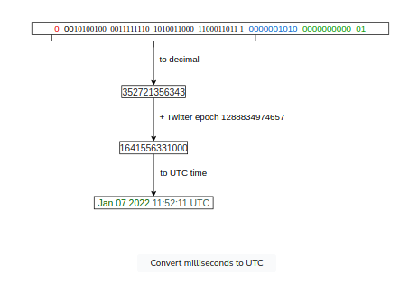
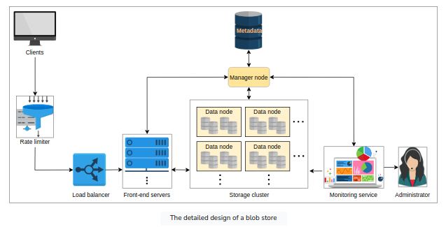
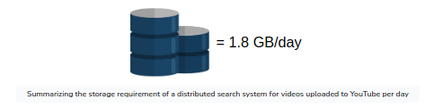

<br />
<br />
<br />
<br />
<br />
<br />
<br />
<br />
<br />
<br />
<br />
<br />
<br />
<br />
<br />
<br />
<br />
<br />
<br />
<br />
<br />
<br />
<p style="text-align: center;">System Design Building Blocks</p>
<br />
<br />          
<p style="text-align: center;">Raja</p>
<br />
<br />
<div style="page-break-after: always"></div>


<!-- TOC -->
- [1. Domain Name System](#1-domain-name-system)
  - [Important Details](#important-details)
  - [DNS hierarchy](#dns-hierarchy)
  - [DNS caching](#dns-caching)
  - [DNS as a distributed system](#dns-as-a-distributed-system)
  - [Test](#test)
- [2. Load balancers](#2-load-balancers)
  - [Introduction](#introduction)
  - [Global server load balancers (GSLB)](#global-server-load-balancers-gslb)
  - [Local Load balancers](#local-load-balancers)
  - [Advanced Load balancers](#advanced-load-balancers)
- [3. Databases](#3-databases)
  - [Introduction](#introduction-1)
  - [Types of Database](#types-of-database)
    - [1. Relational Database](#1-relational-database)
      - [Flexibility](#flexibility)
      - [Reduced redundancy](#reduced-redundancy)
      - [Concurrency](#concurrency)
      - [Integration](#integration)
      - [Backup and disaster recovery](#backup-and-disaster-recovery)
      - [Drawbacks of Relational databases](#drawbacks-of-relational-databases)
    - [2. Non-Relational Database](#2-non-relational-database)
      - [Simple design](#simple-design)
      - [Horizontal scaling](#horizontal-scaling)
      - [Availability](#availability)
      - [Support for unstructured and semi-structured data](#support-for-unstructured-and-semi-structured-data)
      - [Cost](#cost)
  - [Data Replication](#data-replication)
    - [Synchronous Vs Asynchronous](#synchronous-vs-asynchronous)
    - [Data replication models](#data-replication-models)
      - [1. Single leader/primary-secondary replication](#1-single-leaderprimary-secondary-replication)
      - [2. Multi-leader replication](#2-multi-leader-replication)
      - [3. Peer to peer/leaderless replication](#3-peer-to-peerleaderless-replication)
  - [Data Partition](#data-partition)
    - [Sharding](#sharding)
      - [1. Vertical Sharding](#1-vertical-sharding)
      - [2. Horizontal Sharding](#2-horizontal-sharding)
      - [3. Re-balance the partitions](#3-re-balance-the-partitions)
    - [Request Routing](#request-routing)
      - [1. ZooKeeper](#1-zookeeper)
  - [Trade-offs in Databases](#trade-offs-in-databases)
    - [Centralized database](#centralized-database)
    - [Distributed database](#distributed-database)
    - [Query optimization and processing speed in a distributed database](#query-optimization-and-processing-speed-in-a-distributed-database)
    - [Parameters assumption](#parameters-assumption)
    - [Possible approaches](#possible-approaches)
- [4. Key-Value Store](#4-key-value-store)
  - [Design of a key-value store](#design-of-a-key-value-store)
    - [Requirements](#requirements)
    - [Assumptions](#assumptions)
    - [API design](#api-design)
  - [Ensure Scalability](#ensure-scalability)
  - [Ensure Replication](#ensure-replication)
  - [Versioning Data and Archiving](#versioning-data-and-archiving)
  - [Enable Fault Tolerance and Failure Detection](#enable-fault-tolerance-and-failure-detection)
- [5. Content Delivery Network](#5-content-delivery-network)
  - [System Design: The Content Delivery Network (CDN)](#system-design-the-content-delivery-network-cdn)
  - [Introduction to CDN](#introduction-to-cdn)
  - [In-depth Investigation of CDN:](#in-depth-investigation-of-cdn)
  - [Evaluation of CDN Design](#evaluation-of-cdn-design)
- [6. Sequencer](#6-sequencer)
  - [System Design Sequencer](#system-design-sequencer)
  - [Design of a Unique ID Generator](#design-of-a-unique-id-generator)
    - [First solution: UUID](#first-solution-uuid)
    - [Second solution: using a database](#second-solution-using-a-database)
    - [Third solution: using a range handler](#third-solution-using-a-range-handler)
  - [Unique IDs with Causality](#unique-ids-with-causality)
    - [UNIX time stamps](#unix-time-stamps)
    - [Twitter Snowflake](#twitter-snowflake)
    - [TrueTime API](#truetime-api)
    - [Summary](#summary)
- [7. Distributed Monitoring](#7-distributed-monitoring)
  - [Distributed Monitoring](#distributed-monitoring)
  - [Monitor Service-side errors](#monitor-service-side-errors)
    - [System Design](#system-design)
    - [Visualize](#visualize)
  - [Monitor Client-side errors](#monitor-client-side-errors)
    - [System Design](#system-design-1)
- [8. Distributed Cache](#8-distributed-cache)
    - [What is a distributed cache?](#what-is-a-distributed-cache)
    - [Why distributed cache?](#why-distributed-cache)
    - [Caching at different Layers of a System](#caching-at-different-layers-of-a-system)
  - [System Design](#system-design-2)
  - [Initial Design](#initial-design)
    - [Requirements](#requirements-1)
    - [API Design](#api-design-1)
    - [Design considerations](#design-considerations)
    - [High-level Design](#high-level-design)
  - [Detailed Design](#detailed-design)
  - [Evaluation](#evaluation)
  - [Memcached vs Redis](#memcached-vs-redis)
- [9. Distributed Messaging Queue](#9-distributed-messaging-queue)
  - [Requirements](#requirements-2)
  - [Considerations](#considerations)
  - [System Design](#system-design-3)
    - [High Level Design](#high-level-design-1)
  - [Evaluation](#evaluation-1)
- [10. Publish-Subscribe System](#10-publish-subscribe-system)
  - [System Design](#system-design-4)
    - [First design](#first-design)
    - [Second design](#second-design)
    - [Finalized design](#finalized-design)
- [11. Rate Limiter](#11-rate-limiter)
  - [Requirements](#requirements-3)
  - [System Design](#system-design-5)
  - [Algorithms](#algorithms)
- [12. Blob Store](#12-blob-store)
  - [Requirements](#requirements-4)
  - [System Design](#system-design-6)
    - [Detailed Design](#detailed-design-1)
  - [Evaluation](#evaluation-2)
- [13. Distributed Search](#13-distributed-search)
  - [Requirements](#requirements-5)
    - [Functional requirements](#functional-requirements)
    - [Non-functional requirements](#non-functional-requirements)
    - [Resource estimation](#resource-estimation)
  - [Indexing](#indexing)
  - [High-level design](#high-level-design-2)
    - [API design](#api-design-2)
    - [Detailed discussion](#detailed-discussion)
  - [Scaling Search and Indexing](#scaling-search-and-indexing)
    - [Problems with the proposed design](#problems-with-the-proposed-design)
    - [Separating Indexing and Search](#separating-indexing-and-search)
    - [Indexing Explained (Map-Reduce)](#indexing-explained-map-reduce)
  - [Evaluation](#evaluation-3)
- [14. Distributed Logging](#14-distributed-logging)
  - [System Design](#system-design-7)
    - [Requirements](#requirements-6)
    - [Building Blocks](#building-blocks)
    - [API Design](#api-design-3)
    - [Design](#design)
- [15. Distributed Task Scheduling](#15-distributed-task-scheduling)
  - [Requirements](#requirements-7)
    - [Functional Requirements](#functional-requirements-1)
    - [Non-Functional Requirements](#non-functional-requirements-1)
  - [System Design](#system-design-8)
    - [Design considerations](#design-considerations-1)
  - [Evaluation](#evaluation-4)
- [16. Shared Counters](#16-shared-counters)
  - [High-level Design](#high-level-design-3)
    - [API Design](#api-design-4)
  - [Detailed design](#detailed-design-2)
    - [Using sharded counters for the Top K problem](#using-sharded-counters-for-the-top-k-problem)
    - [Placement of sharded counters](#placement-of-sharded-counters)
    - [Evaluation of the sharded counters](#evaluation-of-the-sharded-counters)
<!-- TOC -->

<div style="page-break-after: always"></div>

## 1. Domain Name System
DNS is the Internet's naming service that maps human-friendly domain names to machine-readable IP addresses.
Typically, DNS service is transparent to users. The browser translates the domain name to IP address via DNS Infra.

<kbd> 
    
</kbd>

### Important Details

- Name servers: DNS isn't a single server. It's a complete infrastructure with numerous servers.
                DNS servers that respond to the users' queries are called name servers.

- Resource records: The DNS database stores domain name to IP address mappings in the form of
    record names (RR). The RR is the smallest unit of information that users request from the
    name servers. The 3 important pieces of information are type, name, and value.

| Type  | Description                                                                | Name       | Value          | Example(Type, Name, Value)                               |
|-------|----------------------------------------------------------------------------|------------|----------------|----------------------------------------------------------|
| A     | Provides the hostname to IP address mapping                                | Hostname   | IP address     | (A, relay1.main.educative.io,104,18.2.119)               |
| NS    | Provides the hostname that is the authoritative<br/> DNS for a domain name | Domainname | Hostname       | (NS,educative.io, dns.educative.io)                      |
| CNAME | Provides the mapping from alias to canonical hostname                      | Hostname   | Canonical name | (CNAME, educative.io, server1.primary.educative.io)      |
| MX    | Provides the mapping of mail server from alias to canonoical hostname      | Hostname   | Canonical name | (MX, mail.educative.io, mailserver1.backup.educative.io) |

    
- Caching: DNS uses caching at different layers to reduce request latency for the user.

- Hierarchy: DNS name servers are hierarchical form. The hierarchical structure allows DNS to be highly scalable 
    because of its increasing size and query load. 


### DNS hierarchy
- DNS isn't a single server that accepts requests and responds to queries. It's a complete infrastructure with
    "Name Servers" at different hierarchies. Below are the different types of servers in the DNS hierarchy.
    + DNS resolver: Resolvers initiate the querying sequence and forward requests to the other DNS name servers.
        Typically, DNS resolvers lie within the premis of the user's network. These servers can also be called
        as local or defaults servers. Caching technique is used fo cater DNS queries.

    + Root-level name servers: These servers receives requests from the local servers. Root name servers maintain
        name servers based on top-level domain names, such as .com, .edu, .us, and so on. When a user requests the
        IP address of "docker.io", root-level name servers will return a list of top-level domain (TLD) servers
        that hold the IP addresses of the .io domain.

    + Top-level domain(TLD) name servers: These servers hold the IP addresses of authoritative name servers. The
        querying party will get a list of IP addresses that belong to the authoritative servers of the organization.

    + Authoritative name servers: These are the organization's DNS name servers that provide the IP addresses of the
        web or application servers.

<kbd>

</kbd>

- Typically, an iterative query is preferred to reduce query load on DNS infrastructure.


### DNS caching
- A record is a data unit within the DNS database that shows a name-to-value binding. 
    Caching reduces response time to the user and decreases network traffic.

<kbd>

</kbd>

### DNS as a distributed system
- Highly Scalable
    There are 13 logical root name servers (named letter A to M) with over 1,000 replicated instances
spread throughout the world strategically to handle user queries and managed by 12 different organizations.

- Reliable
    + Caching is done in the browser, the OS, and the local name server, and the ISP DNS resolvers also maintain
        a rich cache of freqently visited services. Even if the servers are down, cached records can be served.
    + Server replications
        DNS has replicated copies of each logical server spread systematiclly across the globe to entertain users
        requests at low latency.
    + Protocol
        Many clients rely on the unrealiable UDP to request and recevie DNS response, but is fast and improves
        DNS performance. DNS queries are usually retransmitted at the transport layer if there's no response for
        the previous one. Therefore, request-response might need additional round trips, which provides a shorter
        delay as compared to TCP, which needs a three-way handshake every time before data exchange.

- Consistent
    DNS provides eventual consistency and updates records on replicated servers lazily. Typically, it can take from
    few seconds up to three days on the DNS servers across the Internet.
    Consistency can suffer because of caching too. Since authoritativce servers are located within the ogranization,
    it may be possible that certain resource records are updated on the authoritative servers in case of server
    failures at the organization. To mitigate this issue, each cached record comes with an expiration 
    time called (TTL)

### Test
    nsloop => Non-Authoritative answer --> Refererence to cached response.
    dig => 53 refers to TTL and "Query time: 24 msec" refers to DNS response time
    
<kbd>

</kbd>

<div style="page-break-after: always"></div>

## 2. Load balancers

### Introduction
The job of the load balancer is to faily divide all client's requests among the pool of available servers.
Load balancers perform this  job to avoid overloading or crashing servers.

The load balancing layer is the first point of contact within a data center after the firewall. They provide
following capabilities:-

- Scalability - Load balancers make upscaling or downscaling of servers transparent to the end users. 

- Availability - One of the jobs of the load balancers is to hide faults and failuers of servers. Even if some servers
    go down or suffer a fault, the system still remains available.

- Performance - Load balancers can forward requests to servers with a lesser load so the user can get a 
    quicker response time. This not only improves performance but also improves resource utilization.

Services offered by Load Balancers

- Health checking: LBs use the heartbeat protocol to monitor the health and, therefore, reliability of end-servers.

- TLS termination: LBs reduce the burden on end-servers by handling TLS termination with the client.

- Predictive analytics: LBs can predict traffic patterns through analytics performed over traffic passing
    through them or using statistics of traffic obtained over time.

- Service discovery: Client's requests are forwarded to appropriate hosting servers by inquiring about the
    server registry.

- Security: LBs improve security by mitigating attacks like DoS at different layers of the OSI model (3,4, 7).

### Global server load balancers (GSLB)
GSLB involves the distribution of traffic load across multiple geographical regions. GSLB ensures that globally
arriving traffic load is intelligently forwarded to a data center. 

GSLB takes forwarding decisions based on the users' geographic locations, the number of hosting servers in 
different locations, the health of data centers and so on. GSLB offers automatic zonal failover.
Example: power or network failure in a data center requires that all the traffice be routed to another data center.  

GSLB service can be installed on-premises or obtained through "Load balancing as a Service(LBaaS)".

<kbd>

</kbd>

### Local Load balancers
Load balancing achieved within a data center. This type of load balancing focuses on improving efficieny and better
resource utliziation of the hosting servers in a data center.
They behave like a "reverse proxy" and make their best effort to divide incoming requests among the pool of 
available servers. Incoming clients' requests seamlessly connect to the LB that uses a virtual IP address (VIP).

### Advanced Load balancers
- **Algorithms of load balancers**
    + **Round-robing scheduling** - each request is forwarded to a server in the pool in a repeating sequential manner.

    + **Weighted round-robin** - If some servers have a higher capability of serving clients' requests, then it's 
        preferred to use a weighted round-robin algorithm. Each node is assigned a weight. LBs forward requests 
        according to the weight of the node. The higher the weight, higher the number of assignments.

    + **Least connections** - If all the servers have the same capacity to serve clients, uneven load on certain servers
        is still a possibility. Newer requests are assigned to servers with fewer existing connections. LBs keep
        a state of the number and mapping of existing connections in such a scenario.

    + **Least response time** - In performance-sensitive services, algorithms such as least response time are required.
        This algorithm ensures that the server with the least response time is requested to serve the clients.

    + **IP hash** - Some applications provide a different level of service to users based on their IP addresses. In that
        case, hashing the IP address is performed to assign users' requests to servers.

    + **URL hash** - It may be possible that some services within the application are provided by specific servers only.
        In that case, a client requesting service from a URL is assigned to a certain cluster or set of servers.
        The URL hasing algorithm is used in those scenarios.

    + **Static vs dynamic algorithms**
        - Static algorithms don't consider the changing state of the servers. Therefore, task assignment is carried
            out based on existing knowledge about the server's configuration. 
            
        - Dynamic algorithms consider the current or recent state of the servers. Dynamic algorithms maintain state
            by communicating with the server, which adds a communication overhead. State maintenance makes the 
            design of the algorithm much more complicated.

        In practice, dynamic algorithms provide far better results because they maintain a state of the serving 
        hosts and are, therefore, worth the effort and complexity.

**Stateful load balancers versus stateless LBs**

- Stateful load balancing involved maintaining a state of the sessions established between clients and 
    hosting servers. The stateful LB incorporates state information in its algorithm to perform load 
    balancing. Stateful LBs increase complexity and limit scalability because session information of all the
    clients is maintained across all the load balancers.That is, load balancers share their state information
    with each other to make forwarding decisions.

<kbd>

</kbd>       

- Stateless load balancing maintains no state and is, therefore, faster and light weight. Stateless LBs use
    consistent hashing to make forwarding decisions. However, if infrastructure changes (a new application
    server is added), stateless LBs may not be resilient as stateful LBs because consistent hashing alone
    isn't enough to route a request to the correct application server. Therefore, local state may still be
    required along with consistent hashing.

<kbd>

</kbd>   

- **Types of Load balancers**
    + **Layer 4 load balancer**: Layer 4 refers to load balancing performed on the basis of transport protocol like 
        tcp/udp. These types of LBs maintain conneciton/session with the clients and ensure that the same TCP/UDP
        communication ends up being forwarded to the same back-end server. Even though TLS termination is performed
        at layer 7 LBs, some layer 4 LBs also support it.

    + **Layer 7 load balancer**: Layer 7 load balancers are based on the data of application layer protocols. It's 
        possible to make application-aware forwarding decisions based on HTTP headers, URLs,  cookies, and other
        application-specific data - for example, user ID. Apart from TLS termination, these LBs can take 
        responsibility like rate limiting users, HTTP routing, and header rewriting.

    Layer 7 load balancers are smart in terms of inspection. However, layer 4 load balancers are faster in terms of
    processing.

- **Load balancer deployments**
    In practice, a single layer LB isn't enough for a large data center. In fact, multiple layers of load balancers
    coordinate to take informed forwarding decisions as shown below:-
<kbd>

</kbd>   

    + **Tier-0 and Tier-1 LBs**: If DNS can be considered as the tier-0 load balancer, equal cost multipath (ECMP)
        routers are the tier-1 LBs. ECMP routers divides incoming traffic on the basis of IP or some other algo
        like round-robin or weighted round-robin. Tier-1 LBs will balance the load across different paths to higher
        tiers of load balancers.
        ECMP routers play a vital role in the horizontal scalability of the higher-tier LBs.

    + **Tier-2 LBs**: The Tier-2 LBs include layer 4 load balancers. They make sure that for any connection, all incoming
        packets are forwarded to the same tier-3 LBs. Consistent Hashing can be used for this purpose. Since hashing
        has limiation with infra changes, local or global state needs to be maintained.
        Tier-2 LBs glues Tier-1 and Tier-3 LBs.

    + **Tier-3 LBs**: These LBs are in direct contact with the back-end servers, they perform health monitoring of
        servers at HTTP level. This tier enables scalability by evenly distributing requests amoung  the set of 
        healthy back-end servers.
        This tier also reduces the burden on end-servers by handling low-level details like TCP-congestion control
        protocols, the discover of Path MTU (maximum transmission unit), the difference in application protocol
        between client and back-end servers, and so on.

    Tier-1 balances the load among the load balancers themselves. 
    Tier 2 enables a smooth transition from tier-1 and tier-3 in case of failures
    Tier-3 does the actual load balancing between the back-end servers. 


<div style="page-break-after: always"></div>

## 3. Databases

### Introduction

+ For an application like WhatsApp, why can't we store information in a File?
    1. We can't offer concurrent managment to seperate users accessing the storage files fromd different loc.
    2. We can't grant different access rights to different users.
    3. How will the system scale and be available when adding thousands of entires?
    4. How will we search content for different users in a short time?

A database is an organized collection of data that can be managed and accessed easily. Databases are created to
make it easier to store, retrieve, modify, and delete data in connection with different data-processing procedures.

+ Two basic types of databases:
    - SQL (relational database)
        Relational databases, like phone books that record contact numbers and addresses, are organized 
        and have predetermined schemas.
    - NoSQL (non-relational database)
        Non-Relational databases, like file directories that store anything from a person's constant information
        to shopping preferences, are unstructured, scattered, and feature a dynamic schema.
  
<kbd>

</kbd>

+ Reasons why a database is important
    - Managing large data: A large amount of data can be easily handled with a database, which wouldn't be
        possible using other tools.

    - Retrieving accurate data (data consistency): Due to different constraints in databases, we can retrieve
        accurate data whenever we want.

    - Easy Updation: It is quite easy to update data in databases using data manipulation language (DML).

    - Security: Databases ensure the security of the data. A database only allows authorized users to access data.

    - Data Integrity: Databases ensure data integrity by using different constraints of data.

    - Availability: Databases can be replicated on different servers, which can be concurrently updated. These
        replicas ensure availability.

    - Scalability: Databases are divided (using data paritioning) to manage the load on a single node. 
        This increases scalability.            

### Types of Database

#### 1. Relational Database
Relational databases adhere to particular schemas before stroing the data. The data stored in relational databases
has prior structure. Mostly, this model organizes data into one or more relations called tables, with a unique key
for each tuple
Since each tuple has a unique key, a tuple in one table can be linked to a tuple in other tables by storing the
primary keys in other tables, generally known as foreign keys.

A **SQL (Structural Querying Language)** is used for manipulating the database. This includes insertion, deletion, and
retrieval of data.

Relational databases provide Atomicity, consistency, isolation and durablity (ACID) properties to maintain the
integrity of the database. 
- **Atomicity**: A transasction is considered an atomic unit. If a statement fails within a transaction, it should
be aborted and rolled back.
- **Consistency**: At any given time, the database should be in a consistent stated, and it should remain consistent
after every transaction.
- **Isolation**: In the case of multiple transactions running concurrently, they shouldn't be affected by each
other. The final state of the database should be the same as the transactions were executed sequentially.
- **Durability**: The system should guarantee that completed transactions will survive permanently in the database
even in system failures.

Examples - MySQL, Oracle Database, Microsoft SQL Server, IBM DB2, Postgres, SQLite

One of the greatest powers of the relational database is its abstractions of ACID transactions and related 
programming semantics.


##### Flexibility
In the context of SQL, **DDL (Data Definition Language)** provides us the flexibility to modify the database, including
tables, columns, renaming the tables, and other changes. DDL even allows us to modify the schema while other 
queries are happening and the database server is running.

##### Reduced redundancy
One of the biggest advantages of the relational database is that it eliminates data redundancy. The information
related to a specific entity appears in one table while the relevant data to that specific entity apprears in the
other tables linked through foriegn keys. This process is called normalization and has the additional benefit of
removing an inconsistent dependency.

##### Concurrency
A transaction is considered an atomic operation, so it also works in error handling to either roll back or commit
a transaction on successful execution.

##### Integration
The process of aggregating data from multiple sources is a common practice in enterprise applications. A common
way to perform this aggregation is to integrate a shared database where multiple applications store their data.

##### Backup and disaster recovery
Relational databases gurantee the state of data is consistent at any time. Most cloud-based relational databases
perform continous mirroing to avoid loss of data and make the restoration process easier and quicker.

3
##### Drawbacks of Relational databases

**Impedance mismatch** 
   **Impedance mismatch** is the difference between the relational model and the in-memory data structures. One is a 
   structured data and other is a complex in-memory data structure. so, the impedence mismatch requires translation
   between two representations.

#### 2. Non-Relational Database

A NoSQL database is designed for a variety of data models to access and manage data. These databases are used in
applications that require a large volume of semi-structured and unstructured data, low latency, and flexible data
models.

##### Simple design
Unlike relational databases, NoSQL doesn't require dealing with the impedance mismatch - for ex
storing all the employees' data in one document instead of multiple tables that require join operations. This
strategy makes it simple and easier to write less code, debug, and maintain.

##### Horizontal scaling
Primarily, NoSQL is preferred due to its ability to run databases on a large scale. As the
data is stored in one document. NoSQL databases often spread data across multiple nodes and balance data and
queries across nodes automatically. In case of a node failure, it can be transparently replaced without any
application disruption.

##### Availability
To enhace the availability of data, node replacement can be performed without application downtime.
Data replication is supported to ensure high availability and disaster recovery.

##### Support for unstructured and semi-structured data
Many NoSQL databases work with data that doesn't have schema
at the time of database configuration or data writes. For ex: document databases are structureless; they allow
documents (JSON, XML, BSON and so on) to have different fields.

##### Cost
Licenses for many RDBMSs are pretty expensive, while many NoSQL databases are opensource and freely availble


**Types of Databases**

<kbd>

</kbd>

**Key-Value database**: use key-value methods like hash tables to store data in key-value pairs.
    Key servers as a unique or primary key, and the values can be anything ranging from simple 
    scalar values to complex objects.
    Allow easy partitioning and horizontal scaling of the data.
    Examples: Amazon DynamoDB, Redis, and Memcached DB.

<kbd>

</kbd>

**Use Case**: Key-value databases are efficient for session-oriented applications. Session oriented-applications,
such as web applications, store users' data in the main memory or in a database during a session.

**Document database**: is designed to store and retrieve documens in formats like XMl, JSON, BSON, and so on.
    These documents are composed of hierarchical tree data structure that can include maps, collections, and 
    scalar values. Documents in this type of database may have varying structures and data.
    Examples : MongoDB, Google Cloud Firestore.

<kbd>

</kbd>

**Use Case**: Suitable for unstructured catalog data, like JSON files or other complex structured hierarchical data.
for example in e-commerce applications, a product has thousands of attributes, which is unfeasible to store in a
relational database due to its impact on the reading performance.

**Graph database**: uses graph data structure to store data, where nodes represent entities, and edges show
    relationships between entities. The organizaton of nodes based on relationships leads to interesting patterns
    between the nodes. This database allows us to store the data once and then interpret it differently based on
    relationships. Graph data is kept in store files for persistent storage.
    Examples: Neo4J, OrientDB, InfiniteGraph.

<kbd>

</kbd>

**UseCase**: can be used in social applications and provide interesting facts and figures among different kinds of users
and their activities. The focus of graph database is to store data and pave the way to drive analyses and decisions 
based on relationships between entities. The nature of graph databases makes them suitable for various applications
such as data regulation and privacy, machine learning research, financial services-based applications and many more.

**Columnar database**: store data in columns instead of rows. They enable across to all entries in the database column
quickly and efficiently. Popular columnar databases include Cassandra, HBase, Hypertable, and Amazon redshift.

<kbd>

</kbd>

**UseCase**: Columnar database are efficient for a large number of aggregation and data analytics queries. It 
drastically reduces the disk I/O requirements and the amount of data required to load from the disk. For example, in
applications related to financial institutions, there's a need to sum the financial transaction over a period of time.
Columnar databases make this operation quicker by just reading the column for the amount of money, ignoring other
attributes of customers.


**Choosing the right database**

| Relational database                                                   | Non-relational database                             |
|-----------------------------------------------------------------------|-----------------------------------------------------|
| If the data to be stored is structured                                | If the data to be stored is unstructured            |
| If ACID properties are required                                       | If there's a need to serialize <br/>and deserialize data |
| If the size of the data is relatively small<br/>and can fit on a node | If the size of the data to be stored is large       |

**Drawbacks of NoSQL databases**

**Lack of standardization** - NoSQL doesn't follow any specific standard, like how relational database follow relational
algebra. Porting applications from one type of NoSQL database to another might be a challenge.

**Consistency** - NoSQL provides different products based on the specific trade-offs between consistency and 
availability when failures can happen. We won't have strong data integrity, like primary and referential integrities in
a relational database.

Data might not be strongly consistent but slowly converging using a weak model like eventual consistency.


### Data Replication

Following characteristics are required from a data store :- 
- Availability under faults (failure of some disk, nodes, and network and power outages).
- Scalability (with increasing reads, writes, and other operations).
- Performance (low latency and high throughput for the clients).

It's challenging, or even impossible, to achieve the above characteristics on a single node.

**Replication** refers to keeping multiple copies of the data at various nodes (preferably geographically distributed)
to achieve availability, and performance.  

Replication is relatively simple if the replicated data doesn't frequent changes. The main problem in replication arises
when we have to maintain changes in the replicated data over time.

<kbd>

</kbd>

**Additional complexities** :-
1. How do we keep multiple copies of data consistent with each other?
2. How do we deal with failed replica nodes?
3. Should we replicate synchronously or asynchronously? 
   * How to deal with replication lag in case of asynchronous replication?
4. How do we handle concurrent writes?
5. What consistency model needs to be exposed to the end programmers?

#### Synchronous Vs Asynchronous

There are two ways to disseminate changes to the replica node:
- Synchronous replication
  - Primary node waits for acknowledgment from secondary nodes about updating the data. After receiving all
  the acknowledgments, primary node reports success to the client.
  
- Asynchronous replication
  - Primary node doesn't wait for the acknowledgment from the secondary nodes and reports success to the 
    client after updating itself.

<kbd>

</kbd>

#### Data replication models

##### 1. Single leader/primary-secondary replication
Data is replicated across multiple nodes. One node is designated as the primary. It's responsible for processing any
write to data stored on the cluster. It also sends all the writes to the secondary nodes and keep them in sync.

Appropriate for read-heavy workloads. However, replicating data to many followers can make a primary bottleneck.
In appropriate if workload is write-heavy.

It is read resilient. Secondary nodes can still handle read requests in case of primary node failure.

<kbd>

</kbd>

There are many replication methods in primary-secondary replication-

- Statement-based replication
- Write-ahead log (WAL) shipping
- Logical (row-based) replication

**Statement-based replication** (SBR) is an approach used in MySQL databases. In this approach, the primary 
node executes the SQL statements such as INSERT, UPDATE, DELETE, etc., and then the statements are written into a 
log file. 

In the next step, the log file is sent to the secondary nodes for execution. This type of replication was used in 
MySQL before version 5.1.

While this type of replication seems good, it also has some disadvantages. For example, any nondeterministic functions 
such as NOW() might result in distinct writes on the primary and secondary nodes.

**Write-ahead log** (WAL) shipping is a data replication technique used in both PostgreSQL and Oracle. 
In this technique, when a transaction occurs, it’s initially recorded in a transactional log file, and the 
log file is written to disk. 

Subsequently, the recorded operations are executed on the primary database before being transmitted to 
secondary nodes for execution. Unlike SBR, WAL maintains transactional logs instead of SQL statements into a 
log file, ensuring consistency when dealing with nondeterministic functions. 

Writing to disk also aids in recovery in case of crash failures

For example, when an operation like an UPDATE is executed in PostgreSQL, it’s first written to the transactional 
log file and disk before being applied to the database. This entry in the transactional log can include details 
such as the transaction ID, operation type, affected table, and new values, after which the changes are replicated 
to the secondary nodes. However, the drawback of WAL is its tight coupling with the inner structure of the database 
engine, making software upgrades on the leader and followers complicated.

**Logical (row-based) replication** is utilized in various relational databases, including PostgreSQL and MySQL. 
In this approach, changes made to the database are captured at the level of individual rows and then replicated 
to the secondary nodes. Instead of replicating the actual physical changes made to the database, this approach 
captures the operations in a logical format and then executes them on secondary nodes.

For example, when operations like INSERT or UPDATE are performed, the entire affected row is captured on the 
primary node, containing all the column values of the specified row. This captured change is then executed on 
secondary nodes, where they ensure that the data remains consistent with the data on the primary node. It offers 
advantages in terms of flexibility and compatibility with different types of schemas.

##### 2. Multi-leader replication

**Multi-leader replication** is an alternative to single leader replication. There are multiple primary nodes that 
process the writes and send them to all other primary and secondary nodes to replicate. This type of replication is 
used in databases along with external tools like the Tungsten Replicator for MySQL.

This kind of replication is quite useful in applications in which we can continue work even if we’re offline—for 
example, a calendar application in which we can set our meetings even if we don’t have access to the internet. 
Once we’re online, it replicates its changes from our local database (our mobile phone or laptop acts as a 
primary node) to other nodes.

<kbd>

</kbd>

**Conflict**
Multi-leader replication gives better performance and scalability than single leader replication, but it also 
has a significant disadvantage. Since all the primary nodes concurrently deal with the write requests, they may 
modify the same data, which can create a conflict between them. For example, suppose the same data is edited by 
two clients simultaneously. In that case, their writes will be successful in their associated primary nodes, but 
when they reach the other primary nodes asynchronously, it creates a conflict.

**Handle conflicts**

<kbd>

</kbd>

_Conflict Avoidance_
A simple strategy to deal with conflicts is to prevent them from happening in the first place. 
Conflicts can be avoided if the application can verify that all writes for a given record go via the same leader.

However, the conflict may still occur if a user moves to a different location and is now near a different 
data center. If that happens, we need to reroute the traffic. In such scenarios, the conflict avoidance approach 
fails and results in concurrent writes.

_Last-write-wins_
Using their local clock, all nodes assign a timestamp to each update. When a conflict occurs, the update with 
the latest timestamp is selected. But clock synchronization across nodes is challenging in distributed systems. 

_Custom logic_
Write own logic to handle conflicts according to the needs of our application.

##### 3. Peer to peer/leaderless replication
In primary-secondary replication, the primary node is a bottleneck and a single point of failure. Moreover, it 
helps to achieve read scalability but fails to provide write scalability. The peer-to-peer replication model 
resolves these problems by not having a single primary node. All the nodes have equal weightage and can accept 
read and write requests. This replication scheme can be found in the Cassandra database.

<kbd>

</kbd>

Like primary-secondary replication, this replication can also yield inconsistency. This is because when several 
nodes accept write requests, it may lead to concurrent writes. A helpful approach used for solving write-write 
inconsistency is called quorums.

_Quorums_
Let’s suppose we have three nodes. If at least two out of three nodes are guaranteed to return successful updates, 
it means only one node has failed. This means that if we read from two nodes, at least one of them will have the 
updated version, and our system can continue working.

<kbd>

</kbd>

If we have n nodes, then every write must be updated in at least w nodes to be considered a success, and we must read
from r nodes. We'll get an updated value from reading as long as w+r > n because at least one of the nodes must have
an updated write from which we can read. Quorum reads and writes adhere to these r and w values. Then n, w, and r  are
configurable in Dynamo-style databases.

### Data Partition
Data is an asset for any organization. Increasing data and concurrent read/write traffic to the data puts scalability 
pressure on traditional databases. As a result, the latency and throughput are affected. Traditional databases are 
attractive due to their properties such as range queries, secondary indices, and transactions with the ACID properties.

At some point, a single node-based database isn’t enough to tackle the load. We might need to distribute the data 
over many nodes but still export all the nice properties of relational databases. In practice, it has proved 
challenging to provide single-node database-like properties over a distributed database.

Data partitioning (or sharding) enables us to use multiple nodes where each node manages some part of the whole data. 
To handle increasing query rates and data amounts, we strive for balanced partitions and balanced read/write load.

<kbd>

</kbd>

#### Sharding
To divide load among multiple nodes, we need to partition the data by a phenomenon known as partitioning or sharding.
In this approach, we split a large dataset into smaller chunks of data stored at different nodes on our network.

The partitioning must be balanced so that each partition receives about the same amount of data. If partitioning is
unbalanced, the majority of queries will fall into a few partitions. Partitions that are heavily loaded will
create a system bottleneck.

##### 1. Vertical Sharding
We can put different tables in various database instances, which might be running on a different physical server. 
We might break a table into multiple tables so that some columns are in one table while the rest are in the other. 
We should be careful if there are joins between multiple tables. We may like to keep such tables together on one shard.

vertical sharding is used to increase the speed of data retrieval from a table consisting of columns with very wide 
text or a binary large object (blob). In this case, the column with large text or a blob is split 
into a different table.

<kbd>

</kbd>

##### 2. Horizontal Sharding
Horizontal sharding or partitioning is used to divide a table into multiple tables by splitting data row-wise.
Each partition of the original table distributed over database servers is called a shard.

**Key-range based sharding**

In the key-range based sharding, each partition is assigned a continuous range of keys.

<kbd>

</kbd>

Sometimes, a database consists of multiple tables bound by foreign key relationships. In such a case, the 
horizontal partition is performed using the same partition key on all tables in a relation. Tables (or sub-tables) 
that belong to the same partition key are distributed to one database shard. The following figure shows that 
several tables with the same partition key are placed in a single database shard:

<kbd>

</kbd>

The basic design techniques used in multi-table sharding are as follows:

- There’s a partition key in the Customer mapping table. This table resides on each shard and stores the partition
keys used in the shard. Applications create a mapping logic between the partition keys and database shards by reading
this table from all shards to make the mapping efficient. Sometimes, applications use advanced algorithms to determine
the location of a partition key belonging to a specific shard.

- The partition key column, Customer_Id, is replicated in all other tables as a data isolation point. It has a trade-off
between an impact on increased storage and locating the desired shards efficiently. Apart from this, it’s helpful for
data and workload distribution to different database shards. The data routing logic uses the partition key at the
application tier to map queries specified for a database shard.

- Primary keys are unique across all database shards to avoid key collision during data migration among shards and the
merging of data in the online analytical processing (OLAP) environment.

- The column Creation_date serves as the data consistency point, with an assumption that the clocks of all nodes are
synchronized. This column is used as a criterion for merging data from all database shards into the global view when
essential.

**Advantages**

Using key-range-based sharding method, the range-query-based scheme is easy to implement. We precisely know where 
(which node, which shard) to look for a specific range of keys.

Range queries can be performed using the partitioning keys, and those can be kept in partitions in sorted order. 
How exactly such a sorting happens over time as new data comes in is implementation specific.

**Disadvantages**

Range queries can’t be performed using keys other than the partitioning key.
If keys aren’t selected properly, some nodes may have to store more data due to an uneven distribution of the traffic.

**Hash-based sharding**

Hash-based sharding uses a hash function on an attribute. This hash function produces a hash value that is used to 
perform partitioning. The main concept is to use a hash function on the key to get a hash value and then mod by the 
number of partitions. Once we’ve found an appropriate hash function for keys, we may give each partition a range of 
hashes (rather than a range of keys). Any key whose hash occurs inside that range will be kept in that partition.

In the illustration below, we use a hash function of Value mode = n. The n is the number of nodes, which is four. 
We allocate keys to nodes by checking the mod for each key. Keys with a mod value of 2 are allocated to node 2. 
Keys with a mod value of 1 are allocated to node 1. Keys with a mod value of 3 are allocated to node 3. 
Because there’s no key with a mod value of 0, node 0 is left vacant.

<kbd>

</kbd>

_Advantages_ 
- Keys are uniformly distributed across the nodes.

_Dis-advantages_
- We can't perform range queries with this technique. Keys will be spread over all partitions.

**Consistent hashing** assigns each server or item in a distributed hash table a place on an abstract circle, 
called a ring, irrespective of the number of servers in the table. This permits servers and objects to scale 
without compromising the system’s overall performance.

_Advantages_

It’s easy to scale horizontally.
It increases the throughput and improves the latency of the application.

_Disadvantages_

Randomly assigning nodes in the ring may cause non-uniform distribution.

##### 3. Re-balance the partitions


#### Request Routing

##### 1. ZooKeeper
To track changes in the cluster, many distributed data systems need a separate management server like ZooKeeper. 
Zookeeper keeps track of all the mappings in the network, and each node connects to ZooKeeper for the information. 
Whenever there’s a change in the partitioning, or a node is added or removed, ZooKeeper gets updated and notifies 
the routing tier about the change. HBase, Kafka and SolrCloud use ZooKeeper.

### Trade-offs in Databases
Both horizontal and vertical sharding involve adding resources to our computing infrastructure. 
Our business stakeholders must decide which is suitable for our organization. We must scale our resources 
accordingly for our organization and business to grow, to prevent downtime, and to reduce latency. We can scale 
these resources through a combination of adjustments to CPU, physical memory requirements, hard disk adjustments, 
and network bandwidth.

#### Centralized database

_Advantages_

- Data maintenance, such as updating and taking backups of a centralized database, is easy.
- Centralized databases provide stronger consistency and ACID transactions than distributed databases.
- Centralized databases provide a much simpler programming model for the end programmers as compared to 
   distributed databases.
- It’s more efficient for businesses that have a small amount of data to store that can reside on a single node.

_Disadvantages_

- A centralized database can slow down, causing high latency for end users, when the number of queries per second 
  accessing the centralized database is approaching single-node limits.

- A centralized database has a single point of failure. Because of this, its probability of not being accessible is 
much higher.

#### Distributed database

_Advantages_
- It’s fast and easy to access data in a distributed database because data is retrieved from the nearest database shard 
  or the one frequently used.
- Data with different levels of distribution transparency can be stored in separate places.
- Intensive transactions consisting of queries can be divided into multiple optimized subqueries, which can be 
  processed in a parallel fashion.

_Disadvantages_
- Sometimes, data is required from multiple sites, which takes more time than expected.
- Relations are partitioned vertically or horizontally among different nodes. Therefore, operations such as joins 
  need to reconstruct complete relations by carefully fetching data. These operations can become much more expensive 
  and complex.
- It’s difficult to maintain consistency of data across sites in the distributed database, 
  and it requires extra measures.
- Updates and backups in distributed databases take time to synchronize data.

#### Query optimization and processing speed in a distributed database
<<< TODO >>>
#### Parameters assumption

#### Possible approaches

<div style="page-break-after: always"></div>

## 4. Key-Value Store
**Key-value stores** are distributed hash tables (DHTs). A key is generated by the hash function and should be unique. 
In a key-value store, a key binds to a specific value and doesn’t assume anything about the structure of the value. 
A value can be a blob, image, server name, or anything the user wants to store against a unique key

<kbd>

</kbd>

It’s preferred to keep the size of value relatively smaller (KB to MB). We can put large data in the blob store and 
put links to that data in the value field. Key-value stores are useful in many situations, such as storing user 
sessions in a web application and building NoSQL databases.

Key-Value system design can be divided into the following:-
- _**Design of a key-value store**_: Define the requirements of a key-value store and design the API.
- _**Ensure Scalability and Replication**_: Achieve scalability using consistent hashing and replicate the partitioned data.
- _**Versioning Data and Achieving Configurability**_: Resolve conflicts that occur due to changes made by more than one
  entity, and we'll make our system more configurable for different use cases.
- _**Enable Fault Tolerance and Failure Detection**_: Make a key-value store fault-tolerant and to detect failures in the
  system.

### Design of a key-value store
    
#### Requirements

**Functional Requirements**
Typical key-value stores are expected to offer functions such as _get_ and _put_. However, below are requirements for
the system

- **Configurable service:**  Some applications might have a tendency to trade strong consistency for higher availability. We need to provide a configurable service so that different applications could use a range of consistency models. We need tight control over the trade-offs between availability, consistency, cost-effectiveness,  and performance.

    **_Note_:** Such configurations can only be performed when instantiating a new key-value store instance and cannot be changed dynamically when the system is operational.

- **Ability to always write** (when we picked "A" over "C" in the context of CAP): The applications should always have the ability to write into the key-value storage. If the user wants strong consistency, this requirement might not always be fulfilled due to the implications of the CAP theorem. 

    **_Note_:** The context of the problem determines what will be classified as a functional requirement and what will be classified as non-functional. For example, the ability to always write (high availability) is a functional requirement for Amazon’s shopping cart application, while in other cases, high availability may be considered a non-functional requirement. Drawing inspiration from Amazon’s Dynamo key-value store, we can categorize the ability to always write as a functional requirement.

- **Hardware heterogeneity**: We want to add new servers with different and higher capacities, seamlessly, to our cluster without changing or upgrading existing servers. Our system should be able to accommodate and leverage different capacity servers, ensuring correct core functionality (get and put data) while balancing the workload distribution according to each server’s capacity. This calls for a peer-to-peer design with no distinguished nodes.


**Non Functional Requirements**
The non-functional requirements are as follows:

- **Scalability**: Key-value stores should run on tens of thousands of servers distributed across the globe. Incremental scalability is highly desirable. We should add or remove the servers as needed with minimal to no disruption to the service availability. Moreover, our system should be able to handle an enormous number of users of the key-value store.

- **Fault tolerance**: The key-value store should operate uninterrupted despite failures in servers or their components.

#### Assumptions
We’ll assume the following to keep our design simple:

* The data centers hosting the service are trusted (non-hostile).
* All the required authentication and authorization are already completed.
* User requests and responses are relayed over HTTPS.

#### API design
The **_get_** function - 
We return the associated value on the basis of the parameter key. When data is replicated, it locates the object replica associated with a specific key that’s hidden from the end user. It’s done by the system if the store is configured with a weaker data consistency model. For example, in eventual consistency, there might be more than one value returned against a key.

| Parameter | Description                                     |
|-----------|-------------------------------------------------|
| **Key**       | It's the **key** against which we want to get **value** |


The **_put_** function - 
It stores the value associated with the key. The system automatically determines where data should be placed. Additionally, the system often keeps metadata about the stored object. Such metadata can include the version of the object.

| Parameter | Description                                       |
|-----------|---------------------------------------------------|
| **Key**       | It's the **key** against which we have to store **value** |
| **value**     | It's the object to be stored against the **key**.     |


**_Data Type_** - The key is often a primary key in a key-value store, while the value can be any arbitrary binary data.
**Note**: Dynamo uses MD5 hashes on the key to generate a 128-bit identifier. These identifiers help the system 
determine which server node will be responsible for this specific key.


### Ensure Scalability

**Consistent Hashing** is a special kind of hashing such that when a hash table is re-sized and consistent hashing is used, only k/n keys need to be remapped on average, where k is the number of keys, and n is the number of slots. In contrast, in most traditional hash tables, a change in the number of array slots causes nearly all keys to be remapped

**Hash space and hash ring**
Now we understand the definition of consistent hashing, let us find out how it works. Assume SHA-1 is used as the hash function f, and the output range of the hash function is: x0, x1, x2, x3, …, xn. In cryptography, SHA-1’s hash space goes from 0 to 2^160 - 1. That means x0 corresponds to 0, xn corresponds to 2^160 – 1, and all the other hash values in the middle fall between 0 and 2^160 - 1. Figure 3 shows the hash space.

**_Hash space_**
<kbd>

</kbd>

**_Hash Ring_** 
<kbd>

</kbd>

**Server lookup** -
To determine which server a key is stored on, we go clockwise from the key position on the ring until a server is found. Below explains this process. Going clockwise, key0 is stored on server 0; key1 is stored on server 1; key2 is stored on server 2 and key3 is stored on server 3.

<kbd>

</kbd>

**Add a server** -
Using the logic described above, adding a new server will only require redistribution of a fraction of keys.
Below, after a new server 4 is added, only key0 needs to be redistributed. k1, k2, and k3 remain on the same servers. 
Let us take a close look at the logic. Before server 4 is added, key0 is stored on server 0. 
Now, key0 will be stored on server 4 because server 4 is the first server it encounters by going clockwise 
from key0’s position on the ring. The other keys are not redistributed based on consistent hashing algorithm.

<kbd>

</kbd>


**Remove a server** -
When a server is removed, only a small fraction of keys requires redistribution with consistent hashing. 
Below diagram, when server 1 is removed, only key1 must be remapped to server 2. The rest of the keys are unaffected.

<kbd>

</kbd>

**Two issues in the basic approach**

Basic steps :-
* Map servers and keys on to the ring using a uniformly distributed hash function.
* To find out which server a key is mapped to, go clockwise from the key position until the first server on the ring is found.

Problems :-
1. It is impossible to keep the same size of partitions on the ring for all servers considering a server can be added 
or removed. A partition is the hash space between adjacent servers. It is possible that the size of the partitions on 
the ring assigned to each server is very small or fairly large. Below, if s1 is removed, s2’s partition (highlighted with the bidirectional arrows) is twice as large as s0 and s3’s partition.

<kbd>

</kbd>

2. It is possible to have a non-uniform key distribution on the ring. For instance, if servers are mapped to positions listed below, most of the keys are stored on server 2. 
However, server 1 and server 3 have no data.

<kbd>

</kbd>

A technique called virtual nodes or replicas is used to solve these problems.

**Virtual nodes**

A virtual node refers to the real node, and each server is represented by multiple virtual nodes on the ring. Below, both server 0 and server 1 have 3 virtual nodes. The 3 is arbitrarily chosen; and in real-world systems, the number of virtual nodes is much larger. Instead of using s0, we have s0_0, s0_1, and s0_2 to represent _server 0 on the ring. Similarly, s1_0, s1_1, and s1_2 represent server 1 on the ring. With virtual nodes, each server is responsible for multiple partitions. Partitions (edges) with label s0 are managed by server 0. On the other hand, partitions with label s1 are managed by server 1.

<kbd>

</kbd>

To find which server a key is stored on, we go clockwise from the key’s location and find the first virtual node encountered on the ring. Below, to find out which server k0 is stored on, we go clockwise from k0’s location and find virtual node s1_1, which refers to server 1.

<kbd>

</kbd>

As the number of virtual nodes increases, the distribution of keys becomes more balanced. This is because the standard deviation gets smaller with more virtual nodes, leading to balanced data distribution. Standard deviation measures how data are spread out. The standard deviation will be smaller when we increase the number of virtual nodes. However, more spaces are needed to store data about virtual nodes. This is a tradeoff, and we can tune the number of virtual nodes to fit our system requirements.

### Ensure Replication

**_Primary-secondary approach_** - one of the storage areas is primary, and other storage areas are secondary. The secondary replicates its data from the primary. The primary serves the write requests while the secondary serves read requests. After writing, there’s a lag for replication. Moreover, if the primary goes down, we can’t write into the storage, and it becomes a single point of failure.

<kbd>

</kbd>


**_peer-to-peer_** - all involved storage areas are primary, and they replicate the data to stay updated. Both read and write are allowed on all nodes. Usually, it’s inefficient and costly to replicate in all n nodes. Instead, three or five is a common choice for the number of storage nodes to be replicated.
Refer to topic on _**Quorum**_ for more details.

In the context of the CAP theorem, key-value stores can either be consistent or be available when there are network partitions. For key-value stores, we prefer availability over consistency. It means if the two storage nodes lost connection for replication, they would keep on handling the requests sent to them, and when the connection is restored, they’ll sync up. In the disconnected phase, it’s highly possible for the nodes to be inconsistent. So, we need to resolve such conflicts.

### Versioning Data and Archiving

_**Data versioning**_ - When network partitions and node failures occur during an update, an object’s version history might become fragmented. As a result, it requires a reconciliation effort on the part of the system. It’s necessary to build a way that explicitly accepts the potential of several copies of the same data so that we can avoid the loss of any updates. It’s critical to realize that some failure scenarios can lead to multiple copies of the same data in the system. So, these copies might be the same or divergent. Resolving the conflicts among these divergent histories is essential and critical for consistency purposes.

**_Scenario -_**

    1. Two nodes replicating their data while handling requests.
    2. The network connection between two nodes breaks.
    3. Both nodes continue handling the requests.
    4. The connection is restored, but the data in both nodes isn't necessarily the same.

To handle inconsistency, we need to maintain causality between the events. We can do this using the timestamps and update all conflicting values with the value of the latest request. But time isn’t reliable in a distributed system, so we can’t use it as a deciding factor.

Another approach to maintaining causality effectively is by using vector clocks. A vector clock is a list of (node, counter) pairs. There’s a single vector clock for every version of an object. If two objects have different vector clocks, we’re able to tell whether they’re causally related or not (more on this in a bit). Unless one of the two changes is reconciled, the two are deemed at odds.


### Enable Fault Tolerance and Failure Detection

**_Handle temporary failures_** - Typically, distributed systems use a quorum-based approach to handle failures. A quorum is the minimum number of votes required for a distributed transaction to proceed with an operation. If a server is part of the consensus and is down, then we can’t perform the required operation. It affects the availability and durability of our system.

We’ll use a sloppy quorum instead of strict quorum membership. Usually, a leader manages the communication among the participants of the consensus. The participants send an acknowledgment after committing a successful write. Upon receiving these acknowledgments, the leader responds to the client. However, the drawback is that the participants are easily affected by the network outage. If the leader is temporarily down and the participants can’t reach it, they declare the leader dead. Now, a new leader has to be reelected. Such frequent elections have a negative impact on performance because the system spends more time picking a leader than accomplishing any actual work.

In the sloppy quorum, the first n healthy nodes from the preference list handle all read and write operations. The n healthy nodes may not always be the first n nodes discovered when moving clockwise in the consistent hash ring.

**_Handle permanent failure_** - In the event of permanent failures of nodes, we should keep our replicas synchronized to make our system more durable. We need to speed up the detection of inconsistencies between replicas and reduce the quantity of transferred data. We’ll use **_Merkle trees_** for that.

**_Conclusion_** -
A key-value store provides flexibility and allows us to scale the applications that have unstructured data. Web applications can use key-value stores to store information about a user’s session and preferences. When using a user key, all the data is accessible, and key-value stores are ideal for rapid reads and write operations. Key-value stores can be used to power real-time recommendations and advertising because the stores can swiftly access and present fresh recommendations.

<div style="page-break-after: always"></div>


## 5. Content Delivery Network

If millions of users worldwide use our data-intensive applications, and our service is deployed in a single data center to serve the users’ requests, what possible problems can arise?

- **High latency**: The user-perceived latency will be high due to the physical distance from the serving data center. User-perceived latency has many components, such as transmission delays (a function of available bandwidth), propagation delays (a function of distance), queuing delays (a function of network congestion), and nodal processing delays. Therefore, data transmission over a large distance results in higher latency. Real-time applications require a latency below 200 milliseconds (ms) in general. For the Voice over Internet Protocol (VoIP), latency should not be more than 150 ms, whereas video streaming applications cannot tolerate a latency above a few seconds.

**_Note_**: According to one of the readings taken on December 21, 2021, the average latency from US East (N. Virginia) to US West (N. California) was 62.9 ms. Across continents—for example, from the US East (N. Virginia) to Africa (Cape Town)—was 225.63 ms. This is two-way latency, known as round-trip latency.

- **Data-intensive applications**: Data-intensive applications require transferring large traffic. Over a longer distance, this could be a problem due to the network path stretching through different kinds of ISPs. Because of some smaller Path message transmission unit (MTU) links, the throughput of applications on the network might be reduced. Similarly, different portions of the network path might have different congestion characteristics. The problem multiplies as the number of users grows because the origin servers will have to provide the data individually to each user. That is, the primary data center will need to send out a lot of redundant data when multiple clients ask for it. However, applications that use streaming services are both data-intensive and dynamic in nature.

- **Scarcity of data center resources**: Important data center resources like computational capacity and bandwidth become a limitation when the number of users of a service increases significantly. Services engaging millions of users simultaneously need scaling. Even if scaling is achieved in a single data center, it can still suffer from becoming a single point of failure when the data center goes offline due to natural calamity or connectivity issues with the Internet.

### System Design: The Content Delivery Network (CDN)

A CDN is a group of geographically distributed proxy servers.
A proxy server is an intermediate server between a client and the origin server. The proxy servers are placed on the _network edge_.

As the network edge is close to the end users, the placement of proxy servers helps quickly deliver the content to the end users by reducing latency and saving bandwidth. A CDN has added intelligence on top of being a simple proxy server.
We can bring data close to the user by placing a small data center near the user and storing copies of the data there.

CDN mainly stores two types of data: **static** and **dynamic**. 

A CDN primarily targets propagation delay by bringing the data closer to its users. CDN providers make the extra effort to have sufficient bandwidth available through the path and bring data closer to the users (possibly within their ISP). They also try to reduce transmission and queuing delays because the ISP presumably has more bandwidth available within the autonomous system.

### Introduction to CDN

**Functional requirements**

- **Retrieve**: Depending upon the _type of CDN models_, a CDN should be able to retrieve content from the origin servers.
- **Request**: Content delivery from the proxy server is made upon the user’s request. CDN proxy servers should be able to respond to each user’s request in this regard.
- **Deliver**: In the case of the push model, the origin servers should be able to send the content to the CDN proxy servers.
- **Search**: The CDN should be able to execute a search against a user query for cached or otherwise stored content within the CDN infrastructure.
- **Updated**: In most cases, content comes from the origin server, but if we run a **script** in a CDN, the CDN should be able to update the content within peer CDN proxy servers in a **PoP**.
- **Delete**: Depending upon the type of content (static or dynamic), it should be possible to delete cached entries from the CDN servers after a certain period.

**Non-functional requirements**

- **Performance**: Minimizing latency is one of the core missions of a CDN. The proposed design should have the minimum possible latency.
- **Availability**: CDNs are expected to be available at all times because of their effectiveness. Availability includes protection against attacks like **DDoS**.
- **Scalability**: An increasing number of users will request content from CDNs. Our proposed CDN design should be able to scale horizontally as the requirements increase.
- **Reliability and security**: Our CDN design should ensure no single point of failure. Apart from failures, the designed CDN must reliably handle massive traffic loads. Furthermore, CDNs should provide protection to hosted content from various attacks.

### In-depth Investigation of CDN:

**CDN components**

- **Clients**: End users use various clients, like browsers, smartphones, and other devices, to request content from the CDN.
- **Routing system**: The routing system directs clients to the nearest CDN facility. To do that effectively, this component receives input from various systems to understand where content is placed, how many requests are made for particular content, the load a particular set of servers is handling, and the URI (Uniform Resource Identifier) namespace of various contents. In the next lesson, we’ll discuss different routing mechanisms to forward users to the nearest CDN facility.
- **Scrubber servers**: Scrubber servers are used to separate the good traffic from malicious traffic and protect against well-known attacks, like DDoS. Scrubber servers are generally used only when an attack is detected. In that case, the traffic is scrubbed or cleaned and then routed to the target destination.

<kbd>

</kbd>

- **Proxy servers**: The proxy or edge proxy servers serve the content from RAM to the users. Proxy servers store hot data in RAM, though they can store cold data in SSD or hard drive as well. These servers also provide accounting information and receive content from the distribution system.
- **Distribution system**: The distribution system is responsible for distributing content to all the edge proxy servers to different CDN facilities. This system uses the Internet and intelligent broadcast-like approaches to distribute content across the active edge proxy servers.
- **Origin servers**:  The CDN infrastructure facilitates users with data received from the origin servers. The origin servers serve any unavailable data at the CDN to clients. Origin servers will use appropriate stores to keep content and other mapping metadata. Though, we won’t discuss the internal architecture of origin infrastructure here.
- **Management system**: The management systems are important in CDNs from a business and managerial aspect where resource usage and statistics are constantly observed. This component measures important metrics, like latency, downtime, packet loss, server load, and so on. For third-party CDNs, accounting information can also be used for billing purposes.

**Workflow**

1. The origin servers provide the **URI namespace delegation** of all objects cached in the CDN to the request routing system.
2. The origin server publishes the content to the distribution system responsible for data distribution across the active edge proxy servers.
3. The distribution system distributes the content among the proxy servers and provides feedback to the request routing system. This feedback is helpful in optimizing the selection of the nearest proxy server for a requesting client. This feedback contains information about which content is cached on which proxy server to route traffic to relevant proxy servers.
4. The client requests the routing system for a suitable proxy server from the request routing system.
5. The request routing system returns the IP address of an appropriate proxy server.
6. The client request routes through the scrubber servers for security reasons.
7. The scrubber server forwards good traffic to the edge proxy server.
8. The edge proxy server serves the client request and periodically forwards accounting information to the management system. The management system updates the origin servers and sends feedback to the routing system about the statistics and detail of the content. However, the request is routed to the origin servers if the content isn’t available in the proxy servers. It’s also possible to have a hierarchy of proxy servers if the content isn’t found in the edge proxy servers. For such cases, the request gets forwarded to the parent proxy servers.

**API Design**

**Retrieve content**

If the proxy servers request content, the GET method retrieves the content through the /retrieveContent API below:

```
retrieveCount(proxyserver_id, content_type, content_version, description)
```

| Parameter       | Description                                                                                                                                                                                    |
|-----------------|------------------------------------------------------------------------------------------------------------------------------------------------------------------------------------------------|
| proxyserver_id  | This is a Unique ID of the requesting proxy server.                                                                                                                                            |
| content_type    | This data structure will contain information about the requested content. Specifically, it will contain the category (audio, video, document, script, and so), the requested quality (if any). |
| content_version | This represents the version number of the content. For the **/retrieveContent** API, the **content_version** will be **NULL** if no previous version is available at the proxy server.         |
| description               | This specifies the content detail - for example, the video's extension, resolution detail, and so on if the **content_type** is video.                                                             |


The above API gives a response in a JSON file, which contains the text, content types, links to the images or videos in the content, and so on.

**Deliver content (origin server to proxy servers)**

The origin servers use this API to deliver the specified content, the updated version, to the proxy servers through the distribution system. We call this the /deliverContent API:

```
deliverContent(origin_id, server_list, content_type, content_version, description)
```

| Parameter   | Description                                                                                                                                        |
|-------------|----------------------------------------------------------------------------------------------------------------------------------------------------|
| origin_id   | This recognizes each origin server uniquely                                                                                                        |
| server_list | This identifies the list of servers the content will be pushed to by the distribution system.                                                      |
| content_version     | This represents the updated version of the content at the origin server. The proxy server receiving the content will discard the previous version. |


**Request content (clients to proxy server)**

The users use this API to request the content from the proxy servers. We call this the /requestContent API:

```
requestContent(user_id, content_type, description)
```

| Parameter | Description                                                  |
|-----------|--------------------------------------------------------------|
| user_id   | This is the unique ID of the user who requested the content. |


The specified proxy server returns the particular content to the requested users in response to the above API.

**Search content (proxy server to peer proxy servers)**

Although the content is first searched locally at the proxy server, the proxy servers can also probe requested content in the peer proxy servers in the same **PoP** through the /searchContent API. This could flood the query to all proxy servers in a PoP. Alternatively, we can use a data store in the PoP to query the content, though proxy servers will need to maintain what content is available on which proxy server.

```
searchContent(proxyserver_id, content_type, description)
```


**Update content**

The proxy servers use the /updateContent API to update the specified content in the peer proxy servers in the PoP. It does so when specified isolated scripts run on the CDN to provide image resizing, video resolution conversion, security, and many more services. This type of scripting is known as serverless scripting.

```
updateContent(proxyserver_id, content_type, description)
```

| Parameter      | Description                                                                 |
|----------------|-----------------------------------------------------------------------------|
| proxyserver_id | This recognizes the proxy server uniquely in the PoP to update the content. |


**Content cashing strategies in CDN**

Identifying content to cache is important in delivering up-to-date and popular web content. To ensure timely updates, two classifications of CDNs are used to get the content from the origin servers.

- **Push CDN**: 
  Content gets sent automatically to the CDN proxy servers from the origin server in the push CDN model. The content delivery to the CDN proxy servers is the content provider’s responsibility. Push CDN is appropriate for static content delivery, where the origin server decides which content to deliver to users using the CDN. The content is pushed to proxy servers in various locations according to the content’s popularity. If the content is rapidly changing, the push model might struggle to keep up and will do redundant content pushes.

<kbd>

</kbd>

- **Pull CDN**:
  A CDN pulls the unavailable data from origin servers when requested by a user. The proxy servers keep the files for a specified amount of time and then remove them from the cache if they’re no longer requested to balance capacity and cost.

  When users request web content in the pull CDN model, the CDN itself is responsible for pulling the requested content from the origin server and serving it to the users. Therefore, this type of CDN is more suited for serving dynamic content.

<kbd>

</kbd>

As stated, the push CDN is mostly used for serving static content. Since static content is served to a wide range of users for longer than dynamic content, the push CDN scheme maintains more replicas than the pull CDN, thus improving availability. On the other hand, the pull CDN is favored for frequently changing content and a high traffic load. Low storage consumption is one of the main benefits of the pull CDN.

- **News feed**: Frequently updated articles and blog posts with varying popularity.

- **Static assets**: Infrequently updated items, including the company logo, website design elements, and product images.

**Dynamic content caching optimization**
Since dynamic content often changes, it’s a good idea to cache it optimally.

- Certain dynamic content creation requires the execution of scripts that can be executed at proxy servers instead of running on the origin server.  Dynamic data can be generated using various parameters, which can be beneficial if executed at the proxy servers.
- To reduce the communication between the origin server and proxy servers and storage requirements at proxy servers, it’s useful to employ compression techniques as well. For example, Cloudflare uses Railgun to compress dynamic content.
-  **Edge Side Includes (ESI)** markup language. Usually, a small portion of the web pages changes in a certain time. It means fetching a full web page on each small change contains a lot of redundant data. To resolve this performance penalty, ESI specifies where content was changed so that the rest of the web page content can be cached. It assembles dynamic content at the CDN edge server or client browser. ESI isn’t standardized yet by the World Wide Web Consortium (W3C), but many CDN providers use it.

**Multi-tier CDN architecture**

The content provider sends the content to a large number of clients through a CDN. The task of distributing data to all the CDN proxy servers simultaneously is challenging and burdens the origin server significantly.

CDNs follow a tree-like structure to ease the data distribution process for the origin server. The edge proxy servers have some peer servers that belong to the same hierarchy. This set of servers receives data from the parent nodes in the tree, which eventually receive data from the origin servers. The data is copied from the origin server to the proxy servers by following different paths in the tree.

<kbd>

</kbd>

The tree structure for data distribution allows us to scale our system for increasing users by adding more server nodes to the tree. It also reduces the burden on the origin server for data distribution. A CDN typically has one or two tiers of proxy servers (caches).

Whenever a new proxy server enters the tree of a CDN, it requests the **control core**, which maintains information on all the proxy servers in the CDN and provides initial content with the configuration data.

**Find the nearest proxy server to fetch the data**

It’s vital for the user to fetch data from the nearest proxy server because the CDN aims to reduce user-perceived latency by bringing the data close to the user. However, the question remains of how users worldwide request data from the nearest proxy server. The goal of this section is to answer that question.

**Important factors that affect the proximity of the proxy server**

- **Network distance** - between the user and proxy server is crucial. 
There are two important factors that are relevant to finding the nearest proxy server to the user:

  1. The first is the length of the network path.
  2. The second is the capacity (bandwidth) limits along the network path.

    The shortest network path with the highest capacity (bandwidth) is the nearest proxy server to the user in question. This path helps the user download content more quickly.


- **Requests load** - refers to the load a proxy server handles at any point in time. If a set of proxy servers are overloaded, the request routing system should forward the request to a location with a lesser load. This action balances out the proxy server load and, consequently, reduces the response latency.


**DNS redirection**

In a typical DNS resolution, we use a DNS system to get an IP against a human-readable name. However, the DNS can also return another URI (instead of an IP) to the client. Such a mechanism is called DNS redirect.

Depending on the location of the user, the response of the DNS can be different. Let’s see the slides below to understand how DNS redirection works:

<kbd>

</kbd>

There are two steps in the DNS redirection approach:
1. In the first step, it maps the clients to the appropriate network location.
2. In the second step, it distributes the load over the proxy servers in that location to balance the load among the proxy servers.

DNS redirection takes both of these important factors—network distance and requests load—into consideration, and that reduces the latency towards a proxy server.

**Anycast**

Anycast is a routing methodology in which all the edge servers located in multiple locations share the same single IP address. It employs the **Border Gateway Protocol (BGP)** to route clients based on the Internet’s natural network flow. A CDN provider can use the anycast mechanism so that clients are directed to the nearest proxy servers for content.

**Client multiplexing**

**Client multiplexing** involves sending a client a list of candidate servers. The client then chooses one server from the list to send the request to. This approach is inefficient because the client lacks the overall information to choose the most suitable server for their request. This may result in sending requests to an already-loaded server and experiencing higher access latency.
 
**HTTP redirection**

**HTTP redirection** is the simplest of all approaches. With this scheme, the client requests content from the origin server. The origin server responds with an HTTP protocol to redirect the user via a URL of the content

Below is an example of an HTML snippet provided by Facebook. As is highlighted in line 8, the user is redirected to the CDN to download the logo of Facebook:

<kbd>

</kbd>

**Content consistency in CDN**

Data in the proxy servers should be consistent with data in the origin servers. There’s always a risk of users accessing stale data if the proxy servers don’t remain consistent with the origin servers. Different consistency mechanisms can be used to ensure consistency of data, depending on the push or pull model.

- **Periodic polling** - Using the pull model, proxy servers request the origin server periodically for updated data and change the content in the cache accordingly. When content changes infrequently, the polling approach consumes unnecessary bandwidth. Periodic polling uses **time-to-refresh (TTR)** to adjust the time period for requesting updated data from the origin servers.

- **Time-to-live (TTL)** - Because of the TTR, the proxy servers may uselessly request the origin servers for updated data. A better approach that could be employed to reduce the frequency of refresh messages is the time-to-live (TTL) approach.
  In this approach, each object has a TTL attribute assigned to it by the origin server. The TTL defines the expiration time of the content. The proxy servers serve the same data version to the users until that content expires. Upon expiration, the proxy server checks for an update with the origin server. If the data is changed, it gets the updated data from the origin server and then responds to the user’s requests with the updated data. Otherwise, it keeps the same data with an updated expiration time from the origin servers.

- **Leases** - The origin server grants a lease to the data sent to a proxy server using this technique. The **lease** denotes the time interval for which the origin server agrees to notify the proxy server if there’s any change in the data. The proxy server must send a message requesting a lease renewal after the expiration of the lease. The lease method helps to reduce the number of messages exchanged between the proxy and origin server. Additionally, the lease duration can be optimized dynamically according to the observed load on the proxy servers. This technique is referred to as an **adaptive lease**.

**Deployment**

We have to be clear with the answers to the following questions before we install the CDN facility:

1. What are the best locations to install proxy servers to maximally utilize CDN technology?
2. How many CDN proxy servers should we install?

**Placement of CDN proxy servers**

The CDN proxy servers must be placed at network locations with good connectivity. See the options below:

1. **On-premises** represents a smaller data center that could be placed near major IXPs.
2. **Off-premises** represents placing CDN proxy servers in ISP’s networks.

Today, it might be feasible to keep a large portion of a movie’s data in a CDN infrastructure that’s housed inside an ISP. Still, for services like YouTube, data is so large and ever-expanding that it’s challenging to decide what we should put near a user. Google uses split TCP to reduce user-perceived delays by keeping persistent connections with huge TCP windows from the IXP-level infrastructure to their primary data centers. The client’s TCP requests terminate at the IXP-level infrastructure and are then forwarded on already established, low latency TCP connections.

Doing this substantially reduces client-perceived latency, which is due to the avoidance of the initial three-way handshake of TCP connection and slow-start stages to a host far away (had the client wanted to go to the primary data centers of Google). A round-trip delay to IXP is often very low. Therefore, three-way handshakes and slow starts at that level are negligible. **Predictive push** is a significant research field to decide what to push near the customers.

We can use measurements to facilitate the decision of proxy server placement. One such tool is **_ProxyTeller_** to decide where to place the proxy server and how many proxy servers are required to achieve high performance. ProxyTeller uses hit ratio, network bandwidth, and client-response time (latency) as performance parameters to decide the placement of proxy servers. Other greedy, random, and hotspot algorithms are also used for proxy server placements.

**CDN as a service**

Most companies don’t build their own CDN. Instead, they use the services of a CDN provider, such as Akamai, Cloudflare, Fastly, and so on, to deliver their content. Similarly, players like AWS make it possible for anyone to use a global CDN facility.

The companies sign a contract with the CDN service provider and deliver their content to the CDN, thereby allowing the CDN to distribute the content to the end users. A public CDN raises the following concerns for content providers:

- The content provider can’t do anything if the public CDN is down.
- If a public CDN doesn’t have any proxy servers located in the region or country where some website traffic comes from, then those specific customers are out of luck. In such cases, the content providers have to buy CDN services from other CDN providers or deploy and use their own private CDN.
- It’s possible that some domains or IP addresses of CDN providers are blocked or restricted in some countries because they might be delivering content that’s banned in those countries.

_**Note**_: Some companies make their own CDN instead of using the services of CDN providers. For example, Netflix has its own purpose-built CDN called **Open Connect**.

**Specialized CDN**

We’ve discussed that many companies use CDN as a service, but there are cases where companies build their own CDN. A number of reasons factor into this decision. One is the cost of a commercial CDN service. A specialized CDN consists of **points of presence (PoPs)** that only serve content for their own company. These PoPs can be caching servers, reverse proxies, or application delivery controllers. Although a specialized CDN has high costs at its first setup, the costs eventually decrease with time. In essence, it’s a buy versus build decision.

The specialized CDN’s PoPs consist of many proxy servers to serve petabytes of content. A private CDN can be used in coexistence with a public CDN. In case the capacity of a private CDN isn’t enough or there’s a failure that leads to capacity reduction, the public CDN is used as a backup. Netflix’s **Open Connect Appliance (OCA)** is an example of a CDN that’s specialized in video delivery.

Netflix’s OCA servers don’t store user data. Instead, they fulfill the following tasks:

- They report their status—health, learned routes, and details of cached content—to the Open Connect control plane that resides in AWS (Amazon Web Services).
- They serve the cached content that’s requested by the user.

<kbd>

</kbd>

All the deployed OCAs situated in IXP or embedded in the ISP network are monitored by the Open Connect operation team.

**Why Netflix built its CDN**

As Netflix became more popular, it decided to build and manage its own CDN for the following reasons:

- The CDN service providers were scuffling to expand their infrastructure due to the rapid growth in customer demand for video streaming on Netflix.
- With the increasing volume of streaming videos, the expense of using CDN services increased.
- Video streaming is the main business and a primary revenue source for Netflix. So, protecting the data of all the videos on the platform is critical. Netflix’s OCA manages potential data leakage risks in a better way.
- To provide optimal streaming media delivery to customers, Netflix needed to maximize its control over the user’s video player, the network between the user, and the Netflix servers.
- Netflix’s OCA can use custom HTTP modules and TCP connection algorithms to detect network problems quickly and troubleshoot any issues in their CDN network.
- Netflix wanted to keep popular content for a long time. This wasn’t entirely possible while operating with a public CDN due to the high costs that would be incurred to keep and maintain it.
- As was discussed previously, proxy servers can be implemented in layers where if one layer doesn’t have the content, the request can be entertained by the next layer of proxy servers. For example, the edge proxy servers can request the parent proxy servers. Placing proxy servers at specific ISPs could be the best option when most traffic comes from those ISP regions.


**_Note_**: _Netflix is able to achieve a hit ratio close to 95% using OCA._

### Evaluation of CDN Design

**Performance**

CDN achieves high performance by minimizing latency. Some of the key design decisions that minimize latency are as follows:

- Proxy servers usually serve content from the RAM.
- CDN proxy servers are placed near the users to provide faster access to content.
- A CDN can also be the provider of proxy servers located in the ISP or Internet exchange points (IXPs) to handle high traffic.
- The request routing system ensures that users are directed to the nearest proxy servers, as discussed earlier.
- The proxy servers have long-tail content stored in nonvolatile storage systems like SSD or HDD. Serving from these resources results in a more negligible latency than we’d see from serving content from origin servers.

**Availability**

A CDN can deal with massive traffic due to its distributed nature. A CDN ensures availability through its cached content that serves as a backup whenever the origin servers fail. Moreover, if one or more proxy servers in the CDN stop working, other operational proxy servers step in and continue to drive the web traffic. In addition, edge proxy servers can be made available through redundancy by replicating data to as many proxy servers as needed to avoid a single point of failure and to meet the request load. Finally, we can use a load balancer to distribute the users’ requests to nearby active proxy servers.

**Scalability**

The design of CDN facilitates scalability in the following ways:

- It brings content closer to the user and removes the requirement of high bandwidth, thereby ensuring scalability.
- Horizontal scalability is possible by adding the number of reading replicas in the form of edge proxy servers.
- The limitations with horizontal scalability and storage capacity of an individual proxy server can be dealt with using the layered architecture of the proxy servers we described above.

**Reliability and security**

A CDN ensures no single failure point by carefully implementing maintenance cycles and integrating additional hardware and software when required. Apart from failures, the CDN handles massive traffic loads by equally distributing the load to the edge proxy servers. We can use scrubber servers to prevent DDoS attacks and securely host content. Moreover, we can use the **heartbeat protocol** to monitor the health of servers and omit faulty servers. Real-time applications also build their own specified CDNs to prevent content leakage problems and securely serve content to their end users.

<div style="page-break-after: always"></div>


## 6. Sequencer

### System Design Sequencer

### Design of a Unique ID Generator

Requirements for unique identifiers -

- **Uniqueness**: We need to assign unique identifiers to different events for identification purposes.

- **Scalability**: The ID generation system should generate at least a billion unique IDs per day.

- **Availability**: Since multiple events happen even at the level of nanoseconds, our system should generate IDs for all the events that occur.
64-bit numeric ID: We restrict the length to 64 bits because this bit size is enough for many years in the future. Let’s calculate the number of years after which our ID range will wrap around.

<kbd>

</kbd>

#### First solution: UUID
A straw man solution for our design uses UUIDs (universally unique IDs). This is a 128-bit number and it looks like **_123e4567e89b12d3a456426614174000_** in hexadecimal. 
It gives us about 10^38 numbers. UUIDs have different versions. We opt for version 4, which generates a pseudorandom number.

Each server can generate its own ID and assign the ID to its respective event. No coordination is needed for UUID since it’s independent of the server. Scaling up and down is easy with UUID, and this system is also highly available. Furthermore, it has a low probability of collisions. The design for this approach is given below:

<kbd>

</kbd>

**_Cons_** -  Using 128-bit numbers as primary keys makes the primary-key indexing slower, which results in slow inserts. A workaround might be to interpret an ID as a hex string instead of a number. However, non-numeric identifiers might not be suitable for many use cases. The ID isn’t of 64-bit size. Moreover, there’s a chance of duplication. Although this chance is minimal, we can’t claim UUID to be deterministically unique. Additionally, UUIDs given to clients over time might not be monotonically increasing. The following table summarizes the requirements we have fulfilled using UUID:

|            | Unique | Scalable | Available | 64-bit numeric ID |
|------------|--------|----------|-----------|-------------------|
| Using UUID | No     | Yes      | Yes       | No                |


#### Second solution: using a database

**Centralized Database**:
Consider a central database that provides a current ID and then increments the value by one. We can use the current ID as a unique identifier for our events.

**Cons**: Single point of failure.

#### Third solution: using a range handler

**Using a range handler**:
We can use ranges in a central server. Suppose we have multiple ranges for one to two billion, such as 1 to 1,000,000; 1,000,001 to 2,000,000; and so on. In such a case, a central microservice can provide a range to a server upon request.

Any server can claim a range when it needs it for the first time or if it runs out of the range. Suppose a server has a range, and now it keeps the start of the range in a local variable. Whenever a request for an ID is made, it provides the local variable value to the requestor and increments the value by one.

This resolves the problem of the duplication of user IDs. Each application server can respond to requests concurrently. We can add a load balancer over a set of servers to mitigate the load of requests.

We use a microservice called **range handler** that keeps a record of all the taken and available ranges. The status of each range can determine if a range is available or not. The state—that is, which server has what range assigned to it—can be saved on a replicated storage.

<kbd>

</kbd>


This microservice can become a single point of failure, but a failover server acts as the savior in that case. The failover server hands out ranges when the main server is down. We can recover the state of available and unavailable ranges from the latest checkpoint of the replicated store.

**_Pros_** - This system is scalable, available, and yields user IDs that have no duplicates. Moreover, we can maintain this range in 64 bits, which is numeric.

**_Cons_** - We lose a significant range when a server dies and can only provide a new range once it’s live again. We can overcome this shortcoming by allocating shorter ranges to the servers, although ranges should be large enough to serve identifiers for a while.


### Unique IDs with Causality

#### UNIX time stamps
NIX time stamps are granular to the millisecond and can be used to distinguish different events. We have an ID-generating server that can generate one ID in a single millisecond. Any request to generate a unique ID is routed to that server, which returns a time stamp and then returns a unique ID. The ability to generate an ID in milliseconds allows us to generate a thousand identifiers per second

This means we can get 24 * 60 * 60 * 1000 = 86400000IDs in a day. 

Our system works well with generating IDs, but it poses a crucial problem. The ID-generating server is a single point of failure (SPOF), and we need to handle it. To cater to SPOF, we can add more servers. Each server generates a unique ID for every millisecond. To make the overall identifier unique across the system, we attach the server ID with the UNIX time stamp. Then, we add a load balancer to distribute the traffic more efficiently. The design of a unique ID generator using a UNIX time stamps is given below:

<kbd>

</kbd>

**_pros_** - This approach is simple, scalable, and easy to implement. It also enables multiple servers to handle concurrent requests.

**_cons_** - For two concurrent events, the same time stamp is returned and the same ID can be assigned to them. This way, the IDs are no longer unique.


#### Twitter Snowflake

We can use some bits out of our targetted 64 bits for storing time and the remaining for other information. An overview of division is below:

<kbd>

</kbd>

• **Sign bit**: A single bit is assigned as a sign bit, and its value will always be zero. It makes the overall number positive. Doing so helps to ensure that any programming environment using these identifiers interprets them as positive integers.

• **Time stamp**: 41 bits are assigned for milliseconds. The Twitter Snowflake default epoch will be used. Its value is
1288834974657, which is equivalent to November 4, 2010, 01:42:54 UTC. We can initiate our own epoch when our system will be deployed, say January 1, 2022, at 12 midnight can be the start of our epoch from zero. The maximum time to deplete this range is shown below:

**Time to range depletion = 2^41/(365*24*60*60*1000) ~= 60 years**

The above calculations give us 69 years before we need a new algorithm to generate IDs. As we saw earlier, if we can generate 1,000 identifiers per second, we aren’t able to get our target of a billion identifiers per day. Though now, in the Snowflake proposal, we have ample identifiers available when we utilize worker ID and machine local sequence numbers.

• **Worker number**: The worker number is 10 bits. It gives us 2^10 = 1,024 worker IDs. The server creating the unique ID for its events will attach its ID.

• **Sequence number**: The sequence number is 12 bits. For every ID generated on the server, the sequence number is incremented by one. It gives us **2^12 = 4,096 unique sequence numbers**. We’ll reset it to zero when it reaches 4,096. This number adds a layer to avoid duplication.

<kbd>

</kbd>


**_Pros_** - Twitter Snowflake uses the time stamp as the first component. Therefore, they’re time sortable. The ID generator is highly available as well

**_Cons_** - IDs generated in a dead period are a problem. The dead period is when no request for generating an ID is made to the server. These IDs will be wasted since they take up identifier space. The unique range possible will deplete earlier than expected and create gaps in our global set of user IDs.

#### TrueTime API

Google’s TrueTime API in Spanner is an interesting option. Instead of a particular time stamp, it reports an interval of time. When asking for the current time, we get back two values: the earliest and latest ones. These are the earliest possible and latest possible time stamps.

Based on its uncertainty calculations, the clock knows that the actual current time is somewhere within that interval. The width of the interval depends, among other things, on how long it has been since the local quartz clock was last synchronized with a more accurate clock source.

Google deploys a GPS receiver or atomic clock in each data center, and clocks are synchronized within about 7 ms. This allows Spanner to keep the clock uncertainty to a minimum. The uncertainty of the interval is represented as epsilon.

#### Summary

- We want to avoid duplicate identifiers. Consider what will happen if duplicate payment or purchase orders are generated.

- UUIDs provide probabilistic guarantees about the keys’ non-collision. Deterministically getting non-collision guarantees might need consensus among different distributed entities or stores and read from the replicated store.

- As key length becomes large, it often causes slower tuple updates in a database. Therefore, identifiers should be big enough but not too big.

- Often, it’s desirable that no one is able to guess the next ID. Otherwise, undesirable data leaks can happen, and the organization’s competitors may learn how many orders were processed in a day by simply looking at order IDs. Adding a few random numbers to the bits of the identifier make it hard to guess, although this comes at a performance cost.

- We can use simple counters for generating unique IDs if we don’t want to relate ID to time. Fetching time stamps is slower than simple counters.

- Fetching time stamps is slower than simple counters, though this requires that we store generated IDs persistently. The counter needs to be stored in the database. Storage comes with its own issues. These include multiple concurrent writes becoming overwhelming for the database and the database being the single point of failure.

- For some distributed databases, such as Spanner, it can hurt to generate monotonically increasing or decreasing IDs. Google reports the following: “In fact, using monotonically increasing (or decreasing) values as row keys does not follow best practices in Spanner because it creates hotspots in the database, leading to a reduction in performance.”

<div style="page-break-after: always"></div>


## 7. Distributed Monitoring

### Distributed Monitoring
A good monitoring system needs to clearly define what to measure and in what units (metrics). The monitoring system also needs to define threshold values of all metrics and the ability to inform appropriate stakeholders (alerts) when values are out of acceptable ranges.

Monitoring systems that collect measurements, show data, and send warnings when something appears wrong are helpful for the support team

**Metrics** - Metrics objectively define what we should measure and what units will be appropriate. Metric values provide an insight into the system at any point in time
We need to collect values of metrics with minimal performance penalty.

**Populating the Metrics** - The metrics should be logically centralized for global monitoring and alerting purposes. Fetching metrics is crucial to the monitoring system. Metrics can either be pushed or pulled into a monitoring system, depending on the preference of the user.

In **pull strategy**, each monitored server merely needs to store the metrics in memory and send them to an exposed endpoint. The exposed endpoint allows the monitoring application to fetch the metrics itself. Servers sending too much data or sending data too frequently can’t overload the monitoring system. The monitoring system will pull data as per its own schedule.

In other situations, though, **pushing strategy** may be beneficial, such as when a firewall prevents the monitoring system from accessing the server directly. The monitoring system has the ability to adjust a global configuration about the data to be collected and the interval at which servers and switches should push the data.

**Persist the data** - A centralized in-memory metrics repository may be all that’s needed. However, for a large data center with millions of things to monitor, there will be an enormous amount of data to store, and a time-series database can help in this regard.

_Time-series databases_ help maintain durability, which is an important factor. Without a historical view of events in a monitoring system, it isn’t very useful. Samples having a value of time stamp are stored in chronological sequence. So, a whole metric’s timeline can be shown in the form of a time series.

**Application Metrics** - We may need to add code or APIs to expose metrics we care about for other components, notably our own applications. We embed logging or monitoring code in our applications, called code instrumentation, to collect information of interest.

**Alerting** - Alerting is the part of a monitoring system that responds to changes in metric values and takes action. There are two components to an alert definition: a metrics-based condition or threshold, and an action to take when the values fall outside the permitted range.

### Monitor Service-side errors

Requirements for -

- Monitor critical local processes on a server for crashes.
- Monitor any anomalies in the use of CPU/memory/disk/network bandwidth by a process on a server.
- Monitor overall server health, such as CPU, memory, disk, network bandwidth, average load, and so on.
- Monitor hardware component faults on a server, such as memory failures, failing or slowing disk, and so on.
- Monitor the server’s ability to reach out-of-server critical services, such as network file systems and so on.
- Monitor all network switches, load balancers, and any other specialized hardware inside a data center.
- Monitor power consumption at the server, rack, and data center levels.
- Monitor any power events on the servers, racks, and data center.
- Monitor routing information and DNS for external clients.
- Monitor network links and paths’ latency inside and across the data centers.
- Monitor network status at the peering points.
- Monitor overall service health that might span multiple data centers—for example, a CDN and its performance.

#### System Design

**High-level design**

**_Storage_**: A time-series database stores metrics data, such as the current CPU use or the number of exceptions in an application.

**_Data collector service_**: This fetches the relevant data from each service and saves it in the storage.

**_Querying service_**: This is an API that can query on the time-series database and return the relevant information.

<kbd>

</kbd>

**Detailed Design of a Monitoring System**

Let's discuss the core components of our monitoring system, identify the shortcomings of our design, and improve the design to fulfill our requirements.

**_Storage_**
We’ll use time-series databases to save the data locally on the server where our monitoring service is running. Then, we’ll integrate it with a separate storage node. We’ll use blob storage to store our metrics.

We need to store metrics and know which action to perform if a metric has reached a particular value. For example, if CPU usage exceeds 90%, we generate an alert to the end user so the alert receiver can do take the necessary steps, such as allocate more resources to scale. For this purpose, we need another storage area that will contain the rules and actions. Let’s call it a rules database. Upon any violation of the rules, we can take appropriate action.


Add two more components in our design—that is, 
1. a rules and action database
2. a storage node (a blob store).

<kbd>

</kbd>

**Data collector** - We need a monitoring system to update us about our several data centers. We can stay updated if the information about our processes reaches us, which is possible through logging. We’ll choose a pull strategy. Then, we’ll extract our relevant metrics from the logs of the application.

We shall use a distributed messaging queue. The message in the queue has the service name, ID, and a short description of the log. This will help us identify the metric and its information for a specific service. Exposing the relevant metrics to the data collector is necessary for monitoring any service so that our data collector can get the metrics from the service and store them into the time-series database.

**Service discoverer** - 
The data collector is responsible for fetching metrics from the services it monitors. This way, the monitoring system doesn’t need to keep a track of services. Instead, it can find them using discoverer service. We’ll save the relative information of the services we have to monitor. We’ll use a service discovery solution and integrate with several platforms and tools, including EC2, Kubernetes, and Consul. This will allow us to discover which services we have to monitor. Similar dynamic discovery can be used for newly commissioned hardware.

A new component is added to our existing design
- Service Discoverer

<kbd>

</kbd>

**Querying service** -
We want a service to access the database and fetch the relevant query results. We need this because we want to view the errors like values of a particular node’s memory usage, or send an alert if a metric exceeds the set limit. Let’s add the two components we need along with querying.

Two more components are added
- Alert Manager
- Dashboard

_Alert Manager_ - The alert manager is responsible for sending alerts upon violations of set rules. It can send alerts as an email, a Slack message, and so on.

_Dashboard_ - We can set dashboards by using the collected metrics to display the required information—for example, the number of requests in the current week.

<kbd>

</kbd>

Our all-in-one monitoring service works for actively tracking systems and services. It collects and stores data, and it supports searches, graphs, and alerts.

**_Pros_** 
- The design of our monitoring service ensures the smooth working of the operations and keeps an eye on signs of impending problems.
- Our design avoids overloading the network traffic by fetching the data itself.
- The monitoring service provides higher availability.

**_Cons_**
- The system seems scalable, but managing more servers to monitor can be a problem. For example, we have a dedicated server responsible for running the monitoring service. It can be a single point of failure (SPOF). To cater to SPOF, we can have a failover server for our monitoring system. Then, we also need to maintain consistency between actual and failover servers. However, such a design will also hit a scalability ceiling as the number of servers further increase.

- Monitoring collects an enormous amount of data 24/7, and keeping it forever might not be feasible. We need a policy and mechanisms to delete unwanted data periodically to efficiently utilize the resources.

**Improving our design**

We want to improve our design so that our system can scale better and decide what data to keep and what to delete. Let’s see how the push-based approach works. In a push-based approach, the application pushes its data to the monitoring system.

1. We used a pull-based strategy to avoid network congestion. This also allows the applications to be free of the aspect that they have to send the relevant monitoring data of to the system. Instead, the monitoring system fetches or pulls the data itself. To cater to scaling needs, we need to apply a push-based approach too. We’ll use a hybrid approach by combining our pull-based strategy with the push-based strategy.

2. We’ll keep using a pull-based strategy for several servers within a data center. We’ll also assign several monitoring servers for hundreds or thousands of servers within a data center—let’s say one server monitoring 5,000 servers. We’ll call them secondary monitoring servers.

3. Now, we’ll apply the push-based strategy. The secondary monitoring systems will push their data to a primary data center server. The primary data center server will push its data to a global monitoring service responsible for checking all the data centers spread globally.

We’ll use blob storage to store our excessive data, apply elastic search, and view our relevant stats using a visualizer. As our servers or data centers increase, we’ll add more monitoring systems. The design for this is given below.

<kbd>

</kbd>


#### Visualize


Large data centers have millions of servers, and visualizing the health data for all of them is challenging. An important aspect of monitoring a fleet of servers is to know which ones are alive and which ones are offline. A modern data center can house many thousands of servers in a building. We can use a heat map to display information about thousands of servers compactly in a data center.

A heat map is a data visualization technique that shows the magnitude of a phenomenon in two dimensions by using colors.


**Summary** -

- Monitoring systems are critical in distributed systems because they help in analyzing the system and alerting the stakeholders if a problem occurs.

- We can make a monitoring system scalable using a hybrid of the push and pull methods.

- Heat maps are a powerful tool for visualization and help us learn about the health of thousands of servers in a compact space.

### Monitor Client-side errors

**Client-side errors**
In a distributed system, clients often access the service via an HTTP request. We can monitor our web and application servers’ logs if a request fails to process. If multiple requests fail, we can observe a spike in internal errors (error 500).

#### System Design
A service has no visibility of the errors that don’t occur at its infrastructure. Still, such failures are equally frustrating for the customers, and they might have to ask their friends, “Is the service X down for you as well?” or head to sites like Downdetector to see if anyone else is reporting the same issues. They might report the problem via a Tweet or some other communication channel. However, all such cases have a slow feedback loop. As a service provider, we want to detect such problems as quickly as possible to take remedial measures. Let’s design such a system.

**Initial Design** -
To ensure that the client’s requests reach the server, we’ll act as clients and perform reachability and health checks. We’ll need various vantage points across the globe. We can run a service, let’s call it prober, that periodically sends requests to the service to check availability. This way, we can monitor reachability to our service from many places.

<kbd>

</kbd>

**Issues with probers** -

_**Incomplete coverage**_: We might not have good coverage across all autonomous systems. There are 100,000 unique autonomous systems on the Internet as of March 2021. It’s not cost-effective or even possible to put those many probes across the globe. Country or ISP-specific regulations and the need for periodic maintenance are additional hurdles to implementing such a scheme.

**_Lack of user imitation_**: Such probes might not represent a typical user behavior to explain how a typical user will use the service.

**Improve the design** -
Instead of using a prober on vantage points, we can embed the probers into the actual application instead.

Below two components could be added -
- **Agent**: This is a prober embedded in the client application that sends the appropriate service reports about any failures.

- **Collector**: This is a report collector independent of the primary service. It’s made independent to avoid the situations where client agents want to report an error to the failed service. We summarize errors reports from collectors and look for spikes in the errors graph to see client-side issues.

<kbd>

</kbd>

**Activate and deactivate reports** -

<kbd>

</kbd>

**Reach collectors under faulty conditions** - 
The collectors need to be in a different failure domain from the web service endpoint that we’re trying to monitor. The client side can try various collectors in different failure domains until one works. We can see a similar pattern in the following examples. At times, we refer to such a phenomenon as being outside the blast radius of a fault.

**Protect user privacy** -
The human user who uses the client-side software should be in full control to precisely know what data is collected and sent with each request. The user should also be able to reactivate the feature any time they wish.

**Conclusion** 

- In a distributed system, it’s difficult to detect and respond to errors on the client side. So, it’s necessary to monitor such events to provide a good user experience.

- We can handle errors using an independent agent that sends service reports about any failures to a collector. Such collectors should be independent of the primary service in terms of infrastructure and deployment.

<div style="page-break-after: always"></div>


## 8. Distributed Cache

A typical system consists of the following components:
- It has a client that requests the service
- It has one or more service hosts that entertain client requests
- It has a database used by the service for data storage

A cache is a temporary data storage that can serve data faster by keeping data entries in memory.
Caches store only the most frequently accessed data. When a request reaches the serving host, it retrieves data from the cache (**cache hit**) and serves the user. However, if the data is unavailable in the cache (**cache miss**), the data will be queried from the database. Also, the cache is populated with the new value to avoid cache misses for the next time.

<kbd>

</kbd>

A cache is a nonpersistent storage area used to keep repeatedly read and written data, which provides the end user with lower latency. Therefore, a cache must serve data from a storage component that is fast, has enough storage, and is affordable in terms of dollar cost as we scale the caching service. The following illustration highlights the suitability of RAM as the raw building block for caching:

<kbd>

</kbd>

#### What is a distributed cache?
A **distributed cache** is a caching system where multiple cache servers coordinate to store frequently accessed data. Distributed caches are needed in environments where a single cache server isn’t enough to store all the data. At the same time, it’s scalable and guarantees a higher degree of availability.

Caches are generally small, frequently accessed, short-term storage with fast read time. Caches use the **locality of reference** principle.

Generally, distributed caches are beneficial in the following ways:
- They minimize user-perceived latency by precalculating results and storing frequently accessed data.
- They pre-generate expensive queries from the database.
- They store user session data temporarily.
- They serve data from temporary storage even if the data store is down temporarily.
- Finally, they reduce network costs by serving data from local resources.

#### Why distributed cache?
When the size of data required in the cache increases, storing the entire data in one system is impractical. This is because of the following three reasons:

- It can be a potential single point of failure (SPOF).
- A system is designed in layers, and each layer should have its caching mechanism to ensure the decoupling of sensitive data from different layers.
- Caching at different locations helps reduce the serving latency at that layer.

#### Caching at different Layers of a System

| System Layer | Technology in Use                                                          | Usage                                                                |
|--------------|----------------------------------------------------------------------------|----------------------------------------------------------------------|
| Web          | HTTP cache headers, web accelerators,<br/> key-value store, CDNs and so on | Accelerate retrieval of static web content, <br/>and manage sessions. |
| Application  | Local cache and key-value data store                                       | Accelerate application-level computations and data retieval          |
| Database     | Database cache, buffers, and key-value data store                          | Reduce data retrieval latency and I/O load from database             |


### System Design

**Background on reading and writing techniques**

| Section            | Motivation                                                                                                                                                                                              |
|--------------------|---------------------------------------------------------------------------------------------------------------------------------------------------------------------------------------------------------|
| Writing policies   | Data is written to cache and databases. The order in which data writing happens <br/> has performance implications.                                                                                     |
| Eviction policies  | Since the cache is built on limited storage (RAM), we ideally want to keep the most <br/>frequently accessed data in the cache.                                                                         |
| Cache invalidation | Certain cached data may get outdated. We will be required to invalidate data and <br/>remove stale data.                                                                                                |
| Storage mechanism  | A distributed storage has many servers. We’ll discuss important design considerations, <br/>such as which cache entry should be stored in which server and what data structure <br/>to use for storage. |
| Cache client       | A cache server stores cache entries, but a cache client call the cache server to request data.<br/> We'll discuss the details of a cache client library.                                                |

**Writing policies**:

- **Write-through cache**: The write-through mechanism writes on the cache as well as on the database. Writing on both storages can happen concurrently or one after the other. This increases the write latency but ensures strong consistency between the database and the cache.

- **Write-back cache**: In the write-back cache mechanism, the data is first written to the cache and asynchronously written to the database. Although the cache has updated data, inconsistency is inevitable in scenarios where a client reads stale data from the database. However, systems using this strategy will have small writing latency.

- **Write-around cache**: This strategy involves writing data to the database only. Later, when a read is triggered for the data, it’s written to cache after a cache miss. The database will have updated data, but such a strategy isn’t favorable for reading recently updated data.


**Eviction policies**:
One of the main reasons caches perform fast is that they’re small. Small caches mean limited storage capacity. Therefore, we need an eviction mechanism to remove less frequently accessed data from the cache.

- Least recently used (LRU)
- Most recently used (MRU)
- Least frequently used (LFU)
- Most frequently used (MFU)
- First In First Out (FIFO)

**Cache invalidation**: Apart from the eviction of less frequently accessed data, some data residing in the cache may become stale or outdated over time. Such cache entries are invalid and must be marked for deletion.

The situation demands a question: How do we identify stale entries?

Resolution of the problem requires storing metadata corresponding to each cache entry. Specifically, maintaining a **time-to-live (TTL) value** to deal with outdated cache items.

We can use two different approaches to deal with outdated items using TTL:
- **Active expiration**: This method actively checks the TTL of cache entries through a daemon process or thread.

- **Passive expiration**: This method checks the TTL of a cache entry at the time of access.

Each expired item is removed from the cache upon discovery.

**Storage mechanism**:
Storing data in the cache isn’t as trivial as it seems because the distributed cache has multiple cache servers. When we use multiple cache servers, the following design questions need to be answered:

- Which data should we store in which cache servers?
- What data structure should we use to store the data?

The above two questions are important design issues because they’ll decide the performance of our distributed cache, which is the most important requirement for us. We’ll use the following techniques to answer the questions above.

**Hash function** -

It’s possible to use hashing in two different scenarios:
- Identify the cache server in a distributed cache to store and retrieve data.
- Locate cache entries inside each cache server.

For the first scenario, we can use different hashing algorithms. However, consistent hashing or its flavors usually perform well in distributed systems because simple hashing won’t be ideal in case of crashes or scaling.

In the second scenario, we can use typical hash functions to locate a cache entry to read or write inside a cache server. However, a hash function alone can only locate a cache entry. It doesn’t say anything about managing data within the cache server. That is, it doesn’t say anything about how to implement a strategy to evict less frequently accessed data from the cache server. It also doesn’t say anything about what data structures are used to store the data within the cache servers. This is exactly the second design question of the storage mechanism. Let’s take a look at the data structure next.

**Linked list** -
We’ll use a **doubly linked list**. The main reason is its widespread usage and simplicity. Furthermore, **adding** and **removing** data from the doubly linked list in our case will be a constant time operation. This is because we either evict a specific entry from the tail of the linked list or relocate an entry to the head of the doubly linked list. Therefore, no iterations are required.

**Note**: **_Bloom filters_** are an interesting choice for quickly finding if a cache entry doesn’t exist in the cache servers. We can use bloom filters to determine that a cache entry is definitely not present in the cache server, but the possibility of its presence is probabilistic. Bloom filters are quite useful in large caching or database systems.

**Sharding in cache clusters** -
To avoid SPOF and high load on a single cache instance, we introduce sharding. Sharding involves splitting up cache data among multiple cache servers. It can be performed in the following two ways.

**Dedicated cache servers** - In the **dedicated cache servers** method, we separate the application and web servers from the cache servers.

The advantages of using dedicated cache servers are the following:
- There’s flexibility in terms of hardware choices for each functionality.
- It’s possible to scale web/application servers and cache servers separately.
- Working as a standalone caching service enables other microservices to benefit from them.

**Co-located cache** - The **co-located cache** embeds cache and service functionality within the same host. 

The main advantage of this strategy is the reduction in **CAPEX** and **OPEX** of extra hardware.

**Cache client**:
A **cache client** is a piece of code residing in hosting servers that do (hash) computations to store and retrieve data in the cache servers. Also, cache clients may coordinate with other system components like monitoring and configuration services. All cache clients are programmed in the same way so that the same PUT, and GET operations from different clients return the same results. Some of the characteristics of cache clients are the following:

- Each cache client will know about all the cache servers.
- All clients can use well-known transport protocols like TCP or UDP to talk to the cache servers.

### Initial Design

#### Requirements

**Functional requirements**:

- **Insert data**: The user of a distributed cache system must be able to insert an entry to the cache.
- **Retrieve data**: The user should be able to retrieve data corresponding to a specific key.

<kbd>

</kbd>

**Non-functional requirements**:

- **High performance**: The primary reason for the cache is to enable fast retrieval of data. Therefore, both the **insert** and **retrieve** operations must be fast.

- **High availability**: The unavailability of the cache will put an extra burden on the database servers, which can also go down at peak load intervals. We also require our system to survive occasional failures of components and network, as well as power outages.

- **Consistency**: Data stored on the cache servers should be consistent. For example, different cache clients retrieving the same data from different cache servers (primary or secondary) should be up to date.

- **Scalability**: The cache system should scale horizontally with no bottlenecks on an increasing number of requests.

- **Affordability**: Ideally, the caching system should be designed from commodity hardware instead of an expensive supporting component within the design of a system.

#### API Design

**Insertion**

```
insert(key, value)
```

| Parameter | Description                                  |
|-----------|----------------------------------------------|
| key       | This is a unique identifier                  |
| value     | This is the data stored against a unique **key** |

This function returns an acknowledgment or an error depicting the problem at the server end.

**Retreival**

```
retrieve(key)
```

| Parameter | Description                                  |
|-----------|----------------------------------------------|
| key       | This returns the data stored against the **key** |

This call returns an object to the caller.

#### Design considerations

**Storage hardware**

**Data structures**

**Cache client**

**Writing policy**

**Eviction policy**

#### High-level Design

The main components in this high-level design are the following:

- **Cache client**: This library resides in the service application servers. It holds all the information regarding cache servers. The cache client will choose one of the cache servers using a hash and search algorithm for each incoming **insert** and **retrieve** request. All the cache clients should have a consistent view of all the cache servers. Also, the resolution technique to move data to and from the cache servers should be the same. Otherwise, different clients will request different servers for the same data.


<kbd>

</kbd>

- **Cache servers**: These servers maintain the cache of the data. Each cache server is accessible by all the cache clients. Each server is connected to the database to store or retrieve data. Cache clients use TCP or UDP protocol to perform data transfer to or from the cache servers. However, if any cache server is down, requests to those servers are resolved as a missed cache by the cache clients.


### Detailed Design

**Find and remove limitations** - before we get to the detailed design, we need to understand and overcome some challenges:

- There’s no way for the cache client to realize the addition or failure of a cache server.
- The solution will suffer from the problem of single point of failure (SPOF) because we have a single cache server for each set of cache data. Not only that, if some of the data on any of the cache servers is frequently accessed (generally referred to as a hotkey problem), then our performance will also be slow.
- Our solution also didn’t highlight the internals of cache servers. That is, what kind of data structures will it use to store and what eviction policy will it use?

**Maintain cache servers list**: 

**Solution 1**: It’s possible to have a configuration file in each of the service hosts where the cache clients reside. The configuration file will contain the updated health and metadata required for the cache clients to utilize the cache servers efficiently. Each copy of the configuration file can be updated through a push service by any DevOps tool. The main problem with this strategy is that the configuration file will have to be manually updated and deployed through some DevOps tools.

**Solution 2**: We can store the configuration file in a centralized location that the cache clients can use to get updated information about cache servers. This solves the deployment issue, but we still need to manually update the configuration file and monitor the health of each server.

**Solution 3**: An automatic way of handling the issue is to use a configuration service that continuously monitors the health of the cache servers. In addition to that, the cache clients will get notified when a new cache server is added to the cluster. When we use this strategy, no human intervention or monitoring will be required in case of failures or the addition of new nodes. Finally, the cache clients obtain the list of cache servers from the configuration service.

<kbd>

</kbd>

**Improve availablity**:

The second problem relates to cache unavailability if the cache servers fail. A simple solution is the addition of replica nodes. We can start by adding one primary and two backup nodes in a cache shard. With replicas, there’s always a possibility of inconsistency. If our replicas are in close proximity, writing over replicas is performed synchronously to avoid inconsistencies between shard replicas. It’s crucial to divide cache data among shards so that neither the problem of unavailability arises nor any hardware is wasted.

This solution has two main advantages:
- There's improved availability in case of failures.
- Hot shards can have multiple nodes (primary-secondary) for reads.

Not only will such a solution improve availability, but it will also add to the performance.

**Internals of cache server**

Each cache client should use three mechanisms to store and evict entries from the cache servers:

- **Hash map**: The cache server uses a **hash map** to store the store or locate different entries inside the RAM of cache servers. The illustration below shows that the map contains pointers to each cache value.

- **Doubly linked list**: If we have to evict data from the cache, we require a linked list so that we can order entries according to their frequency of access. The illustraion below
depicts how entries are connected using a doubly linked list.

<kbd>

</kbd>

- **Eviction policy**: The eviction policy depends on the application requirements. Here, we assume the least recently used (LRU) eviction policy.


**Detailed Design**:

Let’s summarize the proposed detailed design in a few points:

- The client’s requests reach the service hosts through the load balancers where the cache clients reside.
- Each cache client uses consistent hashing to identify the cache server. Next, the cache client forwards the request to the cache server maintaining a specific shard.

<kbd>

</kbd>

- Each cache server has primary and replica servers. Internally, every server uses the same mechanisms to store and evict cache entries.
- Configuration service ensures that all the clients see an updated and consistent view of the cache servers.
- Monitoring services can be additionally used to log and report different metrics of the caching service.


### Evaluation

**High performance**:
- We used **consistent hashing**. Finding a key under this algorithm requires a time complexity of O(log(N)), where N represents the number of cache shards.
- Inside a cache server, keys are located **using hash tables** that require constant time on average.
- The **LRU eviction approach** uses a constant time to access and update cache entries in a **doubly linked list**.
- The communication between **cache clients** and **servers** is done through **TCP** and **UDP** protocols, which is also very fast.
- Since we added more replicas, these can reduce the performance penalties that we have to face if there’s a high request load on a single machine.
- An important feature of the design is adding, retrieving, and serving data from the RAM. Therefore, the latency to perform these operations is quite low.


**Scalability**:
We can create shards based on requirements and changing server loads. While we add new cache servers to the cluster, we also have to do a limited number of rehash computations, thanks to consistent hashing.

**High availability**:
We have improved the availability through redundant cache servers. Redundancy adds a layer of reliability and fault tolerance to our design. We also used the **leader-follower algorithm** to conveniently manage a cluster shard. However, we haven’t achieved high availability because we have two shard replicas, and at the moment, we assume that the replicas are within a data center.

**Consistency**:
It’s possible to write data to cache servers in a synchronous or asynchronous mode. In the case of caching, the asynchronous mode is favored for improved performance. Consequently, our caching system suffers from inconsistencies. Alternatively, strong consistency comes from synchronous writing, but this increases the overall latency, and the performance takes a hit.

Inconsistency can also arise from faulty configuration files and services. Imagine a scenario where a cache server is down during a write operation, and a read operation is performed on it just after its recovery. We can avoid such scenarios for any joining or rejoining server by not allowing it to serve requests until it’s reasonably sure that it’s up to date.

### Memcached vs Redis

**Memcached**

It’s a key-value store distributed cache designed to store objects very fast. Memcached stores data in the form of a key-value pair. Both the key and the value are strings. This means that any data that has been stored will have to be **serialized**. So, Memcached doesn’t support and can’t manipulate different data structures.

Memcached has a client and server component, each of which is necessary to run the system. The system is designed in a way that half the logic is encompassed in the server, whereas the other half is in the client. However, each server follows the **shared-nothing architecture**. In this architecture, servers are unaware of each other, and there’s no synchronization, data sharing, and communication between the servers.

Due to the disconnected design, Memcached is able to achieve almost a deterministic query speed (O(1)) serving millions of keys per second using a high-end system. Therefore, Memcached offers a high throughput and low latency.


**Redis**

Redis is a data structure store that can be used as a cache, database, and message broker. It offers rich features at the cost of additional complexity. It has the following features:

- **Data structure store** - Redis understands the different data structures it stores. We don’t have to retrieve data structures from it, manipulate them, and then store them back. We can make in-house changes that save both time and effort.
- **Database** - It can persist all the in-memory blobs on the secondary storage.
- **Message broker** - Asynchronous communication is a vital requirement in distributed systems. Redis can translate millions of messages per second from one component to another in a system.

Redis provides a built-in replication mechanism, automatic failover, and different levels of persistence. Apart from that, Redis understands Memcached protocols, and therefore, solutions using Memcached can translate to Redis. A particularly good aspect of Redis is that it separates data access from cluster management. It decouples the control plane from the data plane. This results in increased reliability and performance. Finally, Redis doesn’t provide strong consistency due to the use of asynchronous replication.

<kbd>

</kbd>


**Redis cluster**

Redis has built-in cluster support that provides high availability. This is called Redis Sentinel. A cluster has one or more Redis databases that are queried using multithreaded proxies. Redis clusters perform automatic sharding where each shard has primary and secondary nodes. However, the number of shards in a database or node is configurable to meet the expectations and requirements of an application.

Each Redis cluster is maintained by a cluster manager whose job is to detect failures and perform automatic failovers. The management layer consists of monitoring and configuration software components.

<kbd>

</kbd>


**Pipelining in Redis**

Since Redis uses a client-server model, each request blocks the client until the server receives the result. A Redis client looking to send subsequent requests will have to wait for the server to respond to the first request. So, the overall latency will be higher.

Redis uses pipelining to speed up the process. Pipelining is the process of combining multiple requests from the client side without waiting for a response from the server. As a result, it reduces the number of **RTT** spans for multiple requests.

<kbd>

</kbd>

The process of pipelining reduces the latency through **RTT** and the time to do socket level I/O. Also, mode switching through system calls in the operating system is an expensive operation that’s reduced significantly via pipelining. Pipelining the commands from the client side has no impact on how the server processes these requests.

**Memcached versus Redis**

Even though Memcached and Redis both belong to the NoSQL family, there are subtle aspects that set them apart:

- **Simplicity**: Memcached is simple, but it leaves most of the effort for managing clusters left to the developers of the cluster. This, however, means finer control using Memcached. Redis, on the other hand, automates most of the scalability and data division tasks.
- **Persistence**: Redis provides persistence by properties like append only file (AOF) and Redis database (RDB) snapshot. There’s no persistence support in Memcached. But this limitation can be catered to by using **third-party tools**.
- **Data types**: Memcached stores objects in the form of key-value pairs that are both strings, whereas Redis supports strings, sorted sets, hash maps, bitmaps, and hyper logs. However, the maximum key or value size is configurable.
- **Memory usage**: Both tools allow us to set a maximum memory size for caching. Memcached uses the slab allocation method for reducing fragmentation. However, when we update the existing entries’ size or store many small objects, there may be a wastage of memory. Nonetheless, there are configuration workarounds to resolve such issues.
- **Multithreading**: Redis runs as a single process using one core, whereas Memcached can efficiently use multicore systems with multithreading technology. We could argue that Redis was designed to be a single-threaded process that reduces the complexity of multithreaded systems. Nonetheless, multiple Redis processes can be executed for concurrency. At the same time, Redis has improved over the years by tweaking its performance. Therefore, Redis can store small data items efficiently. Memcached can be the right choice for file sizes above 100 K.
- **Replication**: As stated before, Redis automates the replication process via few commands, whereas replication in Memcached is again subject to the usage of third-party tools. Architecturally, Memcached can scale well horizontally due to its simplicity. Redis provides scalability through clustering that’s considerably complex.

<kbd>

</kbd>


To summarize, **Memcached is preferred for smaller, simpler read-heavy systems**, whereas Redis is useful for systems that are complex and are both read- and write-heavy.


<div style="page-break-after: always"></div>


## 9. Distributed Messaging Queue

**What is a messaging queue?**

A **messaging queue** is an intermediate component between the interacting entities known as producers and consumers. The **producer** produces messages and places them in the queue, while the **consumer** retrieves the messages from the queue and processes them. There might be multiple producers and consumers interacting with the queue at the same time.

<kbd>

</kbd>

**Motivation**

A messaging queue has several advantages and use cases.

**Improved performance**: A messaging queue enables asynchronous communication between the two interacting entities, producers and consumers, and eliminates their relative speed difference. A producer puts messages in the queue without waiting for the consumers. Similarly, a consumer processes the messages when they become available. Moreover, queues are often used to separate out slower operations from the critical path and, therefore, help reduce client-perceived latency. For example, instead of waiting for a specific task that’s taking a long time to complete, the producer process sends a message, which is kept in a queue if there are multiple requests, for the required task and continues its operations. The consumer can notify us about the fate of the processing, whether a success or failure, by using another queue.

**Better reliability**: The separation of interacting entities via a messaging queue makes the system more fault-tolerant. For example, a producer or consumer can fail independently without affecting the others and restart later. Moreover, replicating the messaging queue on multiple servers ensures the system’s availability if one or more servers are down. c 

**Granular scalability**: Asynchronous communication makes the system more scalable. For example, many processes can communicate via a messaging queue. In addition, when the number of requests increases, we distribute the workload across several consumers. So, an application is in full control to tweak the number of producer or consumer processes according to its current need.

**Easy decoupling**: A messaging queue decouples dependencies among different entities in a system. The interacting entities communicate via messages and are kept unaware of each other’s internal working mechanisms.

**Rate limiting**: Messaging queues also help absorb any load spikes and prevent services from becoming overloaded, acting as a rudimentary form of rate limiting when there is a need to avoid dropping any incoming request.

**Priority queue**: Multiple queues can be used to implement different priorities—for example, one queue for each priority—and give more service time to a higher priority queue.


**Messaging queue use cases**

A messaging queue has many use cases, both in single-server and distributed environments. For example, it can be used for interprocess communication within one operating system. It also enables communication between processes in a distributed environment. Some of the use cases of a messaging queue are discussed below.

1. **Sending many emails**: Emails are used for numerous purposes, such as sharing information, account verification, resetting passwords, marketing campaigns, and more. All of these emails written for different purposes don’t need immediate processing and, therefore, they don’t disturb the system’s **_core functionality_**. A messaging queue can help coordinate a large number of emails between different senders and receivers in such cases.

2. **Data post-processing**: Many multimedia applications need to process content for different viewer needs, such as for consumption on a mobile phone and a smart television. Oftentimes, applications upload the content into a store and use a messaging queue for post-processing of content offline. Doing this substantially reduces client-perceived latency and enables the service to schedule the offline work at some appropriate time—probably late at night when the compute capacity is less busy.

3. **Recommender systems**: Some platforms use recommender systems to provide preferred content or information to a user. The recommender system takes the user’s historical data, processes it, and predicts relevant content or information. Since this is a time-consuming task, a messaging queue can be incorporated between the recommender system and requesting processes to increase and quicken performance.

### Requirements
In a distributed messaging queue, data resides on several machines. Our aim is to design a distributed messaging queue that has the following functional and non-functional requirements.

**Functional requirements**:

- **Queue creation** - The client should be able to create a queue and set some parameters - for example, queue name, **queue size**, and _maximum message size_. 
- **Send message** - Producer entities should be able to send messages to queue that's intended for them.
- **Receive message** - Consumer entities should be able to receive messages from their respective queues.
- **Delete message** - The consumer processes should be able to delete a message from the queue after a successful processing of the message.
- **Queue deletion** - Clients should be able to delete a specific queue.


**Non-functional requirements**:

- **Durability** - The data received by teh system should be durable and shouldn't be lost. Producers and consumers can fail independently, and a queue with data durability is critical to make the whole system work, because other entities are relying on the queue.
- **Scalability** - The system need st obe scalable and capable of handling the increased load, queues, 
- **Availability** - The system should be highly available for receiving and sending messages. It should continue operating uninterrupted, even after the failure of one or more of its components.
- **Performance** - The system should provide high throughput and low latency.

### Considerations

**Ordering of messages** -
A messaging queue is used to receive messages from producers. These messages are consumed by the consumers at their own pace. Some operations are critical in that they require strict ordering of the execution of the tasks, driven by the messages in the queue. For example, while chatting over a messenger application with a friend, the messages should be delivered in order; otherwise, such communication can be confusing, to say the least. Similarly, emails received by a user from different users may not require strict ordering. Therefore, in some cases, the strict order of incoming messages in the queue is essential, while many use cases can tolerate some reordering

1. Best-effort ordering
2. Strict ordering

**Best-effort ordering** -
With the best-effort ordering approach, the system puts the messages in a specified queue in the same order that they’re received.

**Strict ordering** -
The strict ordering technique preserves the ordering of messages more rigorously. Through this approach, messages are placed in a queue in the order that they’re produced.

Before putting messages in a queue in the correct sequence, it’s crucial to have a mechanism to identify the order in which the messages were produced on the client side. Often, **a unique identifier** or **time-stamp** is used to mark a message when it’s produced.

One of the following three approaches can be used for ordering incoming messages:

1. **Monotonically increasing numbers** - One way to order incoming messages is to assign monotonically increasing numbers to messages on the server side. When the first message arrives, the system assigns it a number, such as 1. It then assigns the number 2 to the second message, and so on.
    
   **Potential drawbacks of this approach** -
   1. When a burst of requests is received, it acts as a bottleneck that affects the system’s performance because the system has to assign an ID in a specified sequence to a message while the other messages wait for their turn.
   2. It still doesn’t tackle the problem that arises when a message is received before the one that’s produced earlier at the client side. Because of this, it doesn’t guarantee that it will generate the correct order for the messages produced at the client side.
    
2. **Causality-based sorting at the service side** - 
Keeping in view the drawbacks of using monotonically increasing numbers, another approach that can be used for time-stamping and ordering of incoming messages is causality-based sorting. In this approach, messages are sorted based on the time stamp that was produced at the client side and are put in a queue accordingly. The major drawback of this approach is that for multiple client sessions, the service can’t determine the order in terms of wall-clock time.

3. **Using time stamps based on synchronized clocks** - To tackle the potential issues that arise with both of the approaches described above, we can use another appropriate method to assign time stamps to messages that’s based on synchronized clocks. In this approach, the time stamp (ID) provided to each message through a synchronized clock is unique and in the correct sequence of production of messages. We can tag a unique process identifier with the time stamp to make the overall message identifier unique and tackle the situation when two concurrent sessions ask for a time stamp at the exact same time. Moreover, with this approach, the server can easily identify delayed messages based on the time stamp and wait for the delayed messages.

**Sorting** -
Once messages are received at the server side, we need to sort them based on their time stamps. Therefore, we use an appropriate **online sorting algorithm** for this purpose.

**Effect on performance**

Primarily, a **queue** is designed for **first-in, first-out (FIFO)** operations;. First-in, first-out operations suggest that the first message that enters a queue is always handed out first.

Since message A was produced before message B, it’s still uncertain that message A will be consumed before message B. Using monotonically increasing message identifiers or causality-bearing identifiers provide high throughput while putting messages in a queue. Though the need for the online sorting to provide a strict order takes some time before messages are ready for extraction. To minimize latency caused by the online sorting, we use a **_time-window_** approach.

Due to the reasons mentioned above, many distributed messaging queue solutions either don’t guarantee a strict order or have limitations around throughput.

**Managing concurrency**

Concurrent queue access needs proper management. Concurrency can take place at the following stages:

1. When multiple messages arrive at the same time.
2. When multiple consumers request concurrently for a message.

The **first solution** is to use the locking mechanism. When a process or thread requests a message, it should acquire a lock for placing or consuming messages from the queue. However, as was discussed earlier, this approach has several drawbacks. It’s neither scalable nor performant.

**Second solution** is to serialize the requests using the system’s buffer at both ends of the queue so that the incoming messages are placed in an order, and consumer processes also receive messages in their arrival sequence. By serializing requests, we mean that the requests (either for putting data or extracting data), which come to the server would be queued by the OS, and a single application thread will put them in the queue (we can assume that both kinds of requests, put and extract come to the same port) without any locking. It will be a possible lock-free solution, providing high throughput. This is a more viable solution because it can help us avoid the occurrence of race conditions.

<kbd>

</kbd>

### System Design

#### High Level Design

Unlike a single-server messaging queue, a distributed messaging queue resides on multiple servers. A distributed messaging queue has its own challenges. However, it resolves the drawbacks of a single-server messaging queue if designed properly.

<kbd>

</kbd>

**Load balancer** -
The load balancer layer receives requests from producers and consumers, which are forwarded to one of the front-end servers. This layer consists of numerous load balancers. Therefore, requests are accepted with minimal latency and offer high availability.

**Fron-end service** -
The front-end service comprises stateless machines distributed across data centers. The front-end provides the following services:

- **Request validation**: This ensures the validity of a request and checks if it contains all the necessary information.
- **Authentication and authorization**: This service checks if the requester is a valid user and if these services are authorized for use to a requester.
- **Caching**: In the front-end cache, **metadata** information is stored related to the frequently used queues. Along with this, user-related data is also cached here to reduce request time to authentication and authorization services.
- **Request dispatching**: The front-end is also responsible for calling two other services, the back-end and the metadata store. Differentiating calls to both of these services is one of the responsibilities of the front-end.
- **Request deduplication**: The front-end also tracks information related to all the requests, therefore, it also prevents **identical requests** from being put in a queue. Deciding what to do about duplicates might be as easy as searching a hash key in a store. If something is found in the store, this implies a duplicate and the message can be rejected.
- **Usage data collection**: This refers to the collection of real-time data that can be used for audit purposes.

**Metadata service** -

This component is responsible for storing, retrieving, and updating the metadata of queues in the metadata _store_ and _cache_. Whenever a queue is created or deleted, the metadata store and cache are updated accordingly. The metadata service acts as a middleware between the front-end servers and the data layer. Since the metadata of the queues is kept in the cache, the cache is checked first by the front-end servers for any relevant information related to the receipt of the request. If a cache miss occurs, the information is retrieved from the metadata store and the cache is updated accordingly.

There are two different approaches to organizing the metadata cache clusters:

1. If the metadata that needs to be stored is small and can reside on a single machine, then it’s replicated on each cluster server. Subsequently, the request can be served from any random server. In this approach, a load balancer can also be introduced between the front-end servers and metadata services.

<kbd>

</kbd>


2. If the metadata that needs to be stored is too large, then one of the following modes can be followed:
   1. The first strategy is to use the sharding approach to divide data into different shards. Sharding can be performed based on some partition key or hashing techniques, as was discussed in the lesson on **database partitioning**. Each shard is stored on a different host in the cluster. Moreover, each shard is also replicated on different hosts to enhance availability. In this cluster-organization approach, the front-end server has a mapping table between shards and the hosts. Therefore, the front-end server is responsible for redirecting requests to the host where the data is stored.

<kbd>

</kbd>

   2. The second approach is similar to the first one. However, the mapping table in this approach is stored on each host instead of just on the front-end servers. Because of this, any random host can receive a request and forward it to the host where the data resides. This technique is suitable for read-intensive applications.

<kbd>

</kbd>

A vital part of the design is the organization of servers at the back-end for queue creation, deletion, and other such operations. Below focuses on the organization of back-end servers and the management of queues, along with other important operations related to message delivery and retrieval.

**Back-end service**

This is the core part of the architecture where major activities take place. When the front-end receives a message, it refers to the metadata service to determine the host where the message needs to be sent. The message is then forwarded to the host and is replicated on the relevant hosts to overcome a possible availability issue. The message replication in a cluster on different hosts can be performed using one of the following two models:

1. Primary-secondary model
2. A cluster of independent hosts

Two types of cluster managers responsible for queue management: **internal** and **external** cluster managers. The differences between these two cluster managers are shown in the following table.

| Internal Cluster Manager                                                      | External Cluster Manager                                                                                                            |
|-------------------------------------------------------------------------------|-------------------------------------------------------------------------------------------------------------------------------------|
| It manages the assignment of queues within a cluster.                         | It manages the assignment of queues across clusters.                                                                                |
| It knows about each and every node within a cluster.                          | It knows about each cluster. However, it doesn't have <br/>information on every host that's present inside a cluste                 |
| It listens to the hearbeat from each node.                                    | It monitors the health of each independent cluster.                                                                                 |
| It manages host failure, instance addition, and removals from the cluster.    | It manages and utilized clusters.                                                                                                   |
| It partitions a queue into several parts and each part gets a primary server. | It may split a queue across several clusters, so that messages for the same queue are equally distributed between several clusters. |


**Primary-secondary model** - In the **primary-secondary model**, each nodes is considered a **primary host** for a collection of queues. The responsibility of a primary host is to receive requests for a particular queue and be fully responsible for data replication. The request is received by the front-end, which in turn communicates with the metadata service to determine the primary host for the request.

For example, suppose we have two queues with the identities 101 and 102 residing on four different hosts A, B, C, and D. In this example, instance B is the primary host of queue 101 and the secondary hosts where the queue 101 is replicated are A and C. As the front-end receives message requests, it identifies the primary server from the internal cluster manager through the metadata service. The message is retrieved from the primary instance, which is also responsible for deleting the original message upon usage and all of its replicas.

As shown in the following illustration, the internal cluster manager is a component that’s responsible for mapping between the primary host, secondary hosts, and queues. Moreover, it also helps in the primary host selection. Therefore, it needs to be reliable, scalable, and performan

<kbd>

</kbd>

**A cluster of independent hosts** - In the approach involving a **cluster of independent hosts**, we have several clusters of multiple independent hosts that are distributed across data centers. As the front-end receives a message, it determines the corresponding cluster via the metadata service from the external cluster manager. The message is then forwarded to a random host in the cluster, which replicates the message in other hosts where the queue is stored.

The same process is applied to receive message requests from the consumer. Similar to the first approach, the randomly selected host is responsible for message delivery and cleanup upon a successful processing of the message.

Furthermore, another component called an external cluster manager is introduced, which is accountable for maintaining the mapping between queues and clusters, as shown in the following figure. The external cluster manager is also responsible for queue management and cluster assignment to a particular queue.

The following figure illustrates the cluster of independent hosts. There are two clusters, A and B, which consist of several nodes. The external cluster manager has the mapping table between queues and their corresponding cluster. Whenever a front-end receives a request for a queue, it determines the corresponding cluster for the queue and forwards the request to the cluster where the queue resides. The nodes within that cluster are responsible for storing and sending messages accordingly.

<kbd>

</kbd>

**We have discussed --**
1. Two models for organizing the back-end server
2. The management process of queues and how messages are processed at the back-end
3. How back-end servers are managed through different cluster managers.

### Evaluation

**Functional requirements**

- **Queue creation and deletion**: When a request for a queue is received at the front-end, the queue is created with all the necessary details provided by the client after undergoing some essential checks. The corresponding cluster manager assigns servers to the newly created queue and updates the information in the metadata stores and caches through a metadata service.

   Similarly, the queue is deleted when the client doesn’t need it anymore. The responsible cluster manager deallocates the space occupied by the queue and, consequently, deletes the data from all the metadata stores and caches.

- **Send and receive messages**: Producers can deliver messages to specific queues once they are created. At the back-end, receiving messages are sorted based on time stamps to preserve their order and are placed in the queue. Similarly, a consumer can retrieve messages from a specified queue.


When a message is received from a producer for a specific queue, the front-end identifies the primary host or cluster, depending on the replication model, where the queue resides. The request is then forwarded to the corresponding entity and put in the queue.

- **Message deletion**: Primarily, two options are used to delete a message from a queue.
1. The first option is to not delete a message after it’s consumed. However, in this case, the consumer is responsible for keeping track of what’s consumed. For this, we need to maintain the order of messages in the queue and keep track of a message within a queue. A job can then delete the message when the expiration conditions are met. Apache Kafka mostly uses this idea where multiple processes can consume a message.
2. The second approach also doesn’t delete a message after it’s consumed. However, it’s made invisible for some time via an attribute—for example, **visibility_timeout**. This way, the other consumers are unable to get messages that have already been consumed. The message is then deleted by the consumer via an API call.


**Non-functional requirements**

- **Durability**: To achieve durability, the queues’ metadata is replicated on different nodes. Similarly, when a message is received, it’s replicated in the queues that reside on different nodes. Therefore, if a node fails, other nodes can be used to deliver or retrieve messages.
- **Scalability**: Our design components, such as front-end servers, metadata servers, caches, back-end clusters, and more are horizontally scalable. We can add to or remove their capacity to match our needs. The scalability can be divided into two dimensions:
  1. **Increase in the number of messages**: When the number of messages touches a specific limit—say, 80%—the specified queue is expanded. Similarly, the queue is shrunk when the number of messages drops below a certain threshold.
  2. **Increase in the number of queues**: With an increasing number of queues, the demand for more servers also increases, in which case the cluster manager is responsible for adding extra servers. We commission nodes so that there is performance isolation between different queues. An increased load on one queue shouldn’t impact other queues.

- **Availability**: Our data components, metadata and actual messages, are properly replicated inside or outside the data center, and the load balancer routes traffic around failed nodes. Together, these mechanisms make sure that our system remains available for service under faults.

- **Performance**: For better performance we use caches, data replication, and partitioning, which reduces the data reads and writes time. Moreover, the best effort ordering strategy for ordering messages is there to use to increase the throughput and lower the latency when it’s necessary. In the case of strict ordering, we also suggest time-window based sorting to potentially reduce the latency.

<div style="page-break-after: always"></div>


## 10. Publish-Subscribe System

**What is a pub-sub system**

**Publish-subscribe messaging**, often known as **pub-sub messaging**, is an asynchronous service-to-service communication method that’s popular in serverless and microservices architectures. Messages can be sent asynchronously to different subsystems of a system using the pub-sub system. All the services subscribed to the pub-sub model receive the message that’s pushed into the system.


For example, when a famous athlete posts on Instagram or shares a tweet, all of their followers are updated. Here, the athlete is the publisher, their post or tweet is the message, and all of their followers are subscribers.

<kbd>

</kbd>

**Motivation**

The hardware infrastructure of distributed systems consists of millions of machines. Using a pub-sub system to communicate asynchronously increases scalability. Producers and consumers are disconnected and operate independently, thereby allowing us to scale and develop them separately. The decoupling between components, producers and consumers, allows greater scalability because adding or removing any component doesn’t affect the other components.

**Use cases of pub-sub**

Pub-sub messaging offers asynchronous communication. A few use cases of pub-sub:- 

- **Improved performance**: The pub-sub system enables push-based distribution, alleviating the need for message recipients to check for new information and changes regularly.
It encourages faster response times and lowers the delivery latency.

- **Handling ingestion**: The pub-sub helps in handling **log ingestion**. The user-interaction data can help us figure out useful analyses about the behavior of users. We can ingest a large amount of data to the pub-sub system, so much so that it can deliver the data to any analytical system to understand the behavior patterns of users. Moreover, we can also log the details of the event that’s happening while completing a request from the user. Large services like Meta use a pub-sub system called Scribe to know exactly who needs what data, and remove or archive processed or unwanted data. Doing this is necessary to manage an enormous amount of data.

- **Real-time monitoring**: Raw or processed messages of an application or system can be provided to multiple applications to monitor a system in real time.

- **Replicating data**: The pub-sub system can be used to distribute changes. For example, in a leader-follower protocol, the leader sends the changes to its followers via a pub-sub system. It allows followers to update their data asynchronously. The distributed caches can also refresh themselves by receiving the modifications asynchronously. Along the same lines, applications like WhatsApp that allow multiple views of the same conversation—for example, on a mobile phone and a computer’s browser—can elegantly work using a pub-sub, where multiple views can act either as a publisher or a subscriber.

### System Design

**Functional requirements**

- **Create a topic**: The producer should be able to create a topic.
- **Write messages**: Producers should be able to write messages to the topic.
- **Subscription**: Consumers should be able to subscribe to the topic to receive messages.
- **Read messages**: The consumer should be able to read messages from the topic.
- **Specify retention time**: The consumers should be able to specify the retention time after which the message should be deleted from the system.
- **Delete messages**: A message should be deleted from the topic or system after a certain retention period as defined by the user of the system.

**Non-functional requirements**

- **Scalable**: The system should scale with an increasing number of topics and increasing writing (by producers) and reading (by consumers) load.
- **Available**: The system should be highly available, so that producers can add their data and consumers can read data from it anytime.
- **Durability**: The system should be durable. Messages accepted from producers must not be lost and should be delivered to the intended subscribers.
- **Fault tolerance**: Our system should be able to operate in the event of failures.
- **Concurrent**: The system should handle concurrency issues where reading and writing are performed simultaneously.


**API design**

**Create a topic**

```
create(topic_ID, topic_name)
```

| Parameter  | Description                        |
|------------|------------------------------------|
| topic_ID   | It uniquely identifies the topic.  |
| topic_name | It contains the name of the topic. |

This function returns an acknowledgment if it successfully creates a topic, or an error if it fails to do so.

**Write a message**

```
write(topic_ID, message)
```

| Parameter | Description                             |
|-----------|-----------------------------------------|
| message        | The message to be written in the system |

The API call will write a message into a topic with an ID of topic_ID. Each message can have a maximum size of 1 MB. This function will return an acknowledgment if it successfully places the data in the systems, or an appropriate error if it fails.


**Read message**

```
read(topic_ID)
```

| Parameter | Description                                                       |
|-----------|-------------------------------------------------------------------|
| topic_ID  | It is the ID of the topic against which the message will be read. |

The topic is found using topic_ID, and the call will return an object containing the message to the caller.


**Subscribe to a topic**

```
subscribe(topic_ID)
```

| Parameter | Description                                                       |
|-----------|-------------------------------------------------------------------|
| topic_ID  | It is the ID of the topic to which the consumer will be subscribed|

The function adds the consumer as a subscriber to the topic that has the topic_ID.

**Unsubscribe from a topic**

```
unsubscribe(topic_ID)
```

| Parameter | Description                                                                 |
|-----------|-----------------------------------------------------------------------------|
| topic_ID  | It is the ID of the topic against which the consumers will be unsubscribed. |

The function removes the consumer as a subscriber from the topic that has the topic_ID.

**Delete a topic**

```
delete_topic(topic_ID)
```

| Parameter | Description                                       |
|-----------|---------------------------------------------------|
| topic_ID  | It is the ID of the topic which is to be deleted. |

The function deletes the topic on the basis of the topic_ID.


#### First design

A producer writes into topics, and consumers subscribe to a topic to read messages from that topic. 
Since new messages are added at the end of the queue, we can use distributed messaging queues for topics.

- **Topic queue**: Each topic will be a distributed messaging queue so we can store the messages sent to us from the producer. A producer will write their messages to that queue.
- **Database**: We’ll use a relational database that will store the subscription details. For example, we need to store which consumer has subscribed to which topic so we can provide the consumers with their desired messages. We’ll use a relational database since our consumer-related data is structured and we want to ensure our data integrity.
- **Message director**: This service will read the message from the topic queue, fetch the consumers from the database, and send the message to the consumer queue.
- **Consumer queue**:  The message from the topic queue will be copied to the consumer’s queue so the consumer can read the message. For each consumer, we’ll define a separate distributed queue.
- **Subscriber**: When the consumer requests a subscription to a topic, this service will add an entry into the database.

<kbd>

</kbd>

The consumer will subscribe to a topic, and the system will add the subscriber’s details to the database. The producer will write into the topics, and the message director will read the message from the queue, fetch the details to whom it should add the message, and send it to them. The consumers will consume the message from their queue.

Using the distributed messaging queues makes our design simple. However, the huge number of queues needed is a significant concern. If we have millions of subscribers for thousands of topics, defining and maintaining millions of queues is expensive. Moreover, we’ll copy the same message for a topic in all subscriber queues, which is unnecessary duplication and takes up space.

#### Second design

- **Broker**: This server will handle the messages. It will store the messages sent from the producer and allow the consumers to read them.
- **Cluster manager**: We’ll have numerous broker servers to cater to our scalability needs. We need a cluster manager to supervise the broker’s health. It will notify us if a broker fails.
- **Storage**: We’ll use a relational database to store consumer details, such as subscription information and retention period.
- **Consumer manager**: This is responsible for managing the consumers. For example, it will verify if the consumer is authorized to read a message from a certain topic or not.

Besides these components, we also have the following design considerations:

- **Acknowledgement**: An acknowledgement is used to notify the producer that the received message has been stored successfully. The system will wait for an acknowledgment from the consumer if it has successfully consumed the message.
- **Retention time**: The consumers can specify the retention period time of their messages. The default will be seven days, but it is configurable. Some applications like banking applications require the data to be stored for a few weeks as a business requirement, while an analytical application might not need the data after consumption.

<kbd>

</kbd>

**Broker** 

The broker server is the core component of our pub-sub system. It will handle write and read requests. A broker will have multiple topics where each topic can have multiple partitions associated with it. We use partitions to store messages in the local storage for persistence. Consequently, this improves availability. Partitions contain messages encapsulated in segments. Segments help identify the start and end of a message using an offset address. Using segments, consumers consume the message of their choice from a partition by reading from a specific offset address. The illustration below depicts the concept that has been described above.

<kbd>

</kbd>

As we know, a topic is a persistent sequence of messages stored in the local storage of the broker. Once the data has been added to the topic, it cannot be modified. Reading and writing a message from or to a topic is an I/O task for computers, and scaling such tasks is challenging. This is the reason we split the topics into multiple partitions. The data belonging to a single topic can be present in numerous partitions. For example, let’s assume have Topic A and we allocate three partitions for it. The producers will send their messages to the relevant topic. The messages received will be sent to various partitions on basis of the **round-robin algorithm**. We’ll use a variation of round-robin: **weighted round-robin**. The following slides show how the messages are stored in various partitions belonging to a single topic.

<kbd>

</kbd>


**Cluster manager**

We’ll have multiple brokers in our cluster. The cluster manager will perform the following tasks:

- **Broker and topics registry**: This stores the list of topics for each broker.

- **Manage replication**: The cluster manager manages replication by using the leader-follower approach. One of the brokers is the leader. If it fails, the manager decides who the next leader is. In case the follower fails, it adds a new broker and makes sure to turn it into an updated follower. It updates the metadata accordingly. We’ll keep three replicas of each partition on different brokers.

<kbd>

</kbd>

- **Consumer manager**: 

- **Verify the consumer**: The manager will fetch the data from the database and verify if the consumer is allowed to read a certain message. For example, if the consumer has subscribed to Topic A (but not to Topic B), then it should not be allowed to read from Topic B. The consumer manager verifies the consumer’s request.
- **Retention time management**:  The manager will also verify if the consumer is allowed to read the specific message or not. If, according to its retention time, the message should be inaccessible to the consumer, then it will not allow the consumer to read the message.
- **Message receiving options management**:  There are two methods for consumers to get data. The first is that our system pushes the data to its consumers. This method may result in overloading the consumers with continuous messages. Another approach is for consumers to request the system to read data from a specific topic. The drawback is that a few consumers might want to know about a message as soon as it is published, but we do not support this function.

   Therefore, we’ll support both techniques. Each consumer will inform the broker that it wants the data to be pushed automatically or it needs the data to read itself. We can avoid overloading the consumer and also provide liberty to the consumer. We’ll save this information in the relational database along with other consumer details.

- **Allow multiple reads**: The consumer manager stores the offset information of each consumer. We’ll use a key-value to store offset information against each consumer. It allows fast fetching and increases the availability of the consumers. If Consumer 1 has read from offset 0 and has sent the acknowledgment, we’ll store it. So, when the consumer wants to read again, we can provide the next offset to the reader for reading the message.

#### Finalized design

<kbd>

</kbd>

We saw two designs of pub-sub, using queues and using our custom storage optimized for writing and reading small-sized data.

There are numerous use cases of a pub-sub. Due to decoupling between producers and consumers, the system can scale dynamically, and the failures are well-contained. Additionally, due to proper accounting of data consumption, the pub-sub is a system of choice for a large-scale system that produces enormous data. We can determine precisely which data is needed and not needed.

<div style="page-break-after: always"></div>


## 11. Rate Limiter

**What is a rate limiter?**

A **rate limiter**, as the name suggests, puts a limit on the number of requests a service fulfills. It throttles requests that cross the predefined limit. For example, a client using a particular service’s API that is configured to allow 500 requests per minute would block further incoming requests for the client if the number of requests the client makes exceeds that limit.

<kbd>

</kbd>

**Why do we need a rate limiter?**

A rate limiter is generally used as a defensive layer for services to avoid their excessive usage, whether intended or unintended. It also protects services against abusive behaviors that target the application layer, such as denial-of-service (DOS) attacks and brute-force password attempts.

- **Preventing resource starvation**: Some denial of service incidents are caused by errors in software or configurations in the system, which causes resource starvation. Such attacks are referred to as friendly-fire denial of service. One of the common use cases of rate limiters is to avoid resource starvation caused by such denial of service attacks, whether intentional or unintentional.
- **Managing policies and quotas**: There is also a need for rate limiters to provide a fair and reasonable use of resources’ capacity when they are shared among many users. The policy refers to applying limits on the time duration or quantity allocated (quota).

<kbd>

</kbd>

- **Controlling data flow**: Rate limiters could also be used in systems where there is a need to process a large amount of data. Rate limiters control the flow of data to distribute the work evenly among different machines, avoiding the burden on a single machine.
- **Avoiding excess costs**: Rate limiting can also be used to control the cost of operations. For example, organizations can use rate limiting to prevent experiments from running out of control and avoid large bills. Some cloud service providers also use this concept by providing freemium services to certain limits, which can be increased on request by charging from users.

### Requirements

**Functional Requirements**
- To limit the number of requests a client can send to an API within a time window.
- To make the limit of requests per window configurable.
- To make sure that the client gets a message (error or notification) whenever the defined threshold is crossed within a single server or combination of servers.

**Non-functional requirements**
- **Availability** - Essentially, the rate limiter protects our system. Therefore, it should be highly available.
- **Low latency** - Because all API requests pass through the rate limiter, it should work with a minimum latency without affecting the user experience.
- **Scalability** - Our design should be highly scalable. It should be able to rate limit an increasing number of clients’ requests over time.

**Types of throttling**

A rate limiter can perform three types of throttling.

1. **Hard throttling** - This type of throttling puts a hard limit on the number of API requests. So, whenever a request exceeds the limit, it is discarded.
2. **Soft throttling** - Under soft throttling, the number of requests can exceed the predefined limit by a certain percentage. For example, if our system has a predefined limit of 500 messages per minute with a 5% exceed in the limit, we can let the client send 525 requests per minute.
3. **Elastic or dynamic throttling** - In this throttling, the number of requests can cross the predefined limit if the system has excess resources available. However, there is no specific percentage defined for the upper limit. For example, if our system allows 500 requests per minute, it can let the user send more than 500 requests when free resources are available.

**Where to place the rate limiter**

There are three different ways to place the rate limiter.

1. **On the client side**: It is easy to place the rate limiter on the client side. However, this strategy is not safe because it can easily be tampered with by malicious activity. Moreover, the configuration on the client side is also difficult to apply in this approach.
2. **On the server side**: As shown in the following figure, the rate limiter is placed on the server-side. In this approach, a server receives a request that is passed through the rate limiter that resides on the server.

<kbd>

</kbd>

3. **As middleware**: In this strategy, the rate limiter acts as middleware, throttling requests to API servers as shown in the following figure.

<kbd>

</kbd>

Placing a rate limiter is dependent on a number of factors and is a subjective decision, based on the organization’s technology stack, engineering resources, priorities, plan, goals, and so on

**Two models for implementing a rate limiter**

One rate limiter might not be enough to handle enormous traffic to support millions of users. Therefore, a better option is to use multiple rate limiters as a cluster of independent nodes. Since there will be numerous rate limiters with their corresponding counters (or their rate limit), there are two ways to use databases to store, retrieve, and update the counters along with the user information.

1. **A rate limiter with a centralized database**: In this approach, rate limiters interact with a centralized database, preferably Redis or Cassandra. The advantage of this model is that the counters are stored in centralized databases. Therefore, a client can’t exceed the predefined limit. However, there are a few drawbacks to this approach. It causes an increase in latency if an enormous number of requests hit the centralized database. Another extensive problem is the potential for race conditions in highly concurrent requests (or associated lock contention).
2. **A rate limiter with a distributed database**: Using an independent cluster of nodes is another approach where the rate-limiting state is in a distributed database. In this approach, each node has to track the rate limit. The problem with this approach is that a client could exceed a rate limit—at least momentarily, while the state is being collected from everyone—when sending requests to different nodes (rate-limiters). To enforce the limit, we must set up sticky sessions in the load balancer to send each consumer to exactly one node. However, this approach lacks fault tolerance and poses scaling problems when the nodes get overloaded.

Aside from the above two concepts, another problem is whether to use a global counter shared by all the incoming requests or individual counters per user. For example, the token bucket algorithm can be implemented in two ways. In the first method, all requests can share the total number of tokens in a single bucket, while in the second method, individual buckets are assigned to users. The choice of using shared or separate counters (or buckets) depends on the use case and the rate-limiting rules.

### System Design

**Rule database**: This is the database, consisting of rules defined by the service owner. Each rule specifies the number of requests allowed for a particular client per unit of time.

**Rules retriever**: This is a background process that periodically checks for any modifications to the rules in the database. The rule cache is updated if there are any modifications made to the existing rules.

<kbd>

</kbd>

**Throttle rules cache**: The cache consists of rules retrieved from the **rule database**. The cache serves a rate-limiter request faster than persistent storage. As a result, it increases the performance of the system. So, when the rate limiter receives a request against an ID (key), it checks the ID against the rules in the cache.

**Decision-maker**: This component is responsible for making decisions against the rules in the cache. This component works based on one of the rate-limiting algorithms that are discussed in the next lesson.

**Client identifier builder**: This component generates a unique ID for a request received from a client. This could be a remote IP address, login ID, or a combination of several other attributes, due to which a sequencer can’t be used here. This ID is considered as a key to store the user data in the key-value database. So, this key is passed to the **decision-maker** for further service decisions.

In case the predefined limit is crossed, APIs return an HTTP response code 429 Too Many Requests, and one of the following strategies is applied to the request:

- Drop the request and return a specific response to the client, such as “too many requests” or “service unavailable.”
- If some requests are rate limited due to a system overload, we can keep those requests in a queue to be processed later.


**Request processing**

When a request is received, the _client identifier builder_ identifies the request and forwards it to the _decision-maker_. The decision-maker determines the services required by request, then checks the cache against the number of requests allowed, as well as the rules provided by the service owner. If the request does not exceed the count limit, it is forwarded to the _request processor_, which is responsible for serving the request.

The decision-maker takes decisions based on the throttling algorithms. The throttling can be hard, soft, or elastic. Based on **soft or elastic throttling**, requests are allowed more than the defined limit. These requests are either served or kept in the queue and served later, upon the availability of resources. Similarly, if **hard throttling** is used, requests are rejected, and a response error is sent back to the client.


**Race condition**

Let’s assume a real-time scenario where millions of requests hit the front-end servers. Each request will retrieve, update, and push back the count to the respective cache. After all these operations, the request is sent forward to be served. This approach could cause latency if there is a high number of requests. To avoid numerous computations in the client’s critical path, we should divide the work into offline and online parts.

Initially, when a client’s request is received, the system will just check the respective count. If it is less than the maximum limit, the system will allow the client’s request. In the second phase, the system updates the respective count and cache offline. For a few requests, this won’t have any effect on the performance, but for millions of requests, this approach increases performance significantly.

**Evaluation**

- **Availability** -  If a rate limiter fails, multiple rate limiters will be available to handle the incoming requests. So, a single point of failure is eliminated.
- **Low latency** - Our system retrieves and updates the data of each incoming request from the cache instead of the database. First, the incoming requests are forwarded if they do not exceed the rate limit, and then the cache and database are updated.
- **Scalability** - The number of rate limiters can be increased or decreased based on the number of incoming requests within the defined limit.

### Algorithms

| Algorithm            | Space efficient                                                                  | Allows burst?                                                                          |
|----------------------|----------------------------------------------------------------------------------|----------------------------------------------------------------------------------------|
| Token bucket         | Yes                                                                              | Yes, it allows a burst of traffic within defined                                       |
| Leaking bucket       | Yes                                                                              | No                                                                                     |
| Fixed window counter | Yes                                                                              | Yes, it allows bursts at the edge of the time window and can exceed the defined limit. |
| Sliding window log   | No, maintaining the log requires extra storage                                   | No                                                                                     |
| Sliding window counter   | Yes, but it requires relatively more space than other space efficient algorithms | Smooths out the burst                                                                  |

**_Note_**: Locking is not always bad by employing the above algorithms. If there is little contention on a lock, acquiring the lock takes little time. If we have high lock contention, a careful analysis is required to manage the situation, possibly by sharding the data and using multiple / finer-grained locks.

<div style="page-break-after: always"></div>


## 12. Blob Store

**What is a blob store?**

Blob store is a storage solution for unstructured data. We can store photos, audio, videos, binary executable codes, or other multimedia items in a **blob** store. Every type of data is stored as a blob. It follows a flat data organization pattern where there are no hierarchies, that is, directories, sub-directories, and so on.

Mostly, it’s used by applications with a particular business requirement called **write once, read many (WORM)**, which states that data can only be written once and that no one can change it. Just like in Microsoft Azure, the blobs are created once and read many times. Additionally, these blobs can’t be deleted until a specified interval, and they also can’t be modified to protect critical data.

**Why do we use a blob store?**

Blob store is an important component of many data-intensive applications, such as YouTube, Netflix, Facebook, and so on.

The table below displays the blob storage used by some of the most well-known applications.

| System   | Blob Store           |
|----------|----------------------|
| Netflix  | S3                   |
| YouTube  | Google Cloud Storage |
| Facebook | Tectonic                   |

These applications generate a huge amount of unstructured data every day. They require a storage solution that is easily scalable, reliable, and highly available, so that they can store large media files. Since the amount of data continuously increases, these applications need to store an unlimited number of blobs.

### Requirements

**Functional requirements**
- **Create a _container_**:  The users should be able to create containers in order to group blobs. For example, if an application wants to store user-specific data, it should be able to store blobs for different user accounts in different containers. Additionally, a user may want to group video blobs and separate them from a group of image blobs. A single blob store user can create many containers, and each container can have many blobs, as shown in the following illustration. For the sake of simplicity, we assume that we can’t create a container inside a container.

<kbd>

</kbd>

- **Put data**: The blob store should allow users to upload blobs to the created containers.
- **Get data**: The system should generate a URL for the uploaded blob, so that the user can access that blob later through this URL.
- **Delete data**: The users should be able to delete a blob. If the user wants to keep the data for a specified period of time (retention time), our system should support this functionality.
- **List blobs**: The user should be able to get a list of blobs inside a specific container.
- **Delete container**: The users should be able to delete a container and all the blobs inside it.
- **List containers**: The system should allow the users to list all the containers under a specific account.

**Non-functional requirements**

- **Availability**: Our system should be highly available
- **Durability**: The data, once uploaded, shouldn't be lost unless users explicitly delete that data.
- **Scalability**: The system should be capable of handling billions of blobs.
- **Throughput**: For transferring gigabytes of data, we should ensure a high data throughput.
- **Reliability**: Since failures are a norm in distributed systems, our design should detect and recover from failures promptly.
- **Consistency**: The system should be strongly consistent. Different users should see the same view of a blob.

**Resource estimation**

**Assumptions:**
- The number of daily active users who upload or watch videos is five million.
- The number of requests per second that a single blob store server can handle is 500.
- The average size of a video is 50 MB.
- The average size of a thumbnail is 20 KB.
- The number of videos uploaded per day is 250,000.
- The number of read requests by a single user per day is 20.


**Number of servers estimation**

<br />
<br />
<br />
<br />
<br />
<br />

**Storage estimation**

<br />
<br />
<br />
<br />
<br />
<br />

**Bandwitdh estimation**

**Incoming traffic**: To estimate the bandwidth required for incoming traffic, we consider the total data uploaded per day, which indirectly means the total storage needed per day that we calculated above. The amount of data transferred to the servers per second can be computed using the following formula:

<br />
<br />
<br />
<br />
<br />
<br />


**Outgoing traffic**:
Since the blob store is a read-intensive store, most of the bandwidth is required for outgoing traffic. Considering the aforementioned assumptions, we calculate the bandwidth required for outgoing traffic using the following formula:

<br />
<br />
<br />
<br />
<br />
<br />

**Total bandwidth**:

<br />
<br />
<br />

### System Design

**API design**

- **Create container**: 
  The createContainer operation creates a new container under the logged-in account from which this request is being generated.

```
createContainer(containerName)
```

| Parameter     | Description                                                                     |
|---------------|---------------------------------------------------------------------------------|
| containerName | This is the name of the container. It should be unique within a storage account |

- **Upload blobs**:
  The client’s data is stored in the form of Bytes in the blob store. The data can be put into a container with the following code:

```
putBlob(containerPath, blobName, data)
```

| Parameter     | Description                                                                                                                                            |
|---------------|--------------------------------------------------------------------------------------------------------------------------------------------------------|
| containerPath | This is the path of the container in which we upload the blob. It consists of the accountID and containerID.                                           |
| blobName      | This is the name of the blob. It should be unique within a container, otherwise our system will give the blob that we uploaded later a version number. |
| data          | This is a file that the user wants to upload to the blob store.                                                                                        |

- **Download blobs**:
  Blobs are identified by their unique name or ID.

```
getBlob(blobPath)
```

 | Parameter | Description                                                                |
|-----------|----------------------------------------------------------------------------|
| blobPath      | Thi is the fully qualified path of the data or file, including its unique |


- **Delete blob**:
  The deleteBlob operation marks the specified blob for deletion. The actual blob is deleted during garbage collection.

```
deleteBlob(blobPath)
```

| Parameter   | Description                                              |
|-----|----------------------------------------------------------|
|   blobPath  | This is the path of the blob that the user wants to dele |

- **List blobs**:
  The listBlobs operation returns a list of blobs under the specified container or path.

```
listBlobs(containerPath)
```

| Parameter     | Description                                                                           |
|---------------|---------------------------------------------------------------------------------------|
| containerPath | This is the path to the container from which the user wants to get the list of blobs. |

- **Delete container**:
  The deleteContainer operation marks the specified container for deletion. The container and any blobs in it are deleted later during garbage collection.

```
deleteContainer(containerPath)
```

| Parameter     | Description                                              |
|---------------|----------------------------------------------------------|
| containerPath | This is the path to the container that the user wants to |

- **List containers**:
  The listContainers operation returns a list of the containers under the specified user’s blob store account.

```
listContainers(accountID)
```

| Parameter  | Description                                                    |
|------------|----------------------------------------------------------------|
| acccountID | This is the ID of the user who wants to list their containers. |


#### Detailed Design

**Components**

- **Client**: This is a user or program that performs any of the API functions that are specified.
- **Rate limiter**: A rate limiter limits the number of requests based on the user’s subscription or limits the number of requests from the same IP address at the same time. It doesn’t allow users to exceed the predefined limit.
- **Load balancer**: A load balancer distributes incoming network traffic among a group of servers. It’s also used to reroute requests to different regions depending on the location of the user, different data centers within the same region, or different servers within the same data center. **DNS** load balancing can be used to reroute the requests among different regions based on the location of the user.
- **Front-end servers**: Front-end servers forward the users’ requests for adding or deleting data to the appropriate storage servers.
- **Data nodes**: Data nodes hold the actual blob data. It’s also possible that they contain a part of the blob’s data. Blobs are split into small, fixed-size pieces called chunks. A data node can accommodate all of the chunks of a blob or at least some of them.
- **Manager node**: A manager node is the core component that manages all data nodes. It stores information about storage paths and the access privileges of blobs. There are two types of access privileges: private and public. A **private** access privilege means that the blob is only accessible by the account containing that blob. A **public** access privilege means that anyone can access that blob.

<kbd>

</kbd>

- **Metadata storage**: Metadata storage is a distributed database that’s used by the manager node to store all the metadata. Metadata consists of account metadata, container metadata, and blob metadata.
  - **Account metadata** contains the account information for each user and the containers held by each account. 
  - **Container metadata** consists of the list of the blobs in each container. 
  - **Blob metadata** consists of where each blob is stored. The blob metadata is discussed in detail in the next lesson.
- **Monitoring service**: A monitoring service monitors the data nodes and the manager node. It alerts the administrator in case of disk failures that require human intervention. It also gets information about the total available space left on the disks to alert administrators to add more disks.
- **Administrator**: An administrator is responsible for handling notifications from the monitoring services and conducting routine checkups of the overall service to ensure reliability.

**Workflow**

- **Write a blob**

  1. The client generates the upload blob request. If the client’s request successfully passes through the rate limiter, the load balancer forwards the client’s request to one of the front-end servers. The front-end server then requests the manager node for the data nodes it should contact to store the blob. 
  2. The manager node assigns the blob a unique ID using a unique ID generator system. It then splits the large-size blob into smaller, fixed-size chunks and assigns each chunk a data node where that chunk is eventually stored. The manager node determines the amount of storage space that’s available on the data nodes using a **free-space management system**. 
  3. After determining the mapping of chunks to data nodes, the front-end servers write the chunks to the assigned data nodes. 
  4. We replicate each chunk for redundancy purposes. All choices regarding chunk replication are made at the manager node. Hence, the manager node also allocates the storage and data nodes for storing replicas. 
  5. The manager node stores the blob metadata in the metadata storage. We discuss the blob’s metadata schema in detail in the next lesson. 
  6. After writing the blob, a fully qualified path of the blob is returned to the client. The path consists of the user ID, container ID where the user has added the blob, the blob ID, and the access level of the blob.

- **Reading a blob**

  1. When a read request for a blob reaches the front-end server, it asks the manager node for that blob’s metadata. 
  2. The manager node first checks whether that blob is private or public, based on the path of the blob and whether we’re authorized to transfer that blob or not. 
  3. After authorizing the blob, the manager node looks for the chunks for that blob in the metadata and looks at their mappings to data nodes. The manager node returns the chunks and their mappings (data nodes) to the client. 
  4. The client then reads the chunk data from the data nodes.

- **Deleting a blob** Upon receiving a delete blob request, the manager node marks that blob as deleted in the metadata, and frees up the space later using a garbage collector. We learn more about garbage collectors in the next lesson.

### Evaluation

**Availability** 

The replication part of our design makes the system available. For reading the data, we keep four replicas for each blob. Having replicas, we can distribute the request load. If one node fails, the other replica node can serve the request. Moreover, our replica placement strategy handles a whole data center failure and can even handle the situation of region unavailability due to natural disasters. We ensure that enough replicas are available at any point in time using our monitoring service, which makes a copy of the data in a timely manner if the number of failed replicas exceeds the specified threshold.

For write requests, we replicate the data within the cluster in a fault-tolerant way and quickly respond to the user, making the system available for write requests.

To keep the manager node available, we keep a backup of its state. In the case of a manager-node failure, we start a new instance of the manager node, initializing it from the saved state.

**Durability**

The replication and monitoring services ensure the durability of the data. The data, once uploaded, is synchronously replicated within a storage cluster. If data loss occurs at one node, we can recover the data from the other nodes. The monitoring service monitors the storage disks. If any disk fails, the monitoring service alerts the administrators to change the disk and sends messages to the manager node to copy the content on that disk on to the other available disk or the newly added disk. The manager node then updates the mapping accordingly.

**Scalability**

The partitioning and splitting of blobs into small-sized chunks helps us scale for billions of blob requests. Blobs are partitioned into separate ranges and served by different partition servers. The partition mappings specify which partition server will serve which particular blob range requests. Partitioning also provides automatic load balancing between partition servers to fulfill the blobs’ traffic needs.

Our system is horizontally scalable for storage. As need for storage arises, we add more data nodes. At some point, though, our manager node can become a bottleneck. A single manager node can handle 10,000 queries per second (QPS).\

**Throughput**

We save chunks of a blob on different data nodes that distribute the requests for a blob to multiple machines. Parallel fetching of chunks from multiple data nodes helps us achieve high throughput.

Additionally, caching at different layers— the client side, front-end servers, and the manager node—improves our throughput and reduces latency.

<div style="page-break-after: always"></div>


## 13. Distributed Search
Nowadays, we see a search bar on almost every website. We use that search bar to pick out relevant content from the enormous amount of content available on that website. A search bar enables us to quickly find what we’re looking for. For example, there are plenty of courses present on the Educative website. If we didn’t have a search feature, users would have to scroll through many pages and read the name of each course to find the one they’re looking for

Search engines are an even bigger example. We have billions of websites on the Internet. Each website has many web pages and there is plenty of content on each of these web pages. With so much content, the Internet would practically be useless without search engines, and users would end up lost in a sea of irrelevant data. Search engines are, essentially, filters for the massive amount of data available. They let users quickly obtain information that is of true interest without having to sift through too many unnecessary web pages.

**What is a search system?**

A **search system** is a system that takes some text input, a search query, from the user and returns the relevant content in a few seconds or less. 

There are three main components of a search system, namely:
- A **crawler**, which fetches content and creates _documents_.

<kbd>

</kbd>

- An **indexer**, which builds a searchable index
- A **searcher**, which responds to search queries by running the search query on the _index_ created by the _indexer_

### Requirements

#### Functional requirements

- **Search**: Users should get relevant content based on their search queries.

<kbd>

</kbd>

#### Non-functional requirements

- **Availability**: The system should be highly available to the users.
- **Scalability**: The system should have the ability to scale with the increasing amount of data. In other words, it should be able to index a large amount of data.
- **Fast search on big data**: The user should get the results quickly, no matter how much content they are searching.
- **Reduced cost**: The overall cost of building a search system should be less

<kbd>

</kbd>

#### Resource estimation
Let’s estimate the total number of servers, storage, and bandwidth that is required by the distributed search system. We’ll calculate these numbers using an example of a YouTube search.

**Number of servers estimation**

To estimate the number of servers, we need to know the number of daily active users of YouTube search feature. Let’s assume that we have 300 million daily active users of YouTube utilizing the search feature. Considering our assumption of using daily active users as a proxy for the number of requests per second to find the number of servers for peak load times, we get 300 million requests per second. Then, we use the following formula to calculate the number of servers:

_Servers needed at peak load = (Number of requests/second)/RPS of server_

Using 64,000 as an estimated RPS of a server from the Back-of-the-envelope Calculations chapter, the required servers are estimated as follows:

_Servers needed at peak load = 300 million/64,000 = 4687.5 ~= 4.7K servers._

**Storage estimation**

Each video’s metadata is stored in a separate JSON document. Each document is uniquely identified by the video ID. This metadata contains the title of the video, its description, the channel name, and a transcript. We assume the following numbers for estimating the storage required to index one video:

- The size of a single JSON document is 200 KB.
- The number of unique terms or keys extracted from a single JSON document is 1,000.
- The amount of storage space required to add one term into the index table is 100 Bytes.

The following formula is used to compute the storage required to index one video:

_Total_storage/video = Storage/doc + (Terms/doc * Storage/term)_

<kbd>

</kbd>

In the table above, we calculate the storage required to index one video. We have already seen that the total storage required per video is 300 KB. Assuming that, on average, the number of videos uploaded per day on YouTube is 6,000, let’s calculate the total storage required to index the videos uploaded per day. The following formula is used to compute the storage required to index the videos uploaded to YouTube in one day:

_Total_storage/day = No. of videos/day * Total_storage/video_

<kbd>

</kbd>

The total storage required to index 6,000 videos uploaded per day on YouTube is 1.8 GB. This storage requirement is just an estimation for YouTube. The storage need will increase if we provide a distributed search system as a service to multiple tenants.

<kbd>

</kbd>

**Bandwidth estimation**

The data is transferred between the user and the server on each search request. We estimate the bandwidth required for the incoming traffic on the server and the outgoing traffic from the server. Here is the formula to calculate the required bandwidth:

_Total_bandwidth = Total_requests_second * Total_query_size_

**Incoming traffic** - To estimate the incoming traffic bandwidth, we assume the following numbers:
1. The number of search requests per day is 150 million.
2. The search query size is 100 Bytes.

<kbd>

</kbd>

**Outgoing traffic** - is the response that the server returns to the user on the search request. We assume that the number of suggested videos aganist a search query is 80, and
one suggestion is of the size 50 Bytes. Suggestions consist of an ordered list of the video IDs.

To estimate the outgoing traffic bandwidth, we assume the following numbers:
- The number of search requests per day is 150 million.
- The response size is 4,000 Bytes.

We can use the same formula to calculate the bandwidth required for the outgoing traffic.

<kbd>

</kbd>

**Note**: _The bandwidth requirements are relatively modest because we are assuming text results. Many search services can return small thumbnails and other media to enhance the search page. The bandwidth needs per page are intentionally low so that the service can provide near real-time results to the client._

### Indexing 

**Indexing** is the organization and manipulation of data that's done to facilitate fast and accurate information retrieval.

**Build a searchable index**

**Simple Document Index** - The simplest way to build a searchable index is to assign a unique ID to each document and store it in a database table, as shown in the following table.
The first column in the table is the ID of the text and the second column contains the text from each document.

| ID  | Document Content                                                                   |
|-----|------------------------------------------------------------------------------------|
| 1   | Elasticsearch is the distributed and analytics engine that is based on REST APIs.  |
| 2   | Elasticsearch is a Lucene library-based search engine.                             |
| 3   | Elasticsearch is a distributed search and analytics engine built on Apache Lucene. |

The size of the table given above would vary, depending on the number of documents we have and the size of those documents. The table above is just an example, and the content from each document only consists of one or two sentences. With an actual, real-world example, the content of every document in the table could be pages long. This would make our table quite large. Running a search query on the document-level index given above isn’t a fast process. On each search request, we have to traverse all the documents and count the occurrence of the search string in each document.

**Note**: _For a **fuzzy search**, we also have to perform different pattern-matching queries. Many strings in the documents would somehow match the searched string. First, we must find the unique candidate strings by traversing all of the documents. Then, we must single out the most approximate matched string out of these strings. We also have to find the occurrence of the most matched string in each document. This means that each search query takes a long time._

The response time to a search query depends on a few factors:
- The data organization strategy in the database.
- The size of the data.
- The processing speed and the RAM of the machine that's used to build the index and process the search query.

Running search queries on billions of documents that are document-level indexed will be a slowprocess, which may take many minutes, or even hours. Let’s look at another data organization and processing technique that helps reduce the search time.

**Inverted index** - An **_inverted index_** is a HashMap-like data structure that employs a document-term matrix. Instead of storing the complete document as it is, it splits the documents into individual words. After this, the **_document-term matrix_** identifies unique words and discards frequently occurring words like “to,” “they,” “the,” “is,” and so on. Frequently occurring words like those are called **_terms_**. The document-term matrix maintains a **_term-level index_** through this identification of unique words and deletion of unnecessary terms.

For each term, the index computes the following information:
- The list of documents in which the term appeared.
- The frequency with which the term appears in each document.
- The position of the term in each document.

<kbd>

</kbd>

In the table above, the “Term” column contains all the unique terms that are extracted from all of the documents. Each entry in the “Mapping” column consists of three lists:
- A list of documents in which the term appeared.
- A list that counts the frequency with which the term appears in each document.
- A two-dimensional list that pinpoints the position of the term in each document. A term can appear multiple times in a single document, which is why a two-dimensional list is used.

**Note**: _Instead of lists, the mappings could also be in the form of tuples— such as doc, freq, and loc._

**Inverted index** is one of the most popular index mechanisms used in document retrieval. It enables efficient implementation of _boolean, extended boolean, proximity, relevance,_ and many other types of search algorithms.

**_Advantages of using an inverted index_**:
- An inverted index faciliates _full-text searches_.
- An inverted index reduces the time of counting the occurrence of a word in each document at the run time because we have mappings against each term.

**_Disadvantages of using an inverted index_**:
- There is storage overhead for maintaining the inverted index along with the actual documents. However, we reduce the search time.
- Maintenance costs (processing) on adding, updating, or deleting a document. To add a document, we extract terms from the document. Then, for each extracted term, we either add a new row in the inverted index or update an existing one if that term already has an entry in the inverted index. Similarly, for deleting a document, we conduct processing to find the entries in the inverted index for the deleted document’s terms and update the inverted index accordingly.

**Searching from an inverted index**

Consider a system that has the following mappings when we search for the word “search engine:”

| Term   | Mapping                                    |
|--------|--------------------------------------------|
| search | ( [1, 2, 3], [1, 1, 1], [[6], [4], [5]] )  |
| engine | ( [1, 2, 3], [1, 1, 1], [[9], [5], [8]] )  |

Both of these words are found in documents 1, 2, and 3. Both words appear once in each document.

The word “search” is located at position 6 in document 1, at position 4 in document 2, and position 5 in document 3.

The word “engine” is located at position 9 in document 1, position 5 in document 2, and position 8 in document 3.

A single term can appear in millions of documents. Thus, the list of documents returned against a search query could be very long.


**Factors of index design** - Here are some of the factors that we should keep in mind while designing an index:
- **Size of the index**: How much computer memory, and RAM, is required to keep the index. We keep the index in the RAM to support the low latency of the search.
- **Search speed**: How quickly we can find a word from an inverted index.
- **Maintenance of the index**: How efficiently the index can be updated if we add or remove a document.
- **Fault tolerance**: How critical it is for the service to remain reliable. Coping with index corruption, supporting whether _invalid data_ can be treated in isolation, dealing with defective hardware, partitioning, and replication are all issues to consider here.
- **Resilience**: How resilient the system is against someone trying to game the system and guard against search engine optimization (SEO) schemes, since we return only a handful of relevant results against a search.

In light of the design factors listed above, let’s look at some problems with building an index on a centralized system.

**Indexing on a centralized system** - In a **centralized search system**, all the search system components run on a single node, which is computationally quite capable.
The architecture of a centralized search system is shown in the following illustration -

<kbd>

</kbd>

- The **indexing process** takes the documents as input and converts them into an inverted index, which is stored in the form of a binary file.
- The **query processing** or **search process** interprets the binary file that contains the inverted index. It also computes the intersection of the inverted lists for a given query to return the search results against the query.

These are the problems that come with the architecture of a centralized search system:
1. **SPOF (single point of failure)**: A centralized system is a single point of failure. If it's dead, no search operation can be performed.
2. **Server overload**: If numerous users perform queries and the queries are complicated, it stresses the server (node).
3. **Large size of the index**: The size of the inverted index increases with the number of documents, placing resource demands on a single server. The bigger the computer system, the higher the cost and complexity of managing it.
   An inverted index needs to be loaded into the main memory when adding a document or running a search query. A large portion of the inverted index must fit into the RAM of the machine for efficiency.

### High-level design
Let’s shape the overall design of a distributed search system before getting into a detailed discussion. There are two phases of such a system, as shown in the illustration below. The **offline phase** involves data crawling and indexing in which the user has to do nothing. The **online phase** consists of searching for results against the search query by the user.

- The **Crawler** collects content from the intended resource. For example, if we build a search for a YouTube application, the crawler will crawl through all the videos on YouTube and extract textual content for
each video. The content could be the title of the video, its description, the channel name, or maybe even the video's annotation to enable an intelligent search
based not only on the title and description but also on the content of that video. The crawler formats the extracted content for each video in a JSON
document and stores these JSON documents in a distributed storage.

<kbd>

</kbd>

- The **indexer** fetches the documents from a distributed storage and indexes these documents using **MapReduce**, which runs on a distributed cluster of commodity machines. The indexer uses a **distributed data processing system** like MapReduce for
parallel and distributed index construction. The constructed _index table_ is stored in th distributed storage.
- The **distributed storge** is used to store the documents and the index.
- The **user** enters the search string that contains multiple words in the search bar.
- The **searcher** parses the search string, searches for the mappings from the index that are stored in the distributed storage, and returns the most matched
results to the user. The searcher intelligently maps the incorrectly spelled words in the search string to the closed vocabulary words. It also looks for the documents that include all the words and ranks them.\


#### API design

**Search**: The search function runs when a user queries the system to find some content.

| Parameter | Description                                                                                            |
|-----------|--------------------------------------------------------------------------------------------------------|
| query         | This is the textual query entered by the user in the search bar, based on which the results are found. |

#### Detailed discussion
Since the indexer is the core component in a search system, we discussed an indexing technique and the problems associated with centralized indexing in the previous lesson. Let's consider a distributed solution for indexing and searching.

**Distributed indexing and searching**: Let’s develop a distributed indexing and searching system. We understand that the input to an indexing system is the documents we created during crawling. To develop an index in a distributed fashion, we employ a large number of low-cost machines (nodes) and partition or divide the documents based on the resources they have. All the nodes are connected. A group of nodes is called a **cluster**.

We use numerous small nodes for indexing to achieve cost efficiency. This process requires us to partition or split the input data (documents) among these nodes. However, a key question needs to be addressed: How do we perform this partitioning?

The two most common techniques used for data partitioning in distributed indexing are these below:
- **Document partitioning** - In document partitioning, all the documents collected by the web crawler are partitioned into subsets of documents. Each node then performs indexing on a subset of documents that are assigned to it.
- **Term partitioning** - The dictionary of all terms is partitioned into subsets, with each subset residing at a single node. For example, a subset of documents is processed and indexed by a node containing the term “search.”

<kbd>

</kbd>

In **term partitioning**, a search query is sent to the nodes that correspond to the query terms. This provides more concurrency because a stream of search queries with different query terms will be served by different nodes. However, **term partitioning turns out to be a difficult task in practice**. **Multiword queries** necessitate sending long mapping lists between groups of nodes for merging, which can be more expensive than the benefits from the increased concurrency.

In **document partitioning**, each query is distributed across all nodes, and the results from these nodes are merged before being shown to the user. This method of partitioning necessitates less inter-node communication.

Following document partitioning, let’s look into a distributed design for index construction and querying, which is shown in the illustration below. We use a cluster that consists of a number of low-cost nodes and a cluster manager. The cluster manager uses a MapReduce programming model to parallelize the index’s computation on each partition. MapReduce can work on significantly larger datasets that are difficult to be handled by a single large server.

<kbd>

</kbd>


**Indexing**
- We have a document set already collected by the crawler.
- The **cluster manager** splits the input document set into N number of partitions, where N is equal to three in the illustration above.
The size of each partition is decided by the cluster manager given the size of the data, the computation, memory limits, and the number of nodes in the cluster.
All the nodes may not be available for various reasons. The cluster manager monitors the health of each node through **periodic heartbeats**.
To assign a document to one of the N partitions, a **hashing function** can be utilized.
- After making partitions, the cluster manager runs indexing algorithms for all the N partitions simultaneously on the N number of nodes in a cluster.
Each indexing process produces a tiny inverted index, which is stored on the node's local storage. In this way, we produce N tiny inverted indices rather than one large inverted index.

**Searching**
- In the **search phase**, when a user query comes in, we run parallel searches on each tiny inverted index stored on the nodes’ local storage generating N queries.
- The search result from each inverted tiny index is a mapping list against the queried term (we assume a single word/term user query). The **merger** aggregates these mapping lists.
- After aggregating the mapping lists, the merger sorts the list of documents from the aggregated **mapping list** based on the frequency of the term in each document.
- The sorted list of documents is returned to the user as a search result. The documents are shown in sorted (ascending) order to the user.

_**Note**_: We’ve designed a search system where we utilized a distributed system and parallelized the indexing and searching process. This helped us handle large datasets by working on the smaller partitions of documents. It should be noted that both searching and indexing are performed on the same node. We refer to this idea as **colocation**.

The proposed design works, and we can replicate it across the globe in various data centers to facilitate all users. Thus, we can achieve the following advantages:
- Our design will not be subject to a single point of failure (SPOF).
- Latency for all users will remain small.
- Maintenance and upgrades in individual data centers will be possible.
- Scalability (serving more users per second) of our system will be improved.

**Replication**
We make replicas of the indexing nodes that produce inverted indices for the assigned partitions. We can answer a query from several sets of nodes with replicas. The overall concept is simple. We continue to use the same architecture as before, but instead of having only one group of nodes, we have R 
groups of nodes to answer user queries. R is the number of replicas. The number of replicas can expand or shrink based on the number of requests, and each group of nodes has all the partitions required to answer each query.

Each group of nodes is hosted on different **availability zones** for better performance and availability of the system in case a data center fails.

**_Note_**: A load balancer component is necessary to spread the queries across different groups of nodes and retry in case of any error.

we can handle a large number of data, and a large number of queries with these strategies:
- Parallel indexing and searching, where both of these processes are colocated on the same nodes.
- Replicating each partition, which means that we replicate the indexing and searching process as well.

### Scaling Search and Indexing

#### Problems with the proposed design
1. **Colocated indexing and searching**: We’ve created a system that colocates indexing and searching on the same node. Although it seems like efficient usage of resources, it has its downsides as well. Searching and indexing are both resource-intensive operations. Both operations impact the performance of each other. Also, this colocated design doesn’t scale efficiently with varying indexing and search operations over time. Colocating both these operations on the same machine can lead to an imbalance, and it results in scalability issues.
2. **Index recomputation**: We assume that each replica will compute the index individually, which leads to inefficient usage of resources. Furthermore, index computation is a resource-intensive task with possibly hundreds of stages of pipelined operations. Thus, recomputing the same index over different replicas requires powerful machines. Instead, the logical approach is to compute the index once and replicate it across availability zones.

#### Separating Indexing and Search

Re-designing distributed indexing and searching system. There are 3 components involved in this search system design:

1. **Indexer**: It consists of a group of nodes to compute the index.
2. **Distributed storage**: This system is used to store partitions and the computed index.
3. **Searcher**: It consists of a number of nodes to perform searching.

<kbd>

</kbd>

In the above illustration, a single node is shown for each indexing and searching operation. But, in reality, there would be N number of nodes in the indexing phase, one node per partition ( set of documents),
that produces inverted indices. The inverted index is stored in the form of binary files on the nodes' local storage.
Caching these blob files will result in performance improvement. These binary files are also pushed to a distributed storage. In the case of a hardware failure, a new searcher or indexer machine is added, and a copy of the data is retrieved from the distributed storage.

When the upload is complete, the searcher nodes download the index files. Depending upon user search patterns, the searching nodes will maintain a cache of frequently asked queries and serve data from RAM. A user search query will be extended to all searcher nodes, which will generate responses according to their respective indices. A merger node in the front-end servers will combine all search results and present them to the user.

#### Indexing Explained (Map-Reduce)
Until now, we have explained the development of a highly scalable and performant design using low-cost nodes. However, we are unaware of the internals of the indexing nodes. In this section, we’ll learn how indexing is performed with a MapReduce distributed model and parallel processing framework.

The **MapReduce framework** is implemented with the help of a cluster manager and a set of worker nodes categorized as Mappers and Reducers. As indicated by its name, MapReduce is composed of two phases:

1. The Map phase
2. The Reduction phase

The input to MapReduce is a number of partitions, or set of documents, whereas its output is an aggregated inverted index.

<kbd>

</kbd>

- **Cluster manager**: The manager initiates the process by assigning a set of partitions to Mappers. Once the Mappers are done, the cluster manager assigns the output of Mappers to Reducers.
- **Mappers**: This component extracts and filters terms from the partitions assigned to it by the cluster manager. These machines output inverted indexes in parallel, which serve as input to the Reducers.
- **Reducers**: The reducer combines mappings for various terms to generate a summarized index.

The cluster manager ensures that all worker nodes are efficiently utilized in the cluster. The MapReduce is built to work under partial failures. If one node fails, it reschedules the work on another node.

Note that the Reducers cannot start as long as the Mappers are working. This means that the cluster manager can use the same node as a Mapper as well as a Reducer.

### Evaluation

**Availability**: We utilized distributed storage to store these items:
- Documents crawled by the indexer.
- Inverted indexes generated by the indexing nodes.

**Scalability**: Partitioning is an essential component of search systems to scale. When we increase the number of partitions and add more nodes to the indexing and search clusters, we can scale in terms of data indexing and querying.

The strong isolation of indexing and search processes help indexing and search scale independently and dynamically.

**Fast search on big data**
We utilized a number of nodes, each of which performs search queries in parallel on smaller inverted indices. The result from each search node is then merged and returned to the user.

**Reduced cost**
We used cheaper machines to compute indexes and perform searches. If one node fails, we don’t have to recompute the complete index. Instead, some of the documents need to be indexed again.

<div style="page-break-after: always"></div>


## 14. Distributed Logging

**Logging** -
A **log file** records details of events occurring in a software application. The details may consist of microservices, transactions, service actions, or anything helpful to debug the flow of an event in the system. Logging is crucial to monitor the application’s flow.

**Need for logging** -
Logging is essential in understanding the flow of an event in a distributed system. It seems like a tedious task, but upon facing a failure or a security breach, logging helps pinpoint when and how the system failed or was compromised. It can also aid in finding out the root cause of the failure or breach. It decreases the meantime to repair a system.

Concurrent activity by a service running on many nodes might need causality information to stitch together a correct flow of events properly. We must be careful while dealing with causality in a distributed system. We use a logging service to appropriately manage the diagnostic and exploratory data of our distributed software.

Log analysis helps us with the following scenarios:

- To troubleshoot applications, nodes, or network issues.
- To adhere to internal security policies, external regulations, and compliance.
- To recognize and respond to data breaches and other security problems.
- To comprehend users’ actions for input to a recommender system.

**Use categorization**
Let’s look into the logging support provided by various programming languages. For example, there’s log4j and logging in Python. The following severity levels are commonly used in logging:

- DEBUG
- INFO
- WARNING
- ERROR
- FATAL/CRITICAL

Usually, the production logs are set to print messages with the severity of WARNING and above. But for more detailed flow, the severity levels can be set to DEBUG and INFO levels too.

**Points to consider while logging**

- Avoid logging personally identifiable information (PII), such as names, addresses, emails, and so on.
- Avoid logging sensitive information like credit card numbers, passwords, and so on.
- Avoid excessive information. Logging all information is unnecessary. It only takes up more space and affects performance. Logging, being an I/O-heavy operation, has its performance penalties.
- The logging mechanism should be secure and not vulnerable because logs contain the application’s flow, and an insecure logging mechanism is vulnerable to hackers.

### System Design

#### Requirements

- **Functional Requirements**
  - **Writing logs**: The services of the distributed system must be able to write into the logging system.
  - **Searchable logs**: It should be effortless for a system to find logs. Similarly, the application’s flow from end-to-end should also be effortless.
  - **Storing logging**: The logs should reside in distributed storage for easy access.
  - **Centralized logging visualizer**: The system should provide a unified view of globally separated services.

- **Non-Functional Requirements**
  - **Low latency**: Logging is an I/O-intensive operation that is often much slower than CPU operations. We need to design the system so that logging is not on an application’s critical path.
  - **Scalability**: We want our logging system to be scalable. It should be able to handle the increasing amounts of logs over time and a growing number of concurrent users. 
  - **Availability**: The logging system should be highly available to log the data.


#### Building Blocks
- **Pub-sub System** - To handle the huge size of logs
- **Distributed search** - To query logs efficiently

<kbd>

</kbd>


#### API Design

**Write a Message** - 
```
write(unique_ID, msg_to_be_logged)
```

| Parameter            | Description                                                              |
|----------------------|--------------------------------------------------------------------------|
| unique_ID            | It is a numeric ID containing application-id, service-id and time stamp. |
| message_to_be_logged | It is the log message stored against a unique key.                       |

```
searching(keyword)
```

| Parameter | Description                                             |
|-----------|---------------------------------------------------------|
| keyword   | It is used for finding the logs containing the keyword. |

#### Design

In a distributed system, clients across the globe generate events by requesting services from different serving nodes. The nodes generate logs while handling each of the requests. These logs are accumulated on the respective nodes.

<kbd>

</kbd>

The Major components of our system :-

- **Log accumulator**: An agent that collects logs from each node and dumps them into storage. So, if we want to know about a particular event, we don't need to visit each node, and we can fetch them from our storage.
- **Storage**: The logs need to be stored somewhere after accumulation. We will choose blob storage to save our logs.
- **Log indexer**: The growing number of log files affects the searching ability. The log indexer will use the distributed search to search efficiently.
- **Visualizer**: The Visualizer is used to provide a unified view of all the logs.

**Logging at Server level**
Consider a situation where we have multiple different applications on a server, such as App 1, App 2, and so on. Each application has various microservices running as well. For example, an e-commerce application can have services like authenticating users, fetching carts, and more running at the same time. Every service produces logs. We use an ID with application-id, service-id, and its time stamp to uniquely identify various services of multiple applications. Time stamps can help us to determine the causality of events.

Each service will push its data to the **_log accumulator_** service. It is responsible for these actions:

- Receiving the logs.
- Storing the logs locally.
- Pushing the logs to a pub-sub system.

We use the pub-sub system to cater to our scalability issue. Now, each server has its log accumulator (or multiple accumulators) push the data to pub-sub. The pub-sub system is capable of managing a huge amount of logs.

To fulfill another requirement of low latency, we don’t want the logging to affect the performance of other processes, so we send the logs asynchronously via a low-priority thread. By doing this, our system does not interfere with the performance of others and ensures availability.

<kbd>

</kbd>

We should be mindful that data can be lost in the process of logging huge amounts of messages. There is a trade-off between user-perceived latency and the guarantee that log data persists. For lower latency, log services often keep data in RAM and persist them asynchronously. Additionally, we can minimize data loss by adding redundant log accumulators to handle growing concurrent users.


**Logging at Data center level**

All servers in a data center push the logs to a pub-sub system. Since we use a horizontally-scalable pub-sub system, it is possible to manage huge amounts of logs. We may use multiple instances of the pub-sub per data center. It makes our system scalable, and we can avoid bottlenecks. Then, the pub-sub system pushes the data to the blob storage.

The data does not reside in pub-sub forever and gets deleted after a few days before being stored in archival storage. However, we can utilize the data while it is available in the pub-sub system. The following services will work on the pub-sub data:

**Filterer** - It identifies the application and stores the logs in the blob storage reserved for that application since we do not want to mix logs of two different applications.

**Error aggregator** - t is critical to identify an error as quickly as possible. We use a service that picks up the error messages from the pub-sub system and informs the respective client. It saves us the trouble of searching the logs.

**Alert aggregator** - Alerts are also crucial. So, it is important to be aware of them early. This service identifies the alerts and notifies the appropriate stakeholders if a fatal error is encountered, or sends a message to a monitoring tool.

**Expiration checker** - Verifying the logs that have to be deleted. Verifying the logs to store in cold storage.

<kbd>

</kbd>

**Conclusion**

- We learned how logging is crucial in understanding the flow of events in a distributed system. It helps to reduce the mean time to repair (MTTR) by steering us toward the root causes of issues.
- Logging is an I/O-intensive operation that is time-consuming and slow. It is essential to handle it carefully and not affect the critical path of other services’ execution.
- Logging is essential for monitoring because the data fetched from logs helps monitor the health of an application. (Alert and error aggregators serve this purpose.)

<div style="page-break-after: always"></div>


## 15. Distributed Task Scheduling

A task is a piece of computational work that requires resources (CPU time, memory, storage, network bandwidth, and so on) for some specified time. For example, uploading a photo or a video on Facebook or Instagram consists of the following background tasks:

1. Encode the photo or video in multiple resolutions.
2. Validate the photo or video to check for content monetization copyrights, and many more.

The successful execution of all the above tasks makes the photo or video visible. However, a photo and video uploader does not need to stop the above tasks to complete.

In a system, many tasks contend for limited computational resources. A system that mediates between tasks and resources by intelligently allocating resources to tasks so that task-level and system-level goals are met is called a **task scheduler**.

### Requirements

#### Functional Requirements

- **Submit tasks** - The system should allow the users to submit their tasks for execution.
- **Allocate resources** - The system should be able to allocate the required resources to each task.
- **Remove tasks** - The system should allow the users to cancel the submitted tasks.
- **Monitor task execution** - The task execution should be adequately monitored and rescheduled if the task fails to execute.
- **Efficient resource utilization** - The resources (CPU and memory) must be used efficiently in terms of time, cost, and fairness. Fairness is all tenants’ ability to get the resources with equally likely probability in a certain cost class.
- **Release resources** - After successfully executing a task, the system should take back the resources assigned to the task.
- **Show task status** - The system should show the users the current status of the task.

<kbd>

</kbd>


#### Non-Functional Requirements

**Availability** - The system should be highly available to schedule and execute tasks.
**Durability** - The tasks received by the system should be durable and should not be lost.
**Scalability** - The system should be able to schedule and execute an ever-increasing number of tasks per day.
**Fault-Tolerance** - The system must be fault-tolerant by providing services uninterrupted despite faults in one or more of its components.
**Bounded waiting time** - This is how long a task needs to wait before starting execution. We must not execute tasks much later than expected. Users shouldn’t be kept on waiting for an infinite time. If the waiting time for users crosses a certain threshold, they should be notified.

<kbd>

</kbd>

**Building blocks**

<kbd>

</kbd>

- **Rate limiter** is required to limit the number of tasks so that our system is reliable.
- **A sequencer** is needed to uniquely identify tasks.
- **Database(s)** are used to store task information.
- **A distributed queue** is required to arrange tasks in the order of execution.
- **Monitoring** is essential to check the health of the resources and to detect failed tasks to provide reliable service to the users.

### System Design

**Components** 

- **Clients**: They initiate the task execution
- **Resources**: The task is executed on the components
- **Scheduler**: A scheduler performs processes between clients and resources and decides which task should get resources first.

<kbd>

</kbd>

It is necessary to put the incoming tasks into a **queue**. For the following reasons -

- We might not have sufficient resources available right now.
- There is a task dependency, and some tasks need to wait for others.
- We need to decouple the clients from the task execution so that they can hand off work to our system. Our system then queues it for execution.

**Design**

Input data of a task for scheduling -

- **_Resource requirements_** - The requirements include how many CPU cores it needs, how much RAM is required to execute this task, how much disk space is required, what should the disk access rate be (input/output rate per second, or IOPS), and how many TCP ports the task needs for the execution, and so on. But, it is difficult for the clients to quantify these requirements. To remedy this situation, we have different tiers of resources like basic, regular, and premium. The client can specify the requirement in terms of these tiers.

- _**Dependency**_ - Broadly, tasks can be of two types: dependent and independent.

  - _Dependent tasks_ - require executing one or more additional tasks for their complete execution. These tasks must run in a sequence. For a dependent task, the client should provide a list of the tasks on which a given task is dependent.
  
  - _Independent tasks_ - don’t depend on the execution of any other task. Independent tasks can run in parallel. We should know whether a task is dependent or independent. The dependency information helps to execute both dependent tasks in order and independent tasks in parallel for efficient utilization of resources.
  
**Design components** -

- **Clients** - The clients of the cloud providers are individuals or organizations from small to large businesses who want to execute their tasks.
- **Rate limiter** - The resources available for a client depend on the cost they pay. It is important to limit the number of tasks for the reliability of our service.
    For instance, X number of tasks per hour are allowed to enter the system. Others will get a message like "Limit exceeded" instead of accepting the task
    and responding late. A rate limiter limits the tasks the client schedules based on its subscription. If the limit is exceeded,
    it returns an error message to the client that the rate limit has been exceeded.
- **Task submitter** - The task submitter admits the task if it successfully passes through the rate limiter. There isn't a single task submitter. Instead, we have a cluster of nodes that admit the increasing number of tasks.
- **Unique ID generator** - It assigns unique IDs to the newly admitted tasks.

<kbd>

</kbd>

- **Database** - All the tasks taken by the task submitter are stored in a distributed database. For each task, we have some attributes, and all the attributes except one are stored in the relational database.
  - **Relational database** - A relational database stores task IDs, user IDs, required resources, execution caps, the total number of attempts made by the client, delay tolerance, and so on.
  - **Graph database** - This is a non-relational database that uses the graph data structure to store data. We use it to build and store a directed acyclic graph (DAG) of dependent tasks, topologically sorted by the task submitter, so that we can schedule tasks according to that DAG.
- **Batching and prioritization** - After we store the tasks in the RDB, the tasks are grouped into batches. Prioritization is based on the attributes of the tasks, such as delay tolerance or the tasks with short execution cap, and so on. The top K priority tasks
   are pushed into the distributed queue, where K limits the number of elements we can push into the queue. The value of K depends on
   many factors, such as current available resources, the client or task priority, and subscription level.
- **Distributed queue** - It consists of a queue and a queue manager. The queue manager adds, updates, or deletes tasks in the queue. It keeps track of the types of queues we use. It is also responsible for keeping the task in the queue until it executes successfully. In case a task execution fails, that task is made visible in the queue again. The queue manager knows which queue to run during the peak time and which queue to run during the off-peak time.
- **Queue manager** - The queue manager deletes a task from the queue if it executes successfully. It also makes the task visible if its previous execution failed. It retries for the allowed number of attempts for a task in case of a failed execution.
- **Resource manager** - The resource manager knows which of the resources are free. It pulls the tasks from the distributed queue and assigns them resources. The resource manager keeps track of the execution of each task and sends back their statuses to the queue manager. If a task goes beyond its promised or required resource use, that task will be terminated, and the status is sent back to the task submitter, which will notify the client about the termination of the task through an error message.
- **Monitoring service** - It is responsible for checking the health of the resource manager and the resources. If some resource fails, it alerts the administrators to repair the resource or add new resources if required. If resources are not being used, it alerts the administrators to remove them or power them off.

**Task submitter** - As we have seen above, every component we use in the design of the distributed task scheduler is distributed and therefore scalable and available. But, the task submitter could be a single point of failure. So, to handle this, we use a cluster of nodes. Each node must admit the tasks, send the tasks to a unique ID generator for ID assignment, and then store the task along with the task ID in the distributed database.

#### Design considerations 

**Queueing**

A distributed queue is a major building block used by a scheduler. The simplest scheduling approach is to push the task into the queue on a **_first-come, first-served basis_**. If there are 10,000 nodes (resources) in a cluster (cloud), the task scheduler quickly extracts tasks from the queue and schedules them on the nodes. But, if all the resources are currently busy, then tasks will need to wait in the queue, and small tasks might need to wait longer.

This scheduling mechanism can affect the reliability of the system, availability of the system, and priority of tasks. There could be cases where we want urgent execution of a task.

Instead, we categorize the tasks and set appropriate priorities. We have the following three categories for our tasks:

<kbd>

</kbd>

This system ensures that tasks in non-urgent queues are not starved. As soon as some task’s delay limit is about to be reached, it is moved to the urgent tasks queue so that it gets service.

**Execution gap**

Some tasks take very long to execute and occupy the resource blocking other tasks. The **_execution cap_** is an important parameter to consider while scheduling tasks.
If we completely allocate a resource to a single task and wait for that task’s completion, some tasks might not halt because of a bug in the task script that doesn’t let it finish its execution.

We let the clients set the execution cap for their tasks. After that specified time, we should stop task execution, release the resource, and allocate it to the next task in the queue. If the task execution stops due to the execution cap limit, our system notifies the respective clients of these instances. The client needs to do appropriate remedial actions for such cases.

If clients don’t set the execution cap, the scheduler uses its default upper bound on the maximum allowed time to kill the tasks.

Cloud providers can’t let a task execute for an unlimited time for a basic (free) account, because using their resources costs a certain fee to the providers. To handle such cases, clients are informed about maximum usage limits so that they can handle long task execution. For example, clients may design their task in such a way that they checkpoint after some time and load from that state to resume progress in case resources are taken from the client due to usage limit.

**Prioritization**

There are tasks that need urgent execution. For example, in a social application like Facebook, the users can mark themselves safe during an emergency situation, such as an earthquake. The tasks that carry out this activity should be executed in a timely manner, otherwise this feature would be useless to Facebook users. Sending an email notification to the customers that their account was debited a certain amount of money is another example of tasks that require urgent execution.

To **prioritize** the tasks, the task scheduler maintains a **delay tolerance parameter** for each task and executes the task close to its delay tolerance. **Delay tolerance** is the maximum amount of time a task execution could be delayed. The task that has the shortest delay tolerance time is executed first. By using a delay tolerance parameter, we can postpone the tasks with longer delay tolerance values to make room for urgent tasks during peak times.


**Resource capacity optimization**

There could be a time when resources are close to the overload threshold (for example, above 80% utilization). This is called peak time. The same resource may be idle during off-peak times. So, we have to think about better utilization of the resources during off-peak times and how to keep resources available during peak times.


### Evaluation

- **Availability**
  - The first component in our design was a rate limiter that is appropriately replicated and ensures availability.
  - Task submission is done by several nodes. If a node that submits a task fails, the other nodes take its place.
  - The queue in which we push the task is also distributed in nature, ensuring availability.
  - We always have resources available because we continuously monitor if we need to add or remove resources.
  - Each component in the design is distributed and makes the overall system available.

- **Durability**
  - We store the tasks in a persistent distributed database and push the tasks into the queue near their execution time.
  - Once a task is submitted, it is in the database until its execution.

- **Scalability**
  - Our task scheduler provides scalability because the task submitter is distributed in our design.
  - The tasks from RDB are then pushed to a distributed queue, which can scale with an increasing number of tasks.

- **Fault tolerance**
  - A task is not removed from the queue the first time it is sent for execution. If the execution fails, we retry for the maximum number of allowed attempts.
  - If the task contains an infinite loop, we kill the task after some specified time and notify the user.

- **Bounded waiting time**
  - We don’t let the users wait for an infinite time. We have a limit on the maximum waiting time. If the limit is reached and we are unable to schedule the task for some reason, we notify the users and ask them to try again.

<div style="page-break-after: always"></div>


## 16. Shared Counters

Real-time applications like Facebook, Twitter, and YouTube have high user traffic. Users interact with the applications and perform multiple operations (view, like, comment, and so on) depending on the application’s structure. For instance, an image is posted on a Facebook page that has millions of followers, and the post’s likes rapidly increase after each millisecond. Here, it might be easy to count the likes for this single image, but what will we do when thousands of such images or videos are uploaded simultaneously by many celebrities, each with millions of followers. This problem is known as the **_heavy hitters problem_**.

On average, six thousand tweets are sent on Twitter within one second, which equals 360,000 tweets per minute and about 500 million tweets per day. A challenging task is to handle billions of likes on these 500 million tweets per day. The following table shows the most liked tweets in one day as of 2022:

<kbd>

</kbd>

How will we handle millions of write requests coming against the likes on thousands of tweets per minute? The challenge is that writing takes more time than reading, and concurrent activity makes this problem harder. As the number of concurrent writes increases for some counter (which might be a variable residing in a node’s memory), the lock contention increases non-linearly. After some point, we might spend most of the time acquiring the lock so that we could safely update the counter.

### High-level Design 

Managing millions of tweet likes requires many counters operating on many nodes. To manage these counters, we need an efficient system that can provide high performance and scalability as the number of users grows.

What will happen when a single tweet on Twitter gets a million likes, and the application server receives a write request against each like to increment the relevant counter? These millions of requests are eventually serialized in a queue for data consistency. Such serialization is one way to deal with concurrent activity, though at the expense of added delay. Real-time applications want to keep the quality of experience high by providing as minimum as possible latency for the end user.

<kbd>

</kbd>


A single counter for each tweet posted by a celebrity is not enough to handle millions of users. The solution to this problem is a **_sharded counter_**, also known as a **_distributed counter_**, where each counter has a specified number of shards as needed. These shards run on different computational units in parallel. We can improve performance and reduce contention by balancing the millions of write requests across shards.

First, a write request is forwarded to the specified tweet counter when the user likes that tweet. Then, the system chooses an available shard of the specified tweet counter to increment the like count. Let’s look at the illustration below to understand sharded counters having specified shards:

<kbd>

</kbd>

In the above illustration, the total number of shards per counter is (N+1). N can be  configured according to our needs.

Let’s assume that a famous YouTube channel with millions of subscribers uploads a new video. The server receives a burst of write requests for video views from worldwide users. First, a new counter initiates for a newly uploaded video. The server forwards the request to the corresponding counter, and our system chooses the shard randomly and updates the shard value, which is initially zero. In contrast, when the server receives read requests, it adds the values of all the shards of a counter to get the current total.

We can use a sharded counter for every scenario where we need scalable counting (such as Facebook posts and YouTube videos).

#### API Design

**Create counter** - Initializes a distributed counter for use.

```
createCounter(counter_id, number_of_shards)
```

|  Parameter   | Description    |
|-----|-----|
|   counter_id  |   It represents the unique ID of the counter. <br/>The caller of this API can use a sequencer to get a unique identifier.  |
| number_of_shards    |  It specifies the number of shards for the counter.                                                                      |   |

We can use an appropriate data store to keep our metadata, which includes counter identifiers, their number of shards, and the mapping of shards to physical machines.

Let’s consider Twitter as an example to understand how an application uses the above API. The \createCounter API is used when a user posts something on social media. For instance, if a user posts a tweet on Twitter, the application server calls the \createCounter API. The content_type parameter is the post type that the system uses to decide the number of counters that need to be created. For example, the system needs a view counter only if the tweet contains a video clip.

To find an appropriate value for number_of_shards, we can use the following heuristics:

- The **_followers_count_** parameter denotes the followers’ count of the user who posts a tweet.
- The **_post_type_** parameter specifies whether the post is public or protected. Protected tweets are for the followers only, and in this case, we have a better predictor of the number of shards.

**Write counter** - is used when we want to increment (or decrement) a counter. 

In reality, a specific shard of the counter is incremented or decremented, and our service makes that decision based on multiple factors, which we’ll discuss later. The \writeCounter API is given below

```
writeCounter(counter_id, action_type)
```

| Parameter   | Description                                                                                                                                                    |
|-------------|----------------------------------------------------------------------------------------------------------------------------------------------------------------|
| counter_id  | It is the unique identifier (provided at the time of counter creation).                                                                                        |
| action_type | It specifies the intended action (increment or decrement value of the counter).<br/>We extract the required information about the counter from the data store. |

In our Twitter example, the \writeCounter API is used when users act (by liking, replying, and so on) on someone else’s post or their own post.

**Read counter** - is used when we want to know the current value of the counter. Our system fetches appropriate information from the datastore to collect value from all shards.

```
readCounter(counter_id)
```

| Parameter  | Description                                                                                                                                                                                                                                                                                                                                                      |
|------------|------------------------------------------------------------------------------------------------------------------------------------------------------------------------------------------------------------------------------------------------------------------------------------------------------------------------------------------------------------------|
| counter_id | It is the unique identifier (provided at the time of counter createion). For Twitter, the _counter_id_ will be decided based on the following metrics:-<br/> The _tweet_id_ specifies the tweet's unique ID for which the request is generated. We can use _tweet_id_ to get the _counter_id_ for all the counters of the features (likes, retweets, and so on). |

The **_readCounter_** API is called when users want to see the number of likes or view counts on a specific tweet. Usually, this API is triggered by another API when users want to see their home or user timeline.
 
### Detailed design

Three primary functionalities of the **sharded counter** - creation, write, and read-in details.

In reference with Twitter, follow are important factors -

1. How many shards should be created against each new tweet?
2. How will the shard value be incremented for a specific tweet?
3. What will happen in the system when read requests come from the end users?

**Sharded counter creation**

When a user posts a tweet on Twitter, the **_createCounter_** API is called. The system creates multiple counters for each newly created post by the user. 
The following is the list of main counters created against each new tweet:
1. Tweet like counter
2. Tweet reply counter
3. Tweet retweet counter
4. Tweet view counter in case a tweet contains video

Now, the question is how does the system decide **the number of shards in each counter**?

The number of shards is critical for good performance. If the shard count is small for a specific write workload, we face high write contention, which results in slow writes. On the other hand, if the shard count is too high for a particular write profile, we encounter a higher overhead on the read operation.

The reason for slower reads is because of the collection of values from different shards that might reside on different nodes inside geographically distributed data centers. The reading cost of a counter value rises linearly with the number of shards because the values of all shards of a respective counter are added.

The writes scale linearly as we add new shards due to increasing requests. **Therefore, there is a trade-off between making writes quick versus read performance.**

The decision about the number of shards depends on many factors that collectively try to predict to write load on a specific counter in the short term (heuristics).

For tweets, these factors include follower count. The tweet of a user with millions of followers gets more shards than a user with few followers on Twitter because there is a possibility that their tweets will get many, often millions, of likes. Sometimes, a celebrity tweet includes one or more hashtags. The system also creates the **sharded counter for this hashtag** because it has a high chance of being marked as a trend.

Many human-centered activities often have a long-tailed activity pattern, where many people are concentrated on a relatively small set of activities. Perhaps shortened attention spans might be playing a role here. It means that after some time, the flurry of likes will die down, and we might not need as many shards now for a counter as were once needed.

Similarly, our initial prediction for future writes might turn out to be wrong, and we might need more shards to handle write requests. We require that our system can dynamically expand or shrink the number of shards based on the current need.

We need to monitor the write load for all the shards to appropriately route requests to specific shards, possibly using load balancers. Such a feedback mechanism can also help us decide when to close down some of the shards for a counter and when to add additional shards. This process does not only provide good performance for the end user but also utilizes our resources at near-optimal levels.

**Burst of Writes requests**

Millions of users interact with our example celebrity’s tweet, which eventually sends a burst of write requests to the system. The system assigns each write request to the available shards of the specified counter of the particular tweet. How does the system select these shards operating on different computational units (nodes) to assign the write requests? We can use three approaches to do this

- **Round-robin selection**:
  For example, let’s assume the number of shards is 100. The system starts with shard_1, then shard_2, and continues until it reaches shard_100. Usually, round-robin work allocation **either overloads or underutilizes resources** because scheduling is done without **considering the current load conditions**. However, **if each request is similar (and roughly needs the same time to serve)**, a round-robin approach can be used and is attractive for its simplicity.

<kbd>

</kbd>


- **Random selection** : Another approach can be to uniformly and randomly select a shard for writing. The challenge with both round-robin selection and random selection is with variable load changes on the nodes (where shards are hosted). It is hard to appropriately distribute the load on available shards. Load variability on nodes is common because a physical node is often being used for multiple purposes.


- **Metrics-based selection**: Another approach is shard selection based on specific metrics. For example, a dedicated node (load balancer) manages the selection of the shards by reading the shards’ status. The below slides go over how sharded counters are created:

<kbd>

</kbd>


**Manage read requests**: When the user sends the read request, the system will aggregate the value of all shards of the specified counter to return the total count of the feature (such as like or reply). Accumulating values from all the shards on each read request will result in low read throughput and high read latency.

The decision of when the system will sum all shards values is also very critical. If there is high write traffic along with reads, it might be virtually impossible to get a real current value because by the time we report a read value to the client, it will have already changed. So, periodically reading all the shards of a counter and caching it should serve most of the use cases. By reducing the accumulation period, we can increase the accuracy of read values.


#### Using sharded counters for the Top K problem
This section will discuss how we can use sharded counters to solve a real-world problem known as the _**Top K**_ problem. We’ll continue to use the real-time application Twitter as an example, where calculating trends is one of the Top K problems for Twitter.
Here **K** represents the number of top trends.

Many users use various hashtags in their tweets. It is a huge challenge to manage millions of hashtags' counts to show them in individual users' trends timelines based on their locality.

The **sharded counter** is the key to the above problem. As discussed earlier, on Twitter, the system creates the counters for each hashtag and decides the shard count according to the user’s followers who used the hashtag in the tweet. When users on Twitter use the same hashtag again in their tweet, the count maintains the same counter created initially on the first use of that hashtag.

Twitter shows trends primarily based on the popularity of the specific hashtag in a user’s region. Twitter will maintain a separate counter for each discussed metric with a global hashtag counter. Let’s discuss each of the metrics below:

- **Region-wise hashtag count**: indicates the number of tweets with the same hashtag used within a specific geographical region. For example, thousands of tweets with the same tags from New York City suggest that users in the New York area may see this hashtag in their trends timeline.
- A **time window** indicates that amount of time during which tweets with specific tags are posted.

<kbd>

</kbd>

Below is more detail on the above illustration:

- The **global hashtag counter** represents the total of all location-based counters.
- **Location-based counters** represent their current count when the system reaches the set threshold in a specified time and the hashtag becomes a trend for some users. For example, Twitter sets 10,000 as a threshold. When location-based hashtag counts reach 10,000, Twitter shows these hashtags in the trends timeline of the users of the respective country where the hashtag is being used. The specified hashtag may be displayed worldwide if counts increase in all countries.

Next, we’ll discuss Top K tweets in a user’s homepage timeline. The Top K tweets include accounts the user is following, tweets the user has liked, and retweets of accounts the user follows. Tweets get priority in Top K problems based on follower count and time. Twitter also shows promoted tweets and some tweets of accounts the user doesn’t follow in the user’s home timeline, depending on the tweet’s popularity and location.

#### Placement of sharded counters
An important concern is where we should place shared counters. Should they reside on the same nodes as application servers, in separate nodes in the data center, in nodes of CDN at the edge of a network near the end users? The exact answer to this question depends on our specific use case. For Twitter, we can compute counts by placing sharded counters near the user, which can also help to handle heavy hitter and Top K problems efficiently.

Reads can store counter values in appropriate data stores and rely on the respective data stores for read scalability. The Cassandra store can be used to maintain views, likes, comments, and many more counts of the users in the specified region. These counts represent the last computed sum of all shards of a particular counter.

When users generate a timeline, read requests are forwarded to the nearest servers, and then the persisted values in the store can be used to respond. This storage also helps to show the region-wise Top K trends. The list of local Top K trends is sent to the application server, and then the application server sorts all the lists to make a list of global Top K trends. Eventually, the application server sends all counters’ details to the cache.

<kbd>

</kbd>

We also need storage for the sharded counters, which store all information about them with their metadata. The Redis or Memcache servers can play a vital role here. For example, each tweet’s unique ID can become the key, and the value of this key can be a counter ID, or a list of counters’ IDs (like counter, reply counter, and so on). Furthermore, each counter ID has its own key-value store where the counter (for example, a likes counter) ID is a key and the value is a list of assigned shards.

The job of identifying the relevant counter and mapping all write requests to the appropriate counter in sharded counters can be done in parallel. We map the all-write request to the appropriate counter, and then each counter chooses a shard randomly based on some metrics to do increments and decrements. In contrast, we reduce periodically to aggregate the value of all shards of the particular counter. Then, these counter values can be stored in the Cassandra store.

#### Evaluation of the sharded counters

**Availability**:
A single counter for any feature (such as like, view, or reply) has a high risk of a single point of failure. Sharded counters eliminate a single point of failure by running many shards for a particular counter. The system remains available even if some shards go down or suffer a fault. This way, sharded counters provide high availability.

**Scalability**:
Sharded counters allow high horizontal scaling as needed. Shards running on additional nodes can be easily added to the system to scale up our operation capacity. Eventually, these additional shards also increase the system’s performance.

**Reliability**:
Another primary purpose of the sharded counters is to reduce the massive write request by mapping each write request to a particular shard. Each write request is handled when it comes, and there is no request waiting in the queue. Due to this, the hit ratio increases, and the system’s reliability also increases. Furthermore, the system periodically saves the computed counts in stable storage—Cassandra, in this case.


